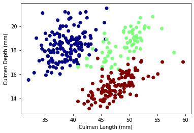

Today, we are going to create some decision regions on the penguins dataset. We are also going to produce some graphs with seaborn.

First, lets import some of the main packages needed in this visualization.


```python
import pandas as pd #import the needed packages
import seaborn as sns
import numpy as np
from matplotlib import pyplot as plt
```

Next, lets download the penguins data frame.


```python
url = "https://raw.githubusercontent.com/PhilChodrow/PIC16B/master/datasets/palmer_penguins.csv" #download dataset and view dataframe
penguins = pd.read_csv(url)
penguins
```


<div>
<style scoped>
    .dataframe tbody tr th:only-of-type {
        vertical-align: middle;
    }

    .dataframe tbody tr th {
        vertical-align: top;
    }

    .dataframe thead th {
        text-align: right;
    }
</style>
<table border="1" class="dataframe">
  <thead>
    <tr style="text-align: right;">
      <th></th>
      <th>studyName</th>
      <th>Sample Number</th>
      <th>Species</th>
      <th>Region</th>
      <th>Island</th>
      <th>Stage</th>
      <th>Individual ID</th>
      <th>Clutch Completion</th>
      <th>Date Egg</th>
      <th>Culmen Length (mm)</th>
      <th>Culmen Depth (mm)</th>
      <th>Flipper Length (mm)</th>
      <th>Body Mass (g)</th>
      <th>Sex</th>
      <th>Delta 15 N (o/oo)</th>
      <th>Delta 13 C (o/oo)</th>
      <th>Comments</th>
    </tr>
  </thead>
  <tbody>
    <tr>
      <th>0</th>
      <td>PAL0708</td>
      <td>1</td>
      <td>Adelie Penguin (Pygoscelis adeliae)</td>
      <td>Anvers</td>
      <td>Torgersen</td>
      <td>Adult, 1 Egg Stage</td>
      <td>N1A1</td>
      <td>Yes</td>
      <td>11/11/07</td>
      <td>39.1</td>
      <td>18.7</td>
      <td>181.0</td>
      <td>3750.0</td>
      <td>MALE</td>
      <td>NaN</td>
      <td>NaN</td>
      <td>Not enough blood for isotopes.</td>
    </tr>
    <tr>
      <th>1</th>
      <td>PAL0708</td>
      <td>2</td>
      <td>Adelie Penguin (Pygoscelis adeliae)</td>
      <td>Anvers</td>
      <td>Torgersen</td>
      <td>Adult, 1 Egg Stage</td>
      <td>N1A2</td>
      <td>Yes</td>
      <td>11/11/07</td>
      <td>39.5</td>
      <td>17.4</td>
      <td>186.0</td>
      <td>3800.0</td>
      <td>FEMALE</td>
      <td>8.94956</td>
      <td>-24.69454</td>
      <td>NaN</td>
    </tr>
    <tr>
      <th>2</th>
      <td>PAL0708</td>
      <td>3</td>
      <td>Adelie Penguin (Pygoscelis adeliae)</td>
      <td>Anvers</td>
      <td>Torgersen</td>
      <td>Adult, 1 Egg Stage</td>
      <td>N2A1</td>
      <td>Yes</td>
      <td>11/16/07</td>
      <td>40.3</td>
      <td>18.0</td>
      <td>195.0</td>
      <td>3250.0</td>
      <td>FEMALE</td>
      <td>8.36821</td>
      <td>-25.33302</td>
      <td>NaN</td>
    </tr>
    <tr>
      <th>3</th>
      <td>PAL0708</td>
      <td>4</td>
      <td>Adelie Penguin (Pygoscelis adeliae)</td>
      <td>Anvers</td>
      <td>Torgersen</td>
      <td>Adult, 1 Egg Stage</td>
      <td>N2A2</td>
      <td>Yes</td>
      <td>11/16/07</td>
      <td>NaN</td>
      <td>NaN</td>
      <td>NaN</td>
      <td>NaN</td>
      <td>NaN</td>
      <td>NaN</td>
      <td>NaN</td>
      <td>Adult not sampled.</td>
    </tr>
    <tr>
      <th>4</th>
      <td>PAL0708</td>
      <td>5</td>
      <td>Adelie Penguin (Pygoscelis adeliae)</td>
      <td>Anvers</td>
      <td>Torgersen</td>
      <td>Adult, 1 Egg Stage</td>
      <td>N3A1</td>
      <td>Yes</td>
      <td>11/16/07</td>
      <td>36.7</td>
      <td>19.3</td>
      <td>193.0</td>
      <td>3450.0</td>
      <td>FEMALE</td>
      <td>8.76651</td>
      <td>-25.32426</td>
      <td>NaN</td>
    </tr>
    <tr>
      <th>...</th>
      <td>...</td>
      <td>...</td>
      <td>...</td>
      <td>...</td>
      <td>...</td>
      <td>...</td>
      <td>...</td>
      <td>...</td>
      <td>...</td>
      <td>...</td>
      <td>...</td>
      <td>...</td>
      <td>...</td>
      <td>...</td>
      <td>...</td>
      <td>...</td>
      <td>...</td>
    </tr>
    <tr>
      <th>339</th>
      <td>PAL0910</td>
      <td>120</td>
      <td>Gentoo penguin (Pygoscelis papua)</td>
      <td>Anvers</td>
      <td>Biscoe</td>
      <td>Adult, 1 Egg Stage</td>
      <td>N38A2</td>
      <td>No</td>
      <td>12/1/09</td>
      <td>NaN</td>
      <td>NaN</td>
      <td>NaN</td>
      <td>NaN</td>
      <td>NaN</td>
      <td>NaN</td>
      <td>NaN</td>
      <td>NaN</td>
    </tr>
    <tr>
      <th>340</th>
      <td>PAL0910</td>
      <td>121</td>
      <td>Gentoo penguin (Pygoscelis papua)</td>
      <td>Anvers</td>
      <td>Biscoe</td>
      <td>Adult, 1 Egg Stage</td>
      <td>N39A1</td>
      <td>Yes</td>
      <td>11/22/09</td>
      <td>46.8</td>
      <td>14.3</td>
      <td>215.0</td>
      <td>4850.0</td>
      <td>FEMALE</td>
      <td>8.41151</td>
      <td>-26.13832</td>
      <td>NaN</td>
    </tr>
    <tr>
      <th>341</th>
      <td>PAL0910</td>
      <td>122</td>
      <td>Gentoo penguin (Pygoscelis papua)</td>
      <td>Anvers</td>
      <td>Biscoe</td>
      <td>Adult, 1 Egg Stage</td>
      <td>N39A2</td>
      <td>Yes</td>
      <td>11/22/09</td>
      <td>50.4</td>
      <td>15.7</td>
      <td>222.0</td>
      <td>5750.0</td>
      <td>MALE</td>
      <td>8.30166</td>
      <td>-26.04117</td>
      <td>NaN</td>
    </tr>
    <tr>
      <th>342</th>
      <td>PAL0910</td>
      <td>123</td>
      <td>Gentoo penguin (Pygoscelis papua)</td>
      <td>Anvers</td>
      <td>Biscoe</td>
      <td>Adult, 1 Egg Stage</td>
      <td>N43A1</td>
      <td>Yes</td>
      <td>11/22/09</td>
      <td>45.2</td>
      <td>14.8</td>
      <td>212.0</td>
      <td>5200.0</td>
      <td>FEMALE</td>
      <td>8.24246</td>
      <td>-26.11969</td>
      <td>NaN</td>
    </tr>
    <tr>
      <th>343</th>
      <td>PAL0910</td>
      <td>124</td>
      <td>Gentoo penguin (Pygoscelis papua)</td>
      <td>Anvers</td>
      <td>Biscoe</td>
      <td>Adult, 1 Egg Stage</td>
      <td>N43A2</td>
      <td>Yes</td>
      <td>11/22/09</td>
      <td>49.9</td>
      <td>16.1</td>
      <td>213.0</td>
      <td>5400.0</td>
      <td>MALE</td>
      <td>8.36390</td>
      <td>-26.15531</td>
      <td>NaN</td>
    </tr>
  </tbody>
</table>
<p>344 rows × 17 columns</p>
</div>


There are many columns with information that we don't need, so lets clean the data down to the variables we need.


```python
penguins = penguins[["Species","Culmen Length (mm)", "Culmen Depth (mm)", "Sex"]] #lets shorten the dataframe to variables we want to study further
penguins
```


<div>
<style scoped>
    .dataframe tbody tr th:only-of-type {
        vertical-align: middle;
    }

    .dataframe tbody tr th {
        vertical-align: top;
    }

    .dataframe thead th {
        text-align: right;
    }
</style>
<table border="1" class="dataframe">
  <thead>
    <tr style="text-align: right;">
      <th></th>
      <th>Species</th>
      <th>Culmen Length (mm)</th>
      <th>Culmen Depth (mm)</th>
      <th>Sex</th>
    </tr>
  </thead>
  <tbody>
    <tr>
      <th>0</th>
      <td>Adelie Penguin (Pygoscelis adeliae)</td>
      <td>39.1</td>
      <td>18.7</td>
      <td>MALE</td>
    </tr>
    <tr>
      <th>1</th>
      <td>Adelie Penguin (Pygoscelis adeliae)</td>
      <td>39.5</td>
      <td>17.4</td>
      <td>FEMALE</td>
    </tr>
    <tr>
      <th>2</th>
      <td>Adelie Penguin (Pygoscelis adeliae)</td>
      <td>40.3</td>
      <td>18.0</td>
      <td>FEMALE</td>
    </tr>
    <tr>
      <th>3</th>
      <td>Adelie Penguin (Pygoscelis adeliae)</td>
      <td>NaN</td>
      <td>NaN</td>
      <td>NaN</td>
    </tr>
    <tr>
      <th>4</th>
      <td>Adelie Penguin (Pygoscelis adeliae)</td>
      <td>36.7</td>
      <td>19.3</td>
      <td>FEMALE</td>
    </tr>
    <tr>
      <th>...</th>
      <td>...</td>
      <td>...</td>
      <td>...</td>
      <td>...</td>
    </tr>
    <tr>
      <th>339</th>
      <td>Gentoo penguin (Pygoscelis papua)</td>
      <td>NaN</td>
      <td>NaN</td>
      <td>NaN</td>
    </tr>
    <tr>
      <th>340</th>
      <td>Gentoo penguin (Pygoscelis papua)</td>
      <td>46.8</td>
      <td>14.3</td>
      <td>FEMALE</td>
    </tr>
    <tr>
      <th>341</th>
      <td>Gentoo penguin (Pygoscelis papua)</td>
      <td>50.4</td>
      <td>15.7</td>
      <td>MALE</td>
    </tr>
    <tr>
      <th>342</th>
      <td>Gentoo penguin (Pygoscelis papua)</td>
      <td>45.2</td>
      <td>14.8</td>
      <td>FEMALE</td>
    </tr>
    <tr>
      <th>343</th>
      <td>Gentoo penguin (Pygoscelis papua)</td>
      <td>49.9</td>
      <td>16.1</td>
      <td>MALE</td>
    </tr>
  </tbody>
</table>
<p>344 rows × 4 columns</p>
</div>


Now we have to get rid of a row with an entry for the "Sex" column that doesn't make sense, drop Na values, and shorten the name for penguin species for better graphing later on. We shall encode the Species column and Sex column into numbers with the LabelEncode() object from the sklearn preprocessing package. This is not needed for the graph we're about to plot, but is good if we want to do machine learning later on with this oode. Then we assign the predictor variables Culmen Length and Culmen Depth into X, and the target variable label (Species) into y.


```python
from sklearn import preprocessing #cleaning the data and encoding numbers for species and sex
le = preprocessing.LabelEncoder()

# clean the data
penguins = penguins.drop(penguins[penguins["Sex"]=="."].index)

#Shorten Species
penguins['Species'] = penguins['Species'].str.split().str.get(0)

#Dropping NaNs
penguins = penguins.dropna(subset = ["Culmen Length (mm)" , "Culmen Depth (mm)", "Sex"])

penguins["label"] = le.fit_transform(penguins["Species"])
penguins["Sex"] = le.fit_transform(penguins["Sex"])

# If you want to study the specific sex for the penguins, enter these variables instead
#X_0 = penguins[penguins['Sex'] == 0][['Culmen Length (mm)', 'Culmen Depth (mm)']]
#y_0 = penguins[penguins['Sex'] == 0]["label"]
#X_1 = penguins[penguins['Sex'] == 1][['Culmen Length (mm)', 'Culmen Depth (mm)']]
#y_1 = penguins[penguins['Sex'] == 1]["label"]


X = penguins[['Culmen Length (mm)', 'Culmen Depth (mm)']]
y = penguins['label']
```


```python
penguins
```


<div>
<style scoped>
    .dataframe tbody tr th:only-of-type {
        vertical-align: middle;
    }

    .dataframe tbody tr th {
        vertical-align: top;
    }

    .dataframe thead th {
        text-align: right;
    }
</style>
<table border="1" class="dataframe">
  <thead>
    <tr style="text-align: right;">
      <th></th>
      <th>Species</th>
      <th>Culmen Length (mm)</th>
      <th>Culmen Depth (mm)</th>
      <th>Sex</th>
      <th>label</th>
    </tr>
  </thead>
  <tbody>
    <tr>
      <th>0</th>
      <td>Adelie Penguin (Pygoscelis adeliae)</td>
      <td>39.1</td>
      <td>18.7</td>
      <td>1</td>
      <td>0</td>
    </tr>
    <tr>
      <th>1</th>
      <td>Adelie Penguin (Pygoscelis adeliae)</td>
      <td>39.5</td>
      <td>17.4</td>
      <td>0</td>
      <td>0</td>
    </tr>
    <tr>
      <th>2</th>
      <td>Adelie Penguin (Pygoscelis adeliae)</td>
      <td>40.3</td>
      <td>18.0</td>
      <td>0</td>
      <td>0</td>
    </tr>
    <tr>
      <th>4</th>
      <td>Adelie Penguin (Pygoscelis adeliae)</td>
      <td>36.7</td>
      <td>19.3</td>
      <td>0</td>
      <td>0</td>
    </tr>
    <tr>
      <th>5</th>
      <td>Adelie Penguin (Pygoscelis adeliae)</td>
      <td>39.3</td>
      <td>20.6</td>
      <td>1</td>
      <td>0</td>
    </tr>
    <tr>
      <th>...</th>
      <td>...</td>
      <td>...</td>
      <td>...</td>
      <td>...</td>
      <td>...</td>
    </tr>
    <tr>
      <th>338</th>
      <td>Gentoo penguin (Pygoscelis papua)</td>
      <td>47.2</td>
      <td>13.7</td>
      <td>0</td>
      <td>2</td>
    </tr>
    <tr>
      <th>340</th>
      <td>Gentoo penguin (Pygoscelis papua)</td>
      <td>46.8</td>
      <td>14.3</td>
      <td>0</td>
      <td>2</td>
    </tr>
    <tr>
      <th>341</th>
      <td>Gentoo penguin (Pygoscelis papua)</td>
      <td>50.4</td>
      <td>15.7</td>
      <td>1</td>
      <td>2</td>
    </tr>
    <tr>
      <th>342</th>
      <td>Gentoo penguin (Pygoscelis papua)</td>
      <td>45.2</td>
      <td>14.8</td>
      <td>0</td>
      <td>2</td>
    </tr>
    <tr>
      <th>343</th>
      <td>Gentoo penguin (Pygoscelis papua)</td>
      <td>49.9</td>
      <td>16.1</td>
      <td>1</td>
      <td>2</td>
    </tr>
  </tbody>
</table>
<p>333 rows × 5 columns</p>
</div>


```python
X
```


<div>
<style scoped>
    .dataframe tbody tr th:only-of-type {
        vertical-align: middle;
    }

    .dataframe tbody tr th {
        vertical-align: top;
    }

    .dataframe thead th {
        text-align: right;
    }
</style>
<table border="1" class="dataframe">
  <thead>
    <tr style="text-align: right;">
      <th></th>
      <th>Culmen Length (mm)</th>
      <th>Culmen Depth (mm)</th>
    </tr>
  </thead>
  <tbody>
    <tr>
      <th>0</th>
      <td>39.1</td>
      <td>18.7</td>
    </tr>
    <tr>
      <th>1</th>
      <td>39.5</td>
      <td>17.4</td>
    </tr>
    <tr>
      <th>2</th>
      <td>40.3</td>
      <td>18.0</td>
    </tr>
    <tr>
      <th>4</th>
      <td>36.7</td>
      <td>19.3</td>
    </tr>
    <tr>
      <th>5</th>
      <td>39.3</td>
      <td>20.6</td>
    </tr>
    <tr>
      <th>...</th>
      <td>...</td>
      <td>...</td>
    </tr>
    <tr>
      <th>338</th>
      <td>47.2</td>
      <td>13.7</td>
    </tr>
    <tr>
      <th>340</th>
      <td>46.8</td>
      <td>14.3</td>
    </tr>
    <tr>
      <th>341</th>
      <td>50.4</td>
      <td>15.7</td>
    </tr>
    <tr>
      <th>342</th>
      <td>45.2</td>
      <td>14.8</td>
    </tr>
    <tr>
      <th>343</th>
      <td>49.9</td>
      <td>16.1</td>
    </tr>
  </tbody>
</table>
<p>333 rows × 2 columns</p>
</div>


```python
y
```


    0      0
    1      0
    2      0
    4      0
    5      0
          ..
    338    2
    340    2
    341    2
    342    2
    343    2
    Name: label, Length: 333, dtype: int64


Now we can create a simple plot where the x-axis is the Culmen Length and y-axis is the Culmen Depth. Each dot represents a penguin. Remember, we are trying to plot decision regions, and decision regions is a form of "UNSUPERVISED" machine learning, which means we aren't trying to predict anything, but rather try to look for patterns in the data. We set the color argument of ax.scatter as y, which is the species.


```python
fig, ax = plt.subplots(1)

ax.scatter(X["Culmen Length (mm)"],
           X["Culmen Depth (mm)"], 
           c = y, 
           cmap = "jet")
#cmap stands for colormap

#Setting labels
ax.set(xlabel = "Culmen Length (mm)",
       ylabel = "Culmen Depth (mm)")

plt.savefig("penguins-decision-regions.png")
```


    

    


Now we will write a plot_regions function that creates decision region for specific model c. This code is from Professor Chodrow's Live Lecture 22, I just added a legend manually.


```python
#Lets write a function to plot decision regions for different models
import matplotlib.patches as mpatches #to manually create the label.

def plot_regions(c, X, y):
    '''
    Plots decision regions of Penguins Culmen Length and Culmen Depth for different machine learning models
    Input: c (a machine learning model), X (the Culmen Length and Culmen Depth dataframe), y (The Species dataframe label encoded)
    Output: A figure of decision regions, needs matplotlib
    '''
        
    x0 = X['Culmen Length (mm)']
    x1 = X['Culmen Depth (mm)']
    
    # treat machine learing prediction it self as a function of two variables
    # create a grid:
    # create a one-dimensional line of x and y by creating a single array of 501 points 
    # between the smallest value of Culmen length and Culmen depth
    grid_x = np.linspace(x0.min(),x0.max(),501)  
    grid_y = np.linspace(x1.min(),x1.max(),501) 
    #These are 1 dimensional arrays, we need 2d array. 
    # using np.meshgrid to create a pair of 2D numpy array corresponding to the x and y,
    xx, yy = np.meshgrid(grid_x, grid_y)  
    
    #(xx[1,2],yy[1,2]) represents a point
    
    # np.c_ attribute to join together the two parts of the grid.
    XX = xx.ravel() #ravel() turns bsck to 1 dimensional array, size is 501x501
    YY = yy.ravel()
    # using the np.c_ attribute to join together the two parts of the grid.
    XY = np.c_[XX, YY]
    
    # turn the resulting predictions p back into 2d
    #p = c.predict(XY)
    p = c.predict(XY)
    p = p.reshape(xx.shape)
    
    # create the plot
    fig, ax = plt.subplots(1)
    
    # use contour plot to visualize the predictions
    ax.contourf(xx, yy, p, cmap = "jet", alpha = 0.2) #xx and yy is the grid, p is the predictions of the species
    
    # plot the data
    ax.scatter(x0, x1, c = y, cmap = "jet") 
    
    #label graphs
    ax.set(xlabel = "Culmen Length (mm)", 
           ylabel = 'Culmen Depth (mm)',
          title = "Decision Regions of Penguin Species")
    
    #create a legend 
    red_patch = mpatches.Patch(color='maroon', label='Gentoo')
    blue_patch = mpatches.Patch(color='navy', label='Adelie')
    green_patch = mpatches.Patch(color='lime', label='Chinstrap')
    plt.legend(handles=[red_patch,green_patch,blue_patch], loc='upper right')
    
    #specific names for colors from :https://matplotlib.org/stable/tutorials/colors/colors.html
    # L = plt.legend()
    # L.get_texts()[0].set_text('A')
    # L.get_texts()[1].set_text('B')
    # L.get_texts()[2].set_text('C')
```


```python
penguins
```


<div>
<style scoped>
    .dataframe tbody tr th:only-of-type {
        vertical-align: middle;
    }

    .dataframe tbody tr th {
        vertical-align: top;
    }

    .dataframe thead th {
        text-align: right;
    }
</style>
<table border="1" class="dataframe">
  <thead>
    <tr style="text-align: right;">
      <th></th>
      <th>Species</th>
      <th>Culmen Length (mm)</th>
      <th>Culmen Depth (mm)</th>
      <th>Sex</th>
      <th>label</th>
    </tr>
  </thead>
  <tbody>
    <tr>
      <th>0</th>
      <td>Adelie Penguin (Pygoscelis adeliae)</td>
      <td>39.1</td>
      <td>18.7</td>
      <td>1</td>
      <td>0</td>
    </tr>
    <tr>
      <th>1</th>
      <td>Adelie Penguin (Pygoscelis adeliae)</td>
      <td>39.5</td>
      <td>17.4</td>
      <td>0</td>
      <td>0</td>
    </tr>
    <tr>
      <th>2</th>
      <td>Adelie Penguin (Pygoscelis adeliae)</td>
      <td>40.3</td>
      <td>18.0</td>
      <td>0</td>
      <td>0</td>
    </tr>
    <tr>
      <th>4</th>
      <td>Adelie Penguin (Pygoscelis adeliae)</td>
      <td>36.7</td>
      <td>19.3</td>
      <td>0</td>
      <td>0</td>
    </tr>
    <tr>
      <th>5</th>
      <td>Adelie Penguin (Pygoscelis adeliae)</td>
      <td>39.3</td>
      <td>20.6</td>
      <td>1</td>
      <td>0</td>
    </tr>
    <tr>
      <th>...</th>
      <td>...</td>
      <td>...</td>
      <td>...</td>
      <td>...</td>
      <td>...</td>
    </tr>
    <tr>
      <th>338</th>
      <td>Gentoo penguin (Pygoscelis papua)</td>
      <td>47.2</td>
      <td>13.7</td>
      <td>0</td>
      <td>2</td>
    </tr>
    <tr>
      <th>340</th>
      <td>Gentoo penguin (Pygoscelis papua)</td>
      <td>46.8</td>
      <td>14.3</td>
      <td>0</td>
      <td>2</td>
    </tr>
    <tr>
      <th>341</th>
      <td>Gentoo penguin (Pygoscelis papua)</td>
      <td>50.4</td>
      <td>15.7</td>
      <td>1</td>
      <td>2</td>
    </tr>
    <tr>
      <th>342</th>
      <td>Gentoo penguin (Pygoscelis papua)</td>
      <td>45.2</td>
      <td>14.8</td>
      <td>0</td>
      <td>2</td>
    </tr>
    <tr>
      <th>343</th>
      <td>Gentoo penguin (Pygoscelis papua)</td>
      <td>49.9</td>
      <td>16.1</td>
      <td>1</td>
      <td>2</td>
    </tr>
  </tbody>
</table>
<p>333 rows × 5 columns</p>
</div>


How did we know what to put for the species in the legend. There might be a better way, but I just plotted the Adelie and Gentoo penguins by itself and compare it with the points above to see which color represented which species.


```python
#To figure the species of the colors, lets graph them seperately
Adelie = penguins[penguins["label"]==0]
Adelie

fig, ax = plt.subplots(1)

ax.scatter(Adelie["Culmen Length (mm)"],
           Adelie["Culmen Depth (mm)"],)
#Clearly Blue is Adelie
```


    <matplotlib.collections.PathCollection at 0x126ff5250>


    

    


```python
Gentoo = penguins[penguins["label"]==2]
Gentoo

fig, ax = plt.subplots(1)

ax.scatter(Gentoo["Culmen Length (mm)"],
           Gentoo["Culmen Depth (mm)"],)
#Clearly Maroon is Gentoo, which leaves Lime as Chinstrap
```


    <matplotlib.collections.PathCollection at 0x123d10d30>


    

    


Now lets create a Logistic Regression model


```python
from sklearn.linear_model import LogisticRegression #Try logistic regression
l = LogisticRegression(C = 0.5, max_iter = 1000)
l.fit(X,y)
```


    LogisticRegression(C=0.5, max_iter=1000)


Using our plot_regions function, we can create a nice decision regions graph for the penguins by using a logistic regression model.


```python
plot_regions(l, X, y)
```


    

    


We can also do this for a SVM model. Gamma is the complexity parameter for SVM. Increasing gamma which will lead to curvier decision regions, which increases flexibility and reduces error. A very complex SVM model with high complexity will lead to overfitting, so be careful.


```python
from sklearn import svm #try support vector machine
SVM = svm.SVC(gamma = 0.2)
SVM.fit(X,y)
plot_regions(SVM, X, y)
```


    

    


A simpler way to do decision regions not by hand as mentioned in Live Lecture 22 is to use the mlxtend package.


```python
#you will need to run the below first to install this package: 
#conda install mlxtend
from mlxtend.plotting import plot_decision_regions
```


```python
SVM = svm.SVC(gamma = 0.2)
SVM.fit(X, y)
plot_decision_regions(np.array(X), np.array(y), clf = SVM)
```


    <AxesSubplot:>


    

    


Using the seaborn package, we can create graphs easily. Here is a violin plot, please let me know what this shows.


```python
sns.violinplot(x="Species", y="Culmen Length (mm)", data=penguins,size=8) #Seaborn can create plots easily
```


    <AxesSubplot:xlabel='Species', ylabel='Culmen Length (mm)'>


    

    


Another plot function in seaborn is the pairplot function, which gives an overview of the graphs of different combination of the variables specified. It automatically generates different graphs that it believes make sense.


```python
sns.pairplot(penguins, hue="Species", height=3,diag_kind="hist") 
```


    <seaborn.axisgrid.PairGrid at 0x12ccc5d60>


    
