# Blog Post 2: Spectral Clustering


Today, we are going to try to apply *spectral clustering* on some data points that are more complex.

First lets import the modules we need. We will use numpy to efficiently manipulate arrays to minimize the use of for loops, sklearn to create the data points we need to cluster, and matplotlit's pyplot to show our results.


```python
import numpy as np
from sklearn import datasets
from matplotlib import pyplot as plt
```

Here, we are creating data points where X is the Euclidean coordinates of data points that may represent some predictor variables, and the true labels for these points in y or the target variables. 


```python
n = 200
np.random.seed(1111)
X, y = datasets.make_blobs(n_samples=n, shuffle=True, random_state=None, centers = 2, cluster_std = 2.0)
plt.scatter(X[:,0], X[:,1])
```


    <matplotlib.collections.PathCollection at 0x1224b1f70>


    
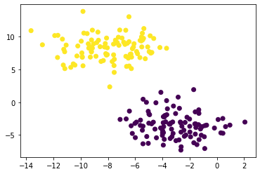


*Clustering* is the task of trying to classify and group points that are more similar together. For circular data such as the one below, K-means is a great algorithm to implement and cluster the data.


```python
from sklearn.cluster import KMeans
km = KMeans(n_clusters = 2)
km.fit(X)
plt.scatter(X[:,0], X[:,1], c = km.predict(X))
```


    <matplotlib.collections.PathCollection at 0x122ff4160>


    

    


However, not all groups of data points are going to be circular in shape. What if there were groups of data points that had a shape of a moon.


```python
np.random.seed(1234)
n = 200
X, y = datasets.make_moons(n_samples=n, shuffle=True, noise=0.05, random_state=None)
plt.scatter(X[:,0], X[:,1])
```


    <matplotlib.collections.PathCollection at 0x1230aec40>


    
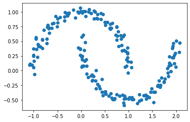
    


Since the group of data points are not circular, K means algorithm would not be a great way to cluster the data points.


```python
km = KMeans(n_clusters = 2)
km.fit(X)
plt.scatter(X[:,0], X[:,1], c = km.predict(X))
```


    <matplotlib.collections.PathCollection at 0x123186d00>


    
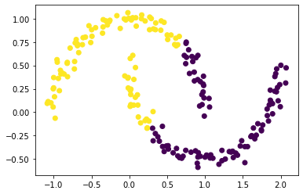
    


We are going to try to use spectral clustering to cluster this moon shaped dataset.

### The Similarity Matrix
First, we shall construct a simiarity matrix A. This matrix is n by n, n representing the number of data points. Basically, we are comparing the distance between each data point. If the distance between the data points are within epsilon, a small number, than we will denote a 1 to this row representing one point and the column representing the other point. Therefore, it is obvious that the diagnol of this matrix would be equal to zero since it will be comparing the same data point and the distance would be zero. However, even though this distance is less than epsilon, it should not be accounted for. For this part we will use episilon to be 0.4, a small number.


```python
from sklearn.metrics import pairwise_distances as pwd
def similarityMatrix(X, epsilon):
    '''
    Finds the data points that are within epsilon distance away from each other, and generates a similarity matrix.
    A similarity matrix compares the points i to points j and assigns 1 if the distance is within epsilon from each other.
    It assigns 0 otherwise and the diagnol consists of 0's. 
    Input: X, a 2d numpy array of data points x,y , and epsilon, a float that determines the distance between the points
    Output: A 2d numpy array of the similarity matrix
    '''

# commented out is the way to do it using for loops, this is highly inefficent and can be done in three lines of code.
#    n = len(X)
#    A = np.ndarray(shape = (n,n))
#    A.fill(0)
    pd_X = pwd(X) #generates the pairwise distances matrix, which calculates the distances of each data point
#     for i in range(len(pd_X)):
#         for j in range(len(pd_X[i])):
#             if pd_X[i][j] < epsilon and i!=j:
#                 A[i][j] = 1
    A = 1.0*(pd_X<epsilon) #creates the similarity matrix where the data points within epsilon will get 1 and the rest will be 0 since it will be False
    np.fill_diagonal(A,0) #fills the diagnol with zeros to exclude the same data points being accounted for
    return A
```

Here is what the X, a 2d numpy array looks like, it contains of the data points of the two moons shown above.


```python
X[0:5] #The first five values of X
```


    array([[ 1.94685074,  0.46317074],
           [ 1.18415455, -0.55596203],
           [ 0.65961041,  0.81003845],
           [ 0.04783049,  1.00594475],
           [-0.4464695 ,  0.90285299]])


We will call the function we created to create the similarity matrix for X's data points.


```python
A = similarityMatrix(X, epsilon = 0.4)
print(A)
```

    [[0. 0. 0. ... 0. 0. 0.]
     [0. 0. 0. ... 0. 0. 0.]
     [0. 0. 0. ... 0. 1. 0.]
     ...
     [0. 0. 0. ... 0. 1. 1.]
     [0. 0. 1. ... 1. 0. 1.]
     [0. 0. 0. ... 1. 1. 0.]]


### The Binary Norm Cut Objective
Next we will use the similarity matrix to partition the data points in X into two clusters. (***Note:*** We are assuming all the data points are in one of the two clusters) We will use this binary norm cut objective of matrix A, which is an equation that will compute a number, and the smaller the number is, the better the partition of data into clusters $C_0$ and $C_1$ is. Here is the equation:

$$N_{\mathbf{A}}(C_0, C_1)\equiv \mathbf{cut}(C_0, C_1)\left(\frac{1}{\mathbf{vol}(C_0)} + \frac{1}{\mathbf{vol}(C_1)}\right)\;.$$


#### The Cut Term

We will write a function to compute the cut term in the binary norm cut objective equation above. The cut term takes our similarity matrix A and adds up the number of 1's in the similarity matrix that correspond to cluster $C_0$ and to cluster $C_1$. Therefore, a small cut term means that the points in $C_0$ are not close to the points in $C_1$. Remember, the cut term is the number of pair of points that are within epsilon distance (hence denoted 1 in the similarity matrix) and are from different clusters. If there are a lot of points that are close and from different clusters, it means that the points in $C_0$ is close to the points in $C_!$.


```python
def cut(A,y):
    '''
    Computes the cut term which is the number of pair of points that are within epsilon distance and are from different clusters
    Input: A, a 2d numpy array of similarity matrix, y a numpy array of the actual cluster data point belongs in
    Output: The cut term, a float, which is the number of pair of points (i,j) that are within episilon distance from each other, but are in different clusters 
    '''
    cut = 0
    for i in range(len(A)):
        for j in range(len(A[i])):
            if y[i] != y[j]:
                cut += A[i][j]
    return cut
```

Now that we have the cut term function defined, lets test it out to see if it works by comparing the cut objective of A with y, which we defined to be the true cluster labels of the data point, and the cut objective of A with b, a random vector of 1's and 0's with the same size as y.


```python
print(cut(A,y))
b = np.random.randint(0, 2, size = n)
print(cut(A,b))
```

    26.0
    2232.0


The cut objective of A with y is significantly smaller than the cut objective of A with b, a random vector of 1's and 0's. This result makes sense as the cut objective should favor the true clusters over randomly assigned clusters. Having a random vector means that there is more chances that the pair of points in the data will be close and from different clusters as there is no structure for b since it is random.

#### The Volume Term 

Now that we have the cut term, lets compute the volume term, which computes the volume of the cluster and determines how big the cluster is. Notice that if the cluster is small, the binary norm objective will be large, which is undesirable for partitioning the two clusters. Therefore, for the binary normcut objective, we want clusters $C_0$ and $C_1$ not to be small and that there are few entries in our similarity matrix that correspond to both clusters.


```python
def vols(A,y):
    '''
    Computes the volume of each cluster
    Input: A, a 2d numpy array of similarity matrix, y a numpy array of the actual cluster data point belongs in
    Output: The volume term of cluster 0 and cluster 1 as a tuple
    '''
    v0 = np.cumsum(A,axis=0)[-1][y==0].sum() #This will add up the values in each row where y corresponds to 0
    v1 = np.cumsum(A,axis=0)[-1][y==1].sum() #This will add up the values in each row where y corresponds to 1
    return v0, v1
```

Lets compute the volume of clusters $C_0$ and $C_1$.


```python
vols(A,y)
```


    (2299.0, 2217.0)


Now, we will define the normcut objective function from above now that we have both the cut term and volume term defined. 


```python
def normcut(A,y):
    '''
    Computes the normcut 
    Input: A, a 2d numpy array of similarity matrix, y a numpy array of the actual cluster data point belongs in
    Output: The normcut, a float
    '''
    v0, v1 = vols(A,y)
    return cut(A,y)*((1/v0)+(1/v1))
```


```python
print(f"normcut of A and y: {normcut(A,y)}")
print(f"normcut of A and b: {normcut(A,b)}")
```

    normcut of A and y: 0.02303682466323045
    normcut of A and b: 1.991672673470162


It seems the normcut of A and y is 0.02, which is significantly less than 1.99, the normcut of A and a random vector b. 

This means the normcut for the true labels is about a hundred times smaller than the normcut of the randomly generated labels.

### Linear Algebra version of Normcut Objective

We have now defined a normalized cut objective which results in small values when the input clusters are joined by relatively few entries in $A$ and the clusters are not too small. However, it is difficult to find a cluster vector y such that normcut(A,y) will be smallest, therefore, we will instead introduce a way to compute the normalized cut objective using linear algebra.

We will define a new vector $\mathbf{z} \in \mathbb{R}^n$ such that: 

$$
z_i = 
\begin{cases}
    \frac{1}{\mathbf{vol}(C_0)} &\quad \text{if } y_i = 0 \\ 
    -\frac{1}{\mathbf{vol}(C_1)} &\quad \text{if } y_i = 1 \\ 
\end{cases}
$$


and the normcut objective equation to be 


$$\mathbf{N}_{\mathbf{A}}(C_0, C_1) = 2\frac{\mathbf{z}^T (\mathbf{D} - \mathbf{A})\mathbf{z}}{\mathbf{z}^T\mathbf{D}\mathbf{z}}\;,$$

where $\mathbf{D}$ is the diagonal matrix with nonzero entries $d_{ii} = d_i$, and  where $d_i = \sum_{j = 1}^n a_i$ is the degree (row-sum of of matrix $\mathbf{A}$)

We will first write a function transform that computes the z vector defined above.


```python
def transform(A,y):
    '''
    Computes the z vector 
    Input: A, a 2d numpy array of similarity matrix, y a numpy array of the actual cluster data point belongs in
    Output: z vector, a numpy array
    '''
    v0,v1=vols(A,y)
    z = np.zeros(len(y))
    z[y==0]=1/v0
    z[y==1]=-1/v1
    return z
```

We will also write a function to compute the degreeMatrix D defined above.


```python
def degreeMatrix(A):
    '''
    Computes the degree matrix
    Input: A, a 2d numpy array of similarity matrix
    Output: D, a 2d numpy array
    '''
    n = len(A)
    D = np.zeros((n,n))
    np.fill_diagonal(D, A.cumsum(axis=0)[-1])
    return D
```

We will now compare the two normcut equations to see if they are equivalent.


```python
z = transform(A,y)
D = degreeMatrix(A)
print("normcut:",normcut(A,y))
print("matrix product:",2*((z.T@(D-A)@z)/(z@D@z)))
print("identity:",z.T@D@np.ones(len(A)))

print(f"Are both normcut equations the same?: {np.isclose(normcut(A,y), 2*((z.T@(D-A)@z)/(z@D@z)))}")
```

    normcut: 0.02303682466323045
    matrix product: 0.023036824663230145
    identity: 0.0
    Are both normcut equations the same?: True


It seems the two equations are equivalent as the np.isclose function returns True. 

We also checked the identity $\mathbf{z}^T\mathbf{D}\mathbb{1} = 0$, where $\mathbb{1}$ is the vector of `n` ones. This identity means that $\mathbf{z}$ should contain roughly as many positive as negative entries, and so our vector $\mathbf{z}$ is correct.


```python
z[0:5] #this is how z looks like, there are only two values
```


    array([-0.00045106, -0.00045106,  0.00043497,  0.00043497,  0.00043497])


### Minimizing the Function related to Norm Cut Objective

We want to minimize this function as it is related to the normcut objective equation above:

$$ R_\mathbf{A}(\mathbf{z})\equiv \frac{\mathbf{z}^T (\mathbf{D} - \mathbf{A})\mathbf{z}}{\mathbf{z}^T\mathbf{D}\mathbf{z}} $$

where the condition $\mathbf{z}^T\mathbf{D}\mathbb{1} = 0$ is satisfied. The matrix multiplication for this function can be optimized by substituting $\mathbf{z}$ with the orthogonal complement of $\mathbf{z}$ relative to $\mathbf{D}\mathbf{1}$. 


```python
def orth(u, v):
    return (u @ v) / (v @ v)*v

e = np.ones(n) 

d = D @ e

def orth_obj(z):
    z_o = z - orth(z, d)
    return (z_o @ (D - A) @ z_o)/(z_o @ D @ z_o)
```


```python
d[0:5] #This is what d looks like
```


    array([15., 25., 24., 27., 22.])


Now that we have functions that calculate the orthogonal complement of $\mathbf{z}$ relative to $\mathbf{D}\mathbf{1}$, we can calculate the approximation of z, z_min, that optimizes the orthogonal objective. Note that now z_min can contain any value since we are no longer exactly optimizing the normcut objective, but approximating. This math trick is called continous relaxation of the normcut problem.

We will use the minimize function from scipy.optimize to minimize the function orth_obj() on z.


```python
import scipy
z_ = scipy.optimize.minimize(orth_obj, z) #scipy.optimize.minimize() returns an object
z_min = z_.x #This object has an x attribute, the solution array
```


```python
scipy.optimize.minimize?
```


```python
z_min[0:5] #The values can all be different
```


    array([-0.00183352, -0.0024169 , -0.00120207, -0.00141736, -0.00098547])


## Part E

We will plot the moon-shaped clusters again using this optimized z_min vector to cluster each data point. The number in z_min should be greater than 0 when it is in $C_0$ and less than 0 when it is in $C_1$. However, we’ll make the bottom threshold a small negative number to accommodate for the chance of error. In this case, I chose to denote this threshold to be less than -0.0015 rather than 0.


```python
def clusterLabel(z_min):
    '''
    Computes the cluster label
    Input: z_min, a numpy array
    Output: cluster labels, a numpy array
    '''
    clusterLabels = np.ones(len(z_min))
    clusterLabels[z_min<-0.0015]=0
    return clusterLabels
```


```python
clusterLabel(z_min)
```


    array([0., 0., 1., 1., 1., 1., 1., 1., 0., 0., 0., 1., 1., 0., 0., 0., 0.,
           1., 1., 1., 0., 1., 0., 1., 1., 0., 1., 0., 0., 1., 1., 0., 0., 0.,
           0., 0., 1., 0., 0., 1., 0., 1., 1., 1., 1., 1., 1., 0., 0., 1., 1.,
           1., 0., 0., 1., 1., 0., 1., 0., 1., 1., 1., 0., 1., 0., 1., 1., 1.,
           1., 0., 0., 0., 0., 1., 1., 0., 0., 1., 0., 1., 1., 1., 1., 0., 0.,
           0., 0., 1., 1., 1., 1., 0., 1., 1., 1., 0., 0., 0., 1., 1., 0., 0.,
           0., 1., 0., 0., 1., 1., 0., 0., 1., 1., 1., 0., 1., 1., 1., 1., 1.,
           0., 0., 1., 0., 0., 0., 1., 0., 1., 0., 1., 1., 1., 1., 1., 0., 0.,
           0., 0., 0., 0., 0., 0., 1., 1., 0., 1., 1., 1., 1., 1., 1., 1., 1.,
           0., 0., 1., 0., 1., 1., 1., 0., 0., 1., 1., 0., 0., 0., 1., 1., 1.,
           0., 1., 0., 0., 0., 1., 1., 1., 1., 0., 0., 1., 1., 0., 0., 0., 1.,
           0., 0., 0., 1., 0., 1., 0., 0., 0., 0., 1., 1., 1.])


```python
clusterLabels = clusterLabel(z_min)
plt.scatter(X[:,0], X[:,1], c = clusterLabels)
```


    <matplotlib.collections.PathCollection at 0x123c7c5b0>


    
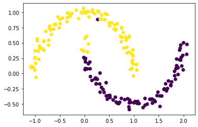
    


Most of the points are correctly clustered, but there are still some points in the upper left tip of the bottom moon-shaped cluster that is misclassified as yellow instead of purple. We need to make our optimization better.

### Laplacian Matrix

To explicitly optimize the orthogonal objective is not the most efficient way to cluster. What if the matrix is very large? It will take a long time to optimize and make $$ R_\mathbf{A}(\mathbf{z})$$ small.  
We want to minimize the function $$ R_\mathbf{A}(\mathbf{z})\equiv \frac{\mathbf{z}^T (\mathbf{D} - \mathbf{A})\mathbf{z}}{\mathbf{z}^T\mathbf{D}\mathbf{z}} $$

with respect to $\mathbf{z}$, subject to the condition $\mathbf{z}^T\mathbf{D}\mathbb{1} = 0$ in a more efficient way. 

Notice that this part of the equation is symmetric:
$${\mathbf{z}^T (\mathbf{D} - \mathbf{A})\mathbf{z}}$$
Therefore, we can minimize this function by calculating the eigenvalues and eigenvectors. Therefore, this problem of minimzing the function has turned into an eigenvector problem for the Laplacian matrix.


The Rayleigh-Ritz Theorem states that the minimizing $\mathbf{z}$ must be the solution with smallest eigenvalue of the generalized eigenvalue problem 

$$ (\mathbf{D} - \mathbf{A}) \mathbf{z} = \lambda \mathbf{D}\mathbf{z}\;, \quad \mathbf{z}^T\mathbf{D}\mathbb{1} = 0$$

which is equivalent to the standard eigenvalue problem 

$$ \mathbf{D}^{-1}(\mathbf{D} - \mathbf{A}) \mathbf{z} = \lambda \mathbf{z}\;, \quad \mathbf{z}^T\mathbb{1} = 0\;.$$

Since we know $\mathbb{1}$ is the eigenvector with smallest eigenvalue of the matrix $\mathbf{D}^{-1}(\mathbf{D} - \mathbf{A})$, the vector $\mathbf{z}$ we want has to be the eigenvector corresponding to the second smallest eigenvalue. 

Here, the matrix $$\mathbf{L} = \mathbf{D}^{-1}(\mathbf{D} - \mathbf{A})$$ is the *Laplacian* matrix of the similarity matrix $\mathbf{A}$.

We will write a function to compute the Laplacian matrix of A.


```python
def LaplacianMatrix(A):
    '''
    Computes the Laplacian Matrix 
    Input: A, a 2d numpy array of similarity matrix
    Output: L, a Laplacian Matrix
    '''
    D = degreeMatrix(A) 
    D_inv = np.linalg.inv(D)
    L = D_inv@(D-A)
    return L
```


```python
L = LaplacianMatrix(A)
```

Here, we will use np.linalg.eig() to calculate the eigenvalues and eigenvectors associated with L. We will sort the eigenvalues in order from least to greatest, and choose the eigenvector associated to the second-smallest eigenvalue, which will be at index 1. 


```python
Lam, U = np.linalg.eig(L)
ix = Lam.argsort() #sort the eigenvalues from least to greatest
Lam, U = Lam[ix], U[:,ix]
z_eig = U[:,1] #The second smallest eigenvalue
```

Now we will plot the data points again using the eigenvector corresponding to the second smallest eignevalue, z_eig,  instead of z_min. 


```python
clusterLabels = clusterLabel(z_eig)
plt.scatter(X[:,0], X[:,1], c = clusterLabels)
```


    <matplotlib.collections.PathCollection at 0x123b52ca0>


    
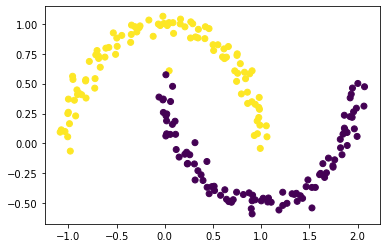
    


The z_eig seems to cluster the data points better than the z_min vector above.

### Creating a Function that will do Spectral Clustering

This funtion will do spectral clustering on X, a numpy array of data points, given an epsilon, a distance threshold. 


```python
def spectral_clustering(X, epsilon):
    '''
    Computes the cluster labels 
    Input: X, a 2d numpy array of data points, epsilon, a float of how close the points should be
    Output: clusterLabels, a numpy array
    '''
    A = similarityMatrix(X, epsilon)
    L = LaplacianMatrix(A)
    Lam, U = np.linalg.eig(L)
    ix = Lam.argsort()
    Lam, U = Lam[ix], U[:,ix]
    z_eig = U[:,1]
    clusterLabels = clusterLabel(z_eig)
    return clusterLabels
```


```python
clusterLabels = spectral_clustering(X, epsilon = 0.4)
plt.scatter(X[:,0], X[:,1], c = clusterLabels)
```


    <matplotlib.collections.PathCollection at 0x125174190>


    

    


### Testing our Data on different Moon-Shaped Datasets

Now that we have a fast algorithm for spectral clustering, lets test them out on our moon-shaped datasets with 1000 points and a noise level of 0.1.


```python
# noise = 0.1
n = 1000
NOISE = 0.1
X, y = datasets.make_moons(n_samples=n, shuffle=True, noise=NOISE, random_state=None)
clusterLabels = spectral_clustering(X, epsilon = 0.4)
plt.scatter(X[:,0], X[:,1], c = clusterLabels)
```


    <matplotlib.collections.PathCollection at 0x125271940>


    
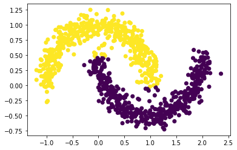
    


Some of the points at the edge are misclassified, but overall the clusters are good. Lets increase the noise level to 0.15.


```python
# noise = 0.15
n = 1000
NOISE = 0.15
X, y = datasets.make_moons(n_samples=n, shuffle=True, noise=NOISE, random_state=None)
clusterLabels = spectral_clustering(X, epsilon = 0.4)
plt.scatter(X[:,0], X[:,1], c = clusterLabels)
```


    <matplotlib.collections.PathCollection at 0x124163c70>


    
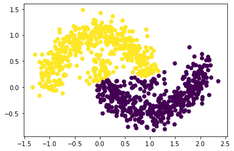
    


More points of the cluster are misclassified as the noise level increases. Lets increase the noise level even more to 0.2.


```python
# noise = 0.2
n = 1000
NOISE = 0.2
X, y = datasets.make_moons(n_samples=n, shuffle=True, noise=NOISE, random_state=None)
clusterLabels = spectral_clustering(X, epsilon = 0.4)
plt.scatter(X[:,0], X[:,1], c = clusterLabels)
```


    <matplotlib.collections.PathCollection at 0x124238f40>


    
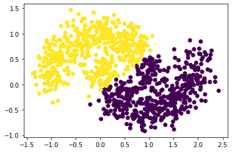
    


It seems like a noise level around 0.1 is the best for clustering the data points.

### Bull's Eye Graph

Now lets try our spectral clustering function on the bull's eye dataset! Here is the bull's eye dataset.


```python
n = 1000
X, y = datasets.make_circles(n_samples=n, shuffle=True, noise=0.05, random_state=None, factor = 0.4)
plt.scatter(X[:,0], X[:,1])
```


    <matplotlib.collections.PathCollection at 0x1242be0a0>


    
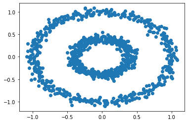
    


Since there are two concentric circles, k-means will not work well. Let's try our spectral clustering algorithm instead.


```python
km = KMeans(n_clusters = 2)
km.fit(X)
plt.scatter(X[:,0], X[:,1], c = km.predict(X))
```


    <matplotlib.collections.PathCollection at 0x12435ec70>


    
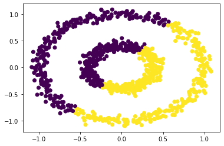
    


We will test different values of epsilon to see which one will result in the best coloring for each of the two circles.

We will first let epsilon be 0.6.


```python
clusterLabels = spectral_clustering(X, epsilon = 0.6) #epsilon = 0.3-0.5 are able to seperate two circles
plt.scatter(X[:,0], X[:,1], c = clusterLabels)
```


    <matplotlib.collections.PathCollection at 0x123b36460>


    
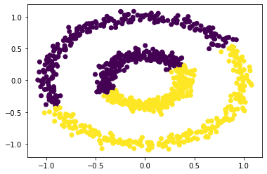
    


The circles don't seem to be clustered very well. Lets try 0.4 for epsilon.


```python
clusterLabels = spectral_clustering(X, epsilon = 0.4) #epsilon = 0.3-0.5 are able to seperate two circles
plt.scatter(X[:,0], X[:,1], c = clusterLabels)
```


    <matplotlib.collections.PathCollection at 0x1244008e0>


    
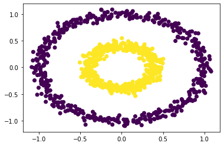
    


After experimenting with some values for epsilon, it seems that anything in between 0.3 to 0.5 will seperate the two circles.

In summary, spectral clustering can be used to cluster data points in the moonshape or the bull's eye datasets.
