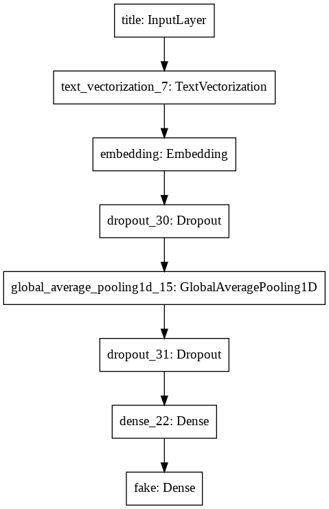
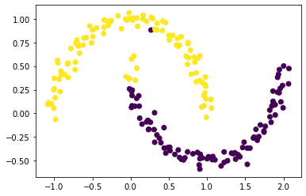
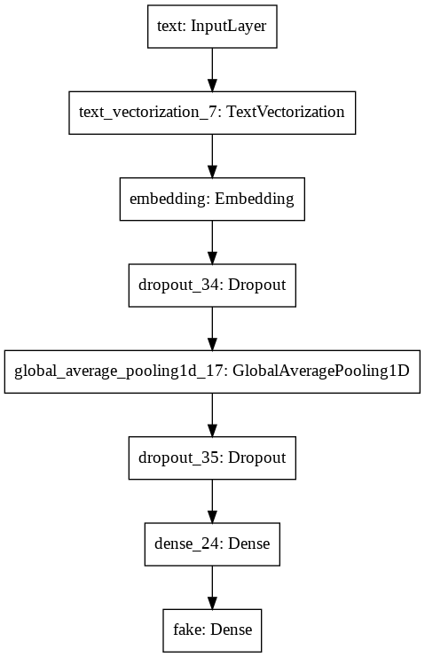
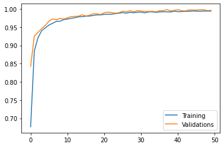
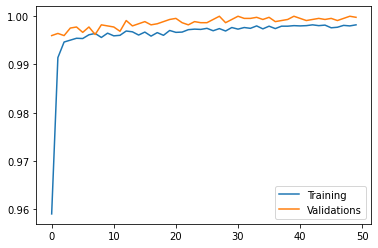

<a href="https://colab.research.google.com/github/philhuang74/philhuang74.github.io/blob/master/BlogPost3.ipynb" target="_parent"></a>

Today, we are going to create a neural network for detecting fake news. 
First we will import the needed packages for this task.


```python
import pandas as pd
import numpy as np
import tensorflow as tf
import re
import string
from matplotlib import pyplot as plt

# For removing stopwords
import nltk
nltk.download('stopwords')
from nltk.corpus import stopwords

# For building model
from tensorflow.keras import layers
from tensorflow.keras import losses
from tensorflow import keras

from tensorflow.keras.layers.experimental.preprocessing import TextVectorization
from tensorflow.keras.layers.experimental.preprocessing import StringLookup

from sklearn.model_selection import train_test_split
from sklearn.preprocessing import LabelEncoder

# For our embedding vizualization
import plotly.express as px 
import plotly.io as pio
pio.templates.default = "plotly_white"
```

    [nltk_data] Downloading package stopwords to /root/nltk_data...
    [nltk_data]   Package stopwords is already up-to-date!


```python
#pip install tensorflow==2.4
```

Next we will import the data.


```python
train_url = "https://github.com/PhilChodrow/PIC16b/blob/master/datasets/fake_news_train.csv?raw=true"
```


```python
df = pd.read_csv(train_url)
```

Now we will create a function that will create a tensorflow dataset where we remove stopwords such as "the", "and", "but" from the text and title column and put them as the input (first part of tuple), and the output as whether the news was fake.


```python
def make_dataset(df):
  

  stop = stopwords.words("english")

  df['text'] = df['text'].apply(lambda x: ' '.join([word for word in x.split() if word.lower() not in (stop)]))
  df['title'] = df['title'].apply(lambda x: ' '.join([word for word in x.split() if word.lower() not in (stop)]))

  #test['tweet'].apply(lambda x: [item for item in x if item not in stop])
  # Creating tensorflow dataset
  data = tf.data.Dataset.from_tensor_slices(
      (
        {
          "title" :  df[["title"]],
          "text" : df[["text"]]
       },

        {
          "fake" : df[["fake"]]
        }
      )
  )

  return data
```


```python
stop = stopwords.words("english")
stop[0:5]
```


    ['i', 'me', 'my', 'myself', 'we']


```python
df
```


<div>
<style scoped>
    .dataframe tbody tr th:only-of-type {
        vertical-align: middle;
    }

    .dataframe tbody tr th {
        vertical-align: top;
    }

    .dataframe thead th {
        text-align: right;
    }
</style>
<table border="1" class="dataframe">
  <thead>
    <tr style="text-align: right;">
      <th></th>
      <th>Unnamed: 0</th>
      <th>title</th>
      <th>text</th>
      <th>fake</th>
    </tr>
  </thead>
  <tbody>
    <tr>
      <th>0</th>
      <td>17366</td>
      <td>Merkel: Strong result for Austria's FPO 'big c...</td>
      <td>German Chancellor Angela Merkel said on Monday...</td>
      <td>0</td>
    </tr>
    <tr>
      <th>1</th>
      <td>5634</td>
      <td>Trump says Pence will lead voter fraud panel</td>
      <td>WEST PALM BEACH, Fla.President Donald Trump sa...</td>
      <td>0</td>
    </tr>
    <tr>
      <th>2</th>
      <td>17487</td>
      <td>JUST IN: SUSPECTED LEAKER and “Close Confidant...</td>
      <td>On December 5, 2017, Circa s Sara Carter warne...</td>
      <td>1</td>
    </tr>
    <tr>
      <th>3</th>
      <td>12217</td>
      <td>Thyssenkrupp has offered help to Argentina ove...</td>
      <td>Germany s Thyssenkrupp, has offered assistance...</td>
      <td>0</td>
    </tr>
    <tr>
      <th>4</th>
      <td>5535</td>
      <td>Trump say appeals court decision on travel ban...</td>
      <td>President Donald Trump on Thursday called the ...</td>
      <td>0</td>
    </tr>
    <tr>
      <th>...</th>
      <td>...</td>
      <td>...</td>
      <td>...</td>
      <td>...</td>
    </tr>
    <tr>
      <th>22444</th>
      <td>10709</td>
      <td>ALARMING: NSA Refuses to Release Clinton-Lynch...</td>
      <td>If Clinton and Lynch just talked about grandki...</td>
      <td>1</td>
    </tr>
    <tr>
      <th>22445</th>
      <td>8731</td>
      <td>Can Pence's vow not to sling mud survive a Tru...</td>
      <td>() - In 1990, during a close and bitter congre...</td>
      <td>0</td>
    </tr>
    <tr>
      <th>22446</th>
      <td>4733</td>
      <td>Watch Trump Campaign Try To Spin Their Way Ou...</td>
      <td>A new ad by the Hillary Clinton SuperPac Prior...</td>
      <td>1</td>
    </tr>
    <tr>
      <th>22447</th>
      <td>3993</td>
      <td>Trump celebrates first 100 days as president, ...</td>
      <td>HARRISBURG, Pa.U.S. President Donald Trump hit...</td>
      <td>0</td>
    </tr>
    <tr>
      <th>22448</th>
      <td>12896</td>
      <td>TRUMP SUPPORTERS REACT TO DEBATE: “Clinton New...</td>
      <td>MELBOURNE, FL is a town with a population of 7...</td>
      <td>1</td>
    </tr>
  </tbody>
</table>
<p>22449 rows × 4 columns</p>
</div>


We will pass our dataframe into our make_dataset function and print the first five input and outputs in our dataset.


```python
data = make_dataset(df)

for input, output in data.take(5):
    print(input)
    print(output)
    print("")
```

    {'title': <tf.Tensor: shape=(1,), dtype=string, numpy=
    array([b"Merkel: Strong result Austria's FPO 'big challenge' parties"],
          dtype=object)>, 'text': <tf.Tensor: shape=(1,), dtype=string, numpy=
    array([b'German Chancellor Angela Merkel said Monday strong showing Austria anti-immigrant Freedom Party (FPO) Sunday election big challenge parties. Speaking news conference Berlin, Merkel added hoping close cooperation Austria conservative election winner Sebastian Kurz European level.'],
          dtype=object)>}
    {'fake': <tf.Tensor: shape=(1,), dtype=int64, numpy=array([0])>}
    
    {'title': <tf.Tensor: shape=(1,), dtype=string, numpy=array([b'Trump says Pence lead voter fraud panel'], dtype=object)>, 'text': <tf.Tensor: shape=(1,), dtype=string, numpy=
    array([b'WEST PALM BEACH, Fla.President Donald Trump said remarks broadcast Sunday would put Vice President Mike Pence charge commission probe believes voter fraud last November\'s election. overwhelming consensus among state officials, election experts, politicians voter fraud rare United States, Trump repeatedly said thinks perhaps millions votes cast Nov. 8 election fraudulent. "I\'m going set commission headed Vice President Pence we\'re going look very, carefully," Trump told Fox News Channel\'s Bill O\'Reilly interview taped Friday. Trump, spending weekend Mar-a-Lago resort Palm Beach, Florida, captured presidency winning enough state-by-state Electoral College votes defeat Democrat Hillary Clinton. Still, Clinton popular vote nearly 3 million votes, piling overwhelming majority deeply Democratic states like California. irked Trump result claimed voter fraud without evidence. Senate Majority Leader Mitch McConnell, Kentucky Republican, said \'s "State Union" election fraud occur "there evidence occurred significant number would changed presidential election." "And think ought spend federal money investigating that. think states take look issue," said.'],
          dtype=object)>}
    {'fake': <tf.Tensor: shape=(1,), dtype=int64, numpy=array([0])>}
    
    {'title': <tf.Tensor: shape=(1,), dtype=string, numpy=
    array([b'IN: SUSPECTED LEAKER \xe2\x80\x9cClose Confidant\xe2\x80\x9d James Comey Reassigned Post TOP FBI Lawyer [VIDEO]'],
          dtype=object)>, 'text': <tf.Tensor: shape=(1,), dtype=string, numpy=
    array([b'December 5, 2017, Circa Sara Carter warned would major shake-up FBI Inspector General report completed. far, Sara Carter right everything reported on, relates Mueller investigation. below, Carter tells Sean Hannity believes FBI major shake-up soon 27 leakers IG looking at! Yes, 27 leakers!Sara Carter: going see parts report December (end month). going see parts report coming January. looking Peter Strzok. looking Comey. looking 27 leakers. would surprise shake-up FBI housecleaning.Watch:Is FBI former top attorney, James Baker, one first leaker casualties? James Baker, FBI leading lawyer confidante fired FBI Director James Comey, reassigned post, agency top personnel high scrutiny.Baker told colleagues assume different duties bureau, Washington Post reported.Baker oversees bureau Office General Counsel received awards George H.W. Bush Award Excellence counter-terrorism 2006.He also subject leak investigation summer Attorney General Jeff Sessions ordered crackdown leakers.The FBI comment asked Baker reassigned would doing.His reassignment comes time increased scrutiny pressure agency, following release private text messages agents working Hillary Clinton email probe. Daily Mail Three sources, knowledge investigation, told Circa Baker top suspect ongoing leak investigation, Circa able confirm details national security information material allegedly leaked.A federal law enforcement official knowledge ongoing internal investigations bureau told Circa, bureau scouring leakers lot investigations. revelation comes Trump administration ramped efforts contain leaks within White House within national security apparatus.Baker close confidant former FBI Director James Comey, recent media reports suggested reportedly advising then-FBI director legal matters following private meetings former director February President Trump Oval Office.Baker appointed FBI general counsel Comey 2014 long distinguished history within intelligence community.'],
          dtype=object)>}
    {'fake': <tf.Tensor: shape=(1,), dtype=int64, numpy=array([1])>}
    
    {'title': <tf.Tensor: shape=(1,), dtype=string, numpy=
    array([b'Thyssenkrupp offered help Argentina disappeared submarine'],
          dtype=object)>, 'text': <tf.Tensor: shape=(1,), dtype=string, numpy=
    array([b'Germany Thyssenkrupp, offered assistance Argentinian authorities investigation disappearance submarine last month, spokesman said Friday. ARA San Juan delivered 1985 built unit Thyssen AG, merged Krupp form Thyssenkrupp 1999. offered support technical investigation tragedy contact Argentinian navy respect, spokesman said. said maintenance submarine conducted Thyssenkrupp. submarine went missing Nov. 15 44 crew members aboard South Atlantic waters. navy said Nov. 27 water entered submarine snorkel caused battery short circuit went missing. tragedy underscored critics described parlous state Argentina military, faced dwindling funding years. German magazine WirtschaftsWoche earlier reported delegation Argentinian Navy traveled Kiel northern Germany discuss questions submarine Thyssenkrupp. identify sources. Argentinian President Mauricio Macri called serious deep investigation incident.'],
          dtype=object)>}
    {'fake': <tf.Tensor: shape=(1,), dtype=int64, numpy=array([0])>}
    
    {'title': <tf.Tensor: shape=(1,), dtype=string, numpy=
    array([b"Trump say appeals court decision travel ban 'political'"],
          dtype=object)>, 'text': <tf.Tensor: shape=(1,), dtype=string, numpy=
    array([b'President Donald Trump Thursday called appellate court ruling upheld suspension order restricting travel seven Muslim-majority countries "political decision," vowed administration would ultimately prevail. "We\'ll see court," Trump told reporters gathered outside press secretary\'s office. "It\'s political decision." Trump said view ruling major setback White House. "This decision came down, we\'re going win case," said.'],
          dtype=object)>}
    {'fake': <tf.Tensor: shape=(1,), dtype=int64, numpy=array([0])>}
    


Next, we will shuffle our data and take 80 percent of the data as training data and the remaining 20 percent to be validation data. We will batch our data by 100 items.


```python
data = data.shuffle(buffer_size = len(data))

train_size = int(0.8*len(data))
val_size   = int(0.2*len(data))

train = data.take(train_size).batch(100)
val   = data.skip(train_size).take(val_size).batch(100)

len(train), len(val)
```


    (180, 45)


Next we will standardize our data so that everything is lower case and remove the punctuations


```python
def standardization(input_data):
    lowercase = tf.strings.lower(input_data)
    no_punctuation = tf.strings.regex_replace(lowercase,
                                  '[%s]' % re.escape(string.punctuation),'')
    return no_punctuation
```

We will then vectorize our data, since computers can't understand words but can understand numbers. 


```python
size_vocabulary = 2000

vectorize_layer = TextVectorization(
    standardize = standardization,
    max_tokens = size_vocabulary,
    output_mode = "int",
    output_sequence_length = 500)

vectorize_layer.adapt(train.map(lambda x, y: x["title"]))
vectorize_layer.adapt(train.map(lambda x, y: x["text"]))
```

We will now start to prepare building our model. We will first specify the input of our model, which is title.


```python
title_input = keras.Input(
    shape = (1,),
    name = "title",
    dtype = "string"
)
```

We will add an embedding layer. It is best to define a layer here so that later we can access the word embeddings of the words in both title and text.


```python
embedding_layer = layers.Embedding(size_vocabulary, 10, name = "embedding")
```

We will use keras Functional API to build our model. We will first look at how well the title features predict whether the news is fake.


```python
title_features = vectorize_layer(title_input)
title_features = embedding_layer(title_features)
title_features = layers.Dropout(0.2)(title_features)
title_features = layers.GlobalAveragePooling1D()(title_features)
title_features = layers.Dropout(0.2)(title_features)
title_features = layers.Dense(32, activation='relu')(title_features)
title_output = layers.Dense(2, name = "fake")(title_features)
```

Since there are two possible outcomes, whether the news if fake or not, our output layer is a dense layer with 2 as a parameter.

We will then check our model by calling the summary method.


```python
model_title = keras.Model(
    inputs = title_input,
    outputs = title_output
)

model_title.summary()
```

    Model: "model_21"
    _________________________________________________________________
    Layer (type)                 Output Shape              Param #   
    =================================================================
    title (InputLayer)           [(None, 1)]               0         
    _________________________________________________________________
    text_vectorization_7 (TextVe (None, 500)               0         
    _________________________________________________________________
    embedding (Embedding)        (None, 500, 10)           20000     
    _________________________________________________________________
    dropout_30 (Dropout)         (None, 500, 10)           0         
    _________________________________________________________________
    global_average_pooling1d_15  (None, 10)                0         
    _________________________________________________________________
    dropout_31 (Dropout)         (None, 10)                0         
    _________________________________________________________________
    dense_22 (Dense)             (None, 32)                352       
    _________________________________________________________________
    fake (Dense)                 (None, 2)                 66        
    =================================================================
    Total params: 20,418
    Trainable params: 20,418
    Non-trainable params: 0
    _________________________________________________________________


Model summary can often be hard to understand, we can also use diagrams to see how our model works


```python
keras.utils.plot_model(model_title)
```


    



We will now compile our model with the adam optimizer.


```python
model_title.compile(optimizer = "adam",
              loss = losses.SparseCategoricalCrossentropy(from_logits=True),
              metrics=['accuracy']
)
```

We are going to train our training data for 50 epochs.


```python
history_title = model_title.fit(train, 
                    validation_data=val,
                    epochs = 50, 
                    verbose = True)
```

    Epoch 1/50


    /usr/local/lib/python3.7/dist-packages/tensorflow/python/keras/engine/functional.py:595: UserWarning:
    
    Input dict contained keys ['text'] which did not match any model input. They will be ignored by the model.
    


    180/180 [==============================] - 2s 10ms/step - loss: 0.6923 - accuracy: 0.5201 - val_loss: 0.6909 - val_accuracy: 0.5215
    Epoch 2/50
    180/180 [==============================] - 2s 9ms/step - loss: 0.6894 - accuracy: 0.5370 - val_loss: 0.6749 - val_accuracy: 0.5284
    Epoch 3/50
    180/180 [==============================] - 2s 8ms/step - loss: 0.6602 - accuracy: 0.6569 - val_loss: 0.5617 - val_accuracy: 0.8452
    Epoch 4/50
    180/180 [==============================] - 2s 8ms/step - loss: 0.5255 - accuracy: 0.8171 - val_loss: 0.4002 - val_accuracy: 0.8496
    Epoch 5/50
    180/180 [==============================] - 2s 8ms/step - loss: 0.3913 - accuracy: 0.8469 - val_loss: 0.3372 - val_accuracy: 0.8641
    Epoch 6/50
    180/180 [==============================] - 2s 8ms/step - loss: 0.3346 - accuracy: 0.8592 - val_loss: 0.3021 - val_accuracy: 0.8679
    Epoch 7/50
    180/180 [==============================] - 2s 8ms/step - loss: 0.3106 - accuracy: 0.8670 - val_loss: 0.2910 - val_accuracy: 0.8726
    Epoch 8/50
    180/180 [==============================] - 2s 8ms/step - loss: 0.2871 - accuracy: 0.8801 - val_loss: 0.2577 - val_accuracy: 0.8944
    Epoch 9/50
    180/180 [==============================] - 2s 8ms/step - loss: 0.2718 - accuracy: 0.8855 - val_loss: 0.2426 - val_accuracy: 0.9000
    Epoch 10/50
    180/180 [==============================] - 2s 8ms/step - loss: 0.2568 - accuracy: 0.8892 - val_loss: 0.2382 - val_accuracy: 0.9033
    Epoch 11/50
    180/180 [==============================] - 2s 8ms/step - loss: 0.2367 - accuracy: 0.9037 - val_loss: 0.2318 - val_accuracy: 0.8982
    Epoch 12/50
    180/180 [==============================] - 2s 8ms/step - loss: 0.2351 - accuracy: 0.9035 - val_loss: 0.2234 - val_accuracy: 0.9055
    Epoch 13/50
    180/180 [==============================] - 2s 8ms/step - loss: 0.2368 - accuracy: 0.8999 - val_loss: 0.2112 - val_accuracy: 0.9098
    Epoch 14/50
    180/180 [==============================] - 2s 8ms/step - loss: 0.2172 - accuracy: 0.9133 - val_loss: 0.1945 - val_accuracy: 0.9216
    Epoch 15/50
    180/180 [==============================] - 2s 8ms/step - loss: 0.2162 - accuracy: 0.9135 - val_loss: 0.2142 - val_accuracy: 0.9084
    Epoch 16/50
    180/180 [==============================] - 2s 8ms/step - loss: 0.2134 - accuracy: 0.9116 - val_loss: 0.2042 - val_accuracy: 0.9140
    Epoch 17/50
    180/180 [==============================] - 1s 8ms/step - loss: 0.2058 - accuracy: 0.9155 - val_loss: 0.1902 - val_accuracy: 0.9180
    Epoch 18/50
    180/180 [==============================] - 2s 8ms/step - loss: 0.1997 - accuracy: 0.9193 - val_loss: 0.1893 - val_accuracy: 0.9234
    Epoch 19/50
    180/180 [==============================] - 2s 8ms/step - loss: 0.1908 - accuracy: 0.9222 - val_loss: 0.1897 - val_accuracy: 0.9254
    Epoch 20/50
    180/180 [==============================] - 2s 8ms/step - loss: 0.1952 - accuracy: 0.9197 - val_loss: 0.2011 - val_accuracy: 0.9140
    Epoch 21/50
    180/180 [==============================] - 2s 9ms/step - loss: 0.1946 - accuracy: 0.9219 - val_loss: 0.1751 - val_accuracy: 0.9258
    Epoch 22/50
    180/180 [==============================] - 2s 9ms/step - loss: 0.1859 - accuracy: 0.9253 - val_loss: 0.1794 - val_accuracy: 0.9269
    Epoch 23/50
    180/180 [==============================] - 2s 8ms/step - loss: 0.1896 - accuracy: 0.9235 - val_loss: 0.1720 - val_accuracy: 0.9278
    Epoch 24/50
    180/180 [==============================] - 2s 8ms/step - loss: 0.1900 - accuracy: 0.9233 - val_loss: 0.1699 - val_accuracy: 0.9312
    Epoch 25/50
    180/180 [==============================] - 2s 8ms/step - loss: 0.1801 - accuracy: 0.9280 - val_loss: 0.1712 - val_accuracy: 0.9323
    Epoch 26/50
    180/180 [==============================] - 2s 8ms/step - loss: 0.1823 - accuracy: 0.9282 - val_loss: 0.1681 - val_accuracy: 0.9325
    Epoch 27/50
    180/180 [==============================] - 2s 8ms/step - loss: 0.1872 - accuracy: 0.9241 - val_loss: 0.1727 - val_accuracy: 0.9325
    Epoch 28/50
    180/180 [==============================] - 2s 8ms/step - loss: 0.1886 - accuracy: 0.9231 - val_loss: 0.1665 - val_accuracy: 0.9287
    Epoch 29/50
    180/180 [==============================] - 2s 8ms/step - loss: 0.1850 - accuracy: 0.9259 - val_loss: 0.1681 - val_accuracy: 0.9312
    Epoch 30/50
    180/180 [==============================] - 2s 8ms/step - loss: 0.1798 - accuracy: 0.9295 - val_loss: 0.1957 - val_accuracy: 0.9240
    Epoch 31/50
    180/180 [==============================] - 2s 8ms/step - loss: 0.1781 - accuracy: 0.9280 - val_loss: 0.1613 - val_accuracy: 0.9396
    Epoch 32/50
    180/180 [==============================] - 2s 8ms/step - loss: 0.1801 - accuracy: 0.9259 - val_loss: 0.1594 - val_accuracy: 0.9370
    Epoch 33/50
    180/180 [==============================] - 2s 8ms/step - loss: 0.1756 - accuracy: 0.9293 - val_loss: 0.1703 - val_accuracy: 0.9327
    Epoch 34/50
    180/180 [==============================] - 2s 8ms/step - loss: 0.1765 - accuracy: 0.9276 - val_loss: 0.1700 - val_accuracy: 0.9263
    Epoch 35/50
    180/180 [==============================] - 2s 9ms/step - loss: 0.1704 - accuracy: 0.9329 - val_loss: 0.1557 - val_accuracy: 0.9392
    Epoch 36/50
    180/180 [==============================] - 2s 8ms/step - loss: 0.1736 - accuracy: 0.9326 - val_loss: 0.1584 - val_accuracy: 0.9390
    Epoch 37/50
    180/180 [==============================] - 2s 8ms/step - loss: 0.1760 - accuracy: 0.9277 - val_loss: 0.1607 - val_accuracy: 0.9352
    Epoch 38/50
    180/180 [==============================] - 2s 8ms/step - loss: 0.1653 - accuracy: 0.9337 - val_loss: 0.1594 - val_accuracy: 0.9363
    Epoch 39/50
    180/180 [==============================] - 2s 8ms/step - loss: 0.1651 - accuracy: 0.9318 - val_loss: 0.1706 - val_accuracy: 0.9289
    Epoch 40/50
    180/180 [==============================] - 2s 8ms/step - loss: 0.1777 - accuracy: 0.9284 - val_loss: 0.1664 - val_accuracy: 0.9383
    Epoch 41/50
    180/180 [==============================] - 2s 9ms/step - loss: 0.1747 - accuracy: 0.9313 - val_loss: 0.1536 - val_accuracy: 0.9396
    Epoch 42/50
    180/180 [==============================] - 2s 9ms/step - loss: 0.1735 - accuracy: 0.9325 - val_loss: 0.1661 - val_accuracy: 0.9332
    Epoch 43/50
    180/180 [==============================] - 2s 8ms/step - loss: 0.1702 - accuracy: 0.9295 - val_loss: 0.1575 - val_accuracy: 0.9412
    Epoch 44/50
    180/180 [==============================] - 2s 8ms/step - loss: 0.1674 - accuracy: 0.9341 - val_loss: 0.1552 - val_accuracy: 0.9378
    Epoch 45/50
    180/180 [==============================] - 2s 8ms/step - loss: 0.1708 - accuracy: 0.9280 - val_loss: 0.1465 - val_accuracy: 0.9441
    Epoch 46/50
    180/180 [==============================] - 2s 8ms/step - loss: 0.1678 - accuracy: 0.9343 - val_loss: 0.1625 - val_accuracy: 0.9367
    Epoch 47/50
    180/180 [==============================] - 2s 8ms/step - loss: 0.1721 - accuracy: 0.9297 - val_loss: 0.1553 - val_accuracy: 0.9385
    Epoch 48/50
    180/180 [==============================] - 2s 8ms/step - loss: 0.1654 - accuracy: 0.9349 - val_loss: 0.1576 - val_accuracy: 0.9410
    Epoch 49/50
    180/180 [==============================] - 2s 9ms/step - loss: 0.1644 - accuracy: 0.9349 - val_loss: 0.1485 - val_accuracy: 0.9405
    Epoch 50/50
    180/180 [==============================] - 2s 8ms/step - loss: 0.1618 - accuracy: 0.9363 - val_loss: 0.1511 - val_accuracy: 0.9385


Now we would like to plot how accurate our model is with the training data.


```python

plt.plot(history_title.history["accuracy"], label = "Training")
plt.plot(history_title.history["val_accuracy"], label = "Validations")
plt.legend()
```


    <matplotlib.legend.Legend at 0x7fe282fefb50>


    




Looks like our model achieved about 93 percent accuracy in both the training and validation data. 

Now we are going to experiment with just the text features and build a model see how accurate it is in predicting fake news.


```python
text_input = keras.Input(
    shape = (1,),
    name = "text",
    dtype = "string"
)
```


```python
text_features = vectorize_layer(text_input)
text_features = embedding_layer(text_features)
text_features = layers.Dropout(0.2)(text_features)
text_features = layers.GlobalAveragePooling1D()(text_features)
text_features = layers.Dropout(0.2)(text_features)
text_features = layers.Dense(32, activation='relu')(text_features)
text_output = layers.Dense(2, name = "fake")(text_features)
```


```python
model_text = keras.Model(
    inputs = text_input,
    outputs = text_output
)

model_text.summary()
```

    Model: "model_22"
    _________________________________________________________________
    Layer (type)                 Output Shape              Param #   
    =================================================================
    text (InputLayer)            [(None, 1)]               0         
    _________________________________________________________________
    text_vectorization_7 (TextVe (None, 500)               0         
    _________________________________________________________________
    embedding (Embedding)        (None, 500, 10)           20000     
    _________________________________________________________________
    dropout_34 (Dropout)         (None, 500, 10)           0         
    _________________________________________________________________
    global_average_pooling1d_17  (None, 10)                0         
    _________________________________________________________________
    dropout_35 (Dropout)         (None, 10)                0         
    _________________________________________________________________
    dense_24 (Dense)             (None, 32)                352       
    _________________________________________________________________
    fake (Dense)                 (None, 2)                 66        
    =================================================================
    Total params: 20,418
    Trainable params: 20,418
    Non-trainable params: 0
    _________________________________________________________________


```python
keras.utils.plot_model(model_text)
```


    




```python
model_text.compile(optimizer = "adam",
              loss = losses.SparseCategoricalCrossentropy(from_logits=True),
              metrics=['accuracy']
)
```


```python
history_text = model_text.fit(train, 
                    validation_data=val,
                    epochs = 50, 
                    verbose = True)
```

    Epoch 1/50


    /usr/local/lib/python3.7/dist-packages/tensorflow/python/keras/engine/functional.py:595: UserWarning:
    
    Input dict contained keys ['title'] which did not match any model input. They will be ignored by the model.
    


    180/180 [==============================] - 4s 18ms/step - loss: 0.6555 - accuracy: 0.5754 - val_loss: 0.4393 - val_accuracy: 0.8425
    Epoch 2/50
    180/180 [==============================] - 3s 16ms/step - loss: 0.3793 - accuracy: 0.8632 - val_loss: 0.2324 - val_accuracy: 0.9256
    Epoch 3/50
    180/180 [==============================] - 3s 16ms/step - loss: 0.2358 - accuracy: 0.9152 - val_loss: 0.1790 - val_accuracy: 0.9356
    Epoch 4/50
    180/180 [==============================] - 3s 16ms/step - loss: 0.1927 - accuracy: 0.9377 - val_loss: 0.1662 - val_accuracy: 0.9463
    Epoch 5/50
    180/180 [==============================] - 3s 16ms/step - loss: 0.1589 - accuracy: 0.9458 - val_loss: 0.1482 - val_accuracy: 0.9552
    Epoch 6/50
    180/180 [==============================] - 3s 16ms/step - loss: 0.1464 - accuracy: 0.9534 - val_loss: 0.1266 - val_accuracy: 0.9666
    Epoch 7/50
    180/180 [==============================] - 3s 16ms/step - loss: 0.1328 - accuracy: 0.9599 - val_loss: 0.1064 - val_accuracy: 0.9728
    Epoch 8/50
    180/180 [==============================] - 3s 16ms/step - loss: 0.1240 - accuracy: 0.9643 - val_loss: 0.1075 - val_accuracy: 0.9704
    Epoch 9/50
    180/180 [==============================] - 3s 16ms/step - loss: 0.1158 - accuracy: 0.9655 - val_loss: 0.0975 - val_accuracy: 0.9744
    Epoch 10/50
    180/180 [==============================] - 3s 16ms/step - loss: 0.1025 - accuracy: 0.9703 - val_loss: 0.0948 - val_accuracy: 0.9722
    Epoch 11/50
    180/180 [==============================] - 3s 16ms/step - loss: 0.0982 - accuracy: 0.9727 - val_loss: 0.0801 - val_accuracy: 0.9757
    Epoch 12/50
    180/180 [==============================] - 3s 16ms/step - loss: 0.0902 - accuracy: 0.9727 - val_loss: 0.0757 - val_accuracy: 0.9791
    Epoch 13/50
    180/180 [==============================] - 3s 16ms/step - loss: 0.0809 - accuracy: 0.9767 - val_loss: 0.0693 - val_accuracy: 0.9797
    Epoch 14/50
    180/180 [==============================] - 3s 16ms/step - loss: 0.0796 - accuracy: 0.9760 - val_loss: 0.0650 - val_accuracy: 0.9802
    Epoch 15/50
    180/180 [==============================] - 3s 16ms/step - loss: 0.0709 - accuracy: 0.9802 - val_loss: 0.0611 - val_accuracy: 0.9840
    Epoch 16/50
    180/180 [==============================] - 3s 16ms/step - loss: 0.0770 - accuracy: 0.9776 - val_loss: 0.0578 - val_accuracy: 0.9806
    Epoch 17/50
    180/180 [==============================] - 3s 16ms/step - loss: 0.0670 - accuracy: 0.9807 - val_loss: 0.0560 - val_accuracy: 0.9831
    Epoch 18/50
    180/180 [==============================] - 3s 17ms/step - loss: 0.0625 - accuracy: 0.9806 - val_loss: 0.0569 - val_accuracy: 0.9869
    Epoch 19/50
    180/180 [==============================] - 3s 16ms/step - loss: 0.0573 - accuracy: 0.9839 - val_loss: 0.0499 - val_accuracy: 0.9866
    Epoch 20/50
    180/180 [==============================] - 3s 16ms/step - loss: 0.0588 - accuracy: 0.9842 - val_loss: 0.0508 - val_accuracy: 0.9849
    Epoch 21/50
    180/180 [==============================] - 3s 16ms/step - loss: 0.0543 - accuracy: 0.9845 - val_loss: 0.0479 - val_accuracy: 0.9895
    Epoch 22/50
    180/180 [==============================] - 3s 16ms/step - loss: 0.0504 - accuracy: 0.9875 - val_loss: 0.0374 - val_accuracy: 0.9913
    Epoch 23/50
    180/180 [==============================] - 3s 16ms/step - loss: 0.0512 - accuracy: 0.9861 - val_loss: 0.0430 - val_accuracy: 0.9900
    Epoch 24/50
    180/180 [==============================] - 3s 16ms/step - loss: 0.0430 - accuracy: 0.9872 - val_loss: 0.0399 - val_accuracy: 0.9884
    Epoch 25/50
    180/180 [==============================] - 3s 16ms/step - loss: 0.0441 - accuracy: 0.9889 - val_loss: 0.0436 - val_accuracy: 0.9898
    Epoch 26/50
    180/180 [==============================] - 3s 16ms/step - loss: 0.0430 - accuracy: 0.9882 - val_loss: 0.0261 - val_accuracy: 0.9938
    Epoch 27/50
    180/180 [==============================] - 3s 16ms/step - loss: 0.0387 - accuracy: 0.9895 - val_loss: 0.0303 - val_accuracy: 0.9924
    Epoch 28/50
    180/180 [==============================] - 3s 16ms/step - loss: 0.0374 - accuracy: 0.9905 - val_loss: 0.0229 - val_accuracy: 0.9953
    Epoch 29/50
    180/180 [==============================] - 3s 16ms/step - loss: 0.0401 - accuracy: 0.9904 - val_loss: 0.0344 - val_accuracy: 0.9922
    Epoch 30/50
    180/180 [==============================] - 3s 16ms/step - loss: 0.0384 - accuracy: 0.9902 - val_loss: 0.0223 - val_accuracy: 0.9953
    Epoch 31/50
    180/180 [==============================] - 3s 16ms/step - loss: 0.0351 - accuracy: 0.9908 - val_loss: 0.0283 - val_accuracy: 0.9944
    Epoch 32/50
    180/180 [==============================] - 3s 16ms/step - loss: 0.0387 - accuracy: 0.9896 - val_loss: 0.0277 - val_accuracy: 0.9935
    Epoch 33/50
    180/180 [==============================] - 3s 16ms/step - loss: 0.0350 - accuracy: 0.9912 - val_loss: 0.0290 - val_accuracy: 0.9933
    Epoch 34/50
    180/180 [==============================] - 3s 16ms/step - loss: 0.0297 - accuracy: 0.9930 - val_loss: 0.0245 - val_accuracy: 0.9938
    Epoch 35/50
    180/180 [==============================] - 3s 16ms/step - loss: 0.0293 - accuracy: 0.9920 - val_loss: 0.0236 - val_accuracy: 0.9922
    Epoch 36/50
    180/180 [==============================] - 3s 16ms/step - loss: 0.0283 - accuracy: 0.9926 - val_loss: 0.0169 - val_accuracy: 0.9951
    Epoch 37/50
    180/180 [==============================] - 3s 16ms/step - loss: 0.0288 - accuracy: 0.9919 - val_loss: 0.0201 - val_accuracy: 0.9955
    Epoch 38/50
    180/180 [==============================] - 3s 16ms/step - loss: 0.0284 - accuracy: 0.9926 - val_loss: 0.0131 - val_accuracy: 0.9982
    Epoch 39/50
    180/180 [==============================] - 3s 16ms/step - loss: 0.0298 - accuracy: 0.9907 - val_loss: 0.0202 - val_accuracy: 0.9949
    Epoch 40/50
    180/180 [==============================] - 3s 17ms/step - loss: 0.0261 - accuracy: 0.9942 - val_loss: 0.0177 - val_accuracy: 0.9960
    Epoch 41/50
    180/180 [==============================] - 3s 16ms/step - loss: 0.0296 - accuracy: 0.9918 - val_loss: 0.0133 - val_accuracy: 0.9980
    Epoch 42/50
    180/180 [==============================] - 3s 16ms/step - loss: 0.0270 - accuracy: 0.9929 - val_loss: 0.0194 - val_accuracy: 0.9955
    Epoch 43/50
    180/180 [==============================] - 3s 16ms/step - loss: 0.0249 - accuracy: 0.9933 - val_loss: 0.0174 - val_accuracy: 0.9947
    Epoch 44/50
    180/180 [==============================] - 3s 16ms/step - loss: 0.0250 - accuracy: 0.9935 - val_loss: 0.0154 - val_accuracy: 0.9973
    Epoch 45/50
    180/180 [==============================] - 3s 16ms/step - loss: 0.0203 - accuracy: 0.9949 - val_loss: 0.0153 - val_accuracy: 0.9969
    Epoch 46/50
    180/180 [==============================] - 3s 16ms/step - loss: 0.0228 - accuracy: 0.9947 - val_loss: 0.0143 - val_accuracy: 0.9969
    Epoch 47/50
    180/180 [==============================] - 3s 16ms/step - loss: 0.0246 - accuracy: 0.9939 - val_loss: 0.0132 - val_accuracy: 0.9980
    Epoch 48/50
    180/180 [==============================] - 3s 16ms/step - loss: 0.0225 - accuracy: 0.9947 - val_loss: 0.0150 - val_accuracy: 0.9978
    Epoch 49/50
    180/180 [==============================] - 3s 16ms/step - loss: 0.0240 - accuracy: 0.9934 - val_loss: 0.0196 - val_accuracy: 0.9955
    Epoch 50/50
    180/180 [==============================] - 3s 16ms/step - loss: 0.0217 - accuracy: 0.9944 - val_loss: 0.0152 - val_accuracy: 0.9962


```python
plt.plot(history_text.history["accuracy"], label = "Training")
plt.plot(history_text.history["val_accuracy"], label = "Validations")
plt.legend()
```


    <matplotlib.legend.Legend at 0x7fe286e8f2d0>


    



It looks like our text model achieve 99 percent accuracy on both the training and validation data. This makes sense as text should give more information on whether the news is fake or not than title.

One cool thing about keras functional API is we can have more than one kind of feature to predict whether the news is fake. We will first merge our title and text features by column so they are stacked side by side.


```python
main_title_text = layers.concatenate([title_features, text_features], axis = 1)
```

We will then just create two dense layers for our model. The activation function will be "relu".


```python
main_title_text = layers.Dense(32, activation='relu')(main_title_text)
title_text_output = layers.Dense(2, name = "fake")(main_title_text)
```


```python
model_title_text = keras.Model(
    inputs = [title_input, text_input],
    outputs = title_text_output
)

model_title_text.summary()
```

    Model: "model_23"
    __________________________________________________________________________________________________
    Layer (type)                    Output Shape         Param #     Connected to                     
    ==================================================================================================
    title (InputLayer)              [(None, 1)]          0                                            
    __________________________________________________________________________________________________
    text (InputLayer)               [(None, 1)]          0                                            
    __________________________________________________________________________________________________
    text_vectorization_7 (TextVecto (None, 500)          0           title[0][0]                      
                                                                     text[0][0]                       
    __________________________________________________________________________________________________
    embedding (Embedding)           (None, 500, 10)      20000       text_vectorization_7[0][0]       
                                                                     text_vectorization_7[3][0]       
    __________________________________________________________________________________________________
    dropout_30 (Dropout)            (None, 500, 10)      0           embedding[0][0]                  
    __________________________________________________________________________________________________
    dropout_34 (Dropout)            (None, 500, 10)      0           embedding[2][0]                  
    __________________________________________________________________________________________________
    global_average_pooling1d_15 (Gl (None, 10)           0           dropout_30[0][0]                 
    __________________________________________________________________________________________________
    global_average_pooling1d_17 (Gl (None, 10)           0           dropout_34[0][0]                 
    __________________________________________________________________________________________________
    dropout_31 (Dropout)            (None, 10)           0           global_average_pooling1d_15[0][0]
    __________________________________________________________________________________________________
    dropout_35 (Dropout)            (None, 10)           0           global_average_pooling1d_17[0][0]
    __________________________________________________________________________________________________
    dense_22 (Dense)                (None, 32)           352         dropout_31[0][0]                 
    __________________________________________________________________________________________________
    dense_24 (Dense)                (None, 32)           352         dropout_35[0][0]                 
    __________________________________________________________________________________________________
    concatenate_6 (Concatenate)     (None, 64)           0           dense_22[0][0]                   
                                                                     dense_24[0][0]                   
    __________________________________________________________________________________________________
    dense_25 (Dense)                (None, 32)           2080        concatenate_6[0][0]              
    __________________________________________________________________________________________________
    fake (Dense)                    (None, 2)            66          dense_25[0][0]                   
    ==================================================================================================
    Total params: 22,850
    Trainable params: 22,850
    Non-trainable params: 0
    __________________________________________________________________________________________________


```python
model_title_text.compile(optimizer = "adam",
              loss = losses.SparseCategoricalCrossentropy(from_logits=True),
              metrics=['accuracy']
)
```


```python
history_title_text = model_title_text.fit(train, 
                    validation_data=val,
                    epochs = 50, 
                    verbose = True)
```

    Epoch 1/50
    180/180 [==============================] - 5s 20ms/step - loss: 0.3338 - accuracy: 0.8985 - val_loss: 0.0377 - val_accuracy: 0.9960
    Epoch 2/50
    180/180 [==============================] - 3s 19ms/step - loss: 0.0374 - accuracy: 0.9908 - val_loss: 0.0196 - val_accuracy: 0.9964
    Epoch 3/50
    180/180 [==============================] - 3s 19ms/step - loss: 0.0249 - accuracy: 0.9941 - val_loss: 0.0162 - val_accuracy: 0.9960
    Epoch 4/50
    180/180 [==============================] - 3s 19ms/step - loss: 0.0204 - accuracy: 0.9948 - val_loss: 0.0132 - val_accuracy: 0.9975
    Epoch 5/50
    180/180 [==============================] - 3s 19ms/step - loss: 0.0188 - accuracy: 0.9952 - val_loss: 0.0124 - val_accuracy: 0.9978
    Epoch 6/50
    180/180 [==============================] - 3s 19ms/step - loss: 0.0191 - accuracy: 0.9943 - val_loss: 0.0119 - val_accuracy: 0.9967
    Epoch 7/50
    180/180 [==============================] - 3s 19ms/step - loss: 0.0155 - accuracy: 0.9965 - val_loss: 0.0102 - val_accuracy: 0.9978
    Epoch 8/50
    180/180 [==============================] - 3s 19ms/step - loss: 0.0155 - accuracy: 0.9961 - val_loss: 0.0118 - val_accuracy: 0.9962
    Epoch 9/50
    180/180 [==============================] - 3s 19ms/step - loss: 0.0183 - accuracy: 0.9955 - val_loss: 0.0081 - val_accuracy: 0.9982
    Epoch 10/50
    180/180 [==============================] - 4s 20ms/step - loss: 0.0157 - accuracy: 0.9959 - val_loss: 0.0121 - val_accuracy: 0.9980
    Epoch 11/50
    180/180 [==============================] - 4s 19ms/step - loss: 0.0157 - accuracy: 0.9952 - val_loss: 0.0102 - val_accuracy: 0.9978
    Epoch 12/50
    180/180 [==============================] - 3s 19ms/step - loss: 0.0156 - accuracy: 0.9954 - val_loss: 0.0096 - val_accuracy: 0.9969
    Epoch 13/50
    180/180 [==============================] - 3s 19ms/step - loss: 0.0121 - accuracy: 0.9966 - val_loss: 0.0049 - val_accuracy: 0.9991
    Epoch 14/50
    180/180 [==============================] - 4s 19ms/step - loss: 0.0125 - accuracy: 0.9968 - val_loss: 0.0099 - val_accuracy: 0.9980
    Epoch 15/50
    180/180 [==============================] - 3s 19ms/step - loss: 0.0162 - accuracy: 0.9957 - val_loss: 0.0092 - val_accuracy: 0.9984
    Epoch 16/50
    180/180 [==============================] - 3s 19ms/step - loss: 0.0111 - accuracy: 0.9971 - val_loss: 0.0048 - val_accuracy: 0.9989
    Epoch 17/50
    180/180 [==============================] - 3s 19ms/step - loss: 0.0121 - accuracy: 0.9963 - val_loss: 0.0096 - val_accuracy: 0.9982
    Epoch 18/50
    180/180 [==============================] - 3s 19ms/step - loss: 0.0126 - accuracy: 0.9964 - val_loss: 0.0060 - val_accuracy: 0.9984
    Epoch 19/50
    180/180 [==============================] - 3s 19ms/step - loss: 0.0123 - accuracy: 0.9962 - val_loss: 0.0053 - val_accuracy: 0.9989
    Epoch 20/50
    180/180 [==============================] - 3s 19ms/step - loss: 0.0092 - accuracy: 0.9979 - val_loss: 0.0047 - val_accuracy: 0.9993
    Epoch 21/50
    180/180 [==============================] - 3s 19ms/step - loss: 0.0126 - accuracy: 0.9964 - val_loss: 0.0034 - val_accuracy: 0.9996
    Epoch 22/50
    180/180 [==============================] - 3s 19ms/step - loss: 0.0113 - accuracy: 0.9969 - val_loss: 0.0044 - val_accuracy: 0.9987
    Epoch 23/50
    180/180 [==============================] - 3s 19ms/step - loss: 0.0104 - accuracy: 0.9973 - val_loss: 0.0067 - val_accuracy: 0.9982
    Epoch 24/50
    180/180 [==============================] - 3s 19ms/step - loss: 0.0076 - accuracy: 0.9977 - val_loss: 0.0045 - val_accuracy: 0.9989
    Epoch 25/50
    180/180 [==============================] - 3s 19ms/step - loss: 0.0102 - accuracy: 0.9970 - val_loss: 0.0063 - val_accuracy: 0.9987
    Epoch 26/50
    180/180 [==============================] - 3s 19ms/step - loss: 0.0085 - accuracy: 0.9971 - val_loss: 0.0052 - val_accuracy: 0.9987
    Epoch 27/50
    180/180 [==============================] - 3s 19ms/step - loss: 0.0134 - accuracy: 0.9955 - val_loss: 0.0032 - val_accuracy: 0.9993
    Epoch 28/50
    180/180 [==============================] - 4s 19ms/step - loss: 0.0071 - accuracy: 0.9977 - val_loss: 0.0012 - val_accuracy: 1.0000
    Epoch 29/50
    180/180 [==============================] - 4s 19ms/step - loss: 0.0085 - accuracy: 0.9968 - val_loss: 0.0050 - val_accuracy: 0.9987
    Epoch 30/50
    180/180 [==============================] - 3s 19ms/step - loss: 0.0072 - accuracy: 0.9978 - val_loss: 0.0031 - val_accuracy: 0.9993
    Epoch 31/50
    180/180 [==============================] - 3s 19ms/step - loss: 0.0105 - accuracy: 0.9969 - val_loss: 9.7041e-04 - val_accuracy: 1.0000
    Epoch 32/50
    180/180 [==============================] - 3s 19ms/step - loss: 0.0069 - accuracy: 0.9978 - val_loss: 0.0022 - val_accuracy: 0.9996
    Epoch 33/50
    180/180 [==============================] - 3s 19ms/step - loss: 0.0104 - accuracy: 0.9969 - val_loss: 0.0017 - val_accuracy: 0.9996
    Epoch 34/50
    180/180 [==============================] - 3s 19ms/step - loss: 0.0056 - accuracy: 0.9981 - val_loss: 9.4896e-04 - val_accuracy: 0.9998
    Epoch 35/50
    180/180 [==============================] - 3s 19ms/step - loss: 0.0076 - accuracy: 0.9976 - val_loss: 0.0043 - val_accuracy: 0.9993
    Epoch 36/50
    180/180 [==============================] - 3s 19ms/step - loss: 0.0057 - accuracy: 0.9985 - val_loss: 0.0012 - val_accuracy: 0.9998
    Epoch 37/50
    180/180 [==============================] - 3s 19ms/step - loss: 0.0072 - accuracy: 0.9979 - val_loss: 0.0027 - val_accuracy: 0.9989
    Epoch 38/50
    180/180 [==============================] - 3s 19ms/step - loss: 0.0076 - accuracy: 0.9976 - val_loss: 0.0022 - val_accuracy: 0.9991
    Epoch 39/50
    180/180 [==============================] - 3s 19ms/step - loss: 0.0065 - accuracy: 0.9980 - val_loss: 0.0033 - val_accuracy: 0.9993
    Epoch 40/50
    180/180 [==============================] - 3s 19ms/step - loss: 0.0097 - accuracy: 0.9975 - val_loss: 5.3976e-04 - val_accuracy: 1.0000
    Epoch 41/50
    180/180 [==============================] - 3s 19ms/step - loss: 0.0068 - accuracy: 0.9980 - val_loss: 0.0010 - val_accuracy: 0.9996
    Epoch 42/50
    180/180 [==============================] - 3s 19ms/step - loss: 0.0058 - accuracy: 0.9978 - val_loss: 0.0018 - val_accuracy: 0.9991
    Epoch 43/50
    180/180 [==============================] - 3s 19ms/step - loss: 0.0058 - accuracy: 0.9980 - val_loss: 0.0013 - val_accuracy: 0.9993
    Epoch 44/50
    180/180 [==============================] - 3s 19ms/step - loss: 0.0055 - accuracy: 0.9977 - val_loss: 0.0012 - val_accuracy: 0.9996
    Epoch 45/50
    180/180 [==============================] - 3s 19ms/step - loss: 0.0055 - accuracy: 0.9980 - val_loss: 0.0022 - val_accuracy: 0.9993
    Epoch 46/50
    180/180 [==============================] - 3s 19ms/step - loss: 0.0060 - accuracy: 0.9975 - val_loss: 0.0014 - val_accuracy: 0.9996
    Epoch 47/50
    180/180 [==============================] - 4s 19ms/step - loss: 0.0057 - accuracy: 0.9981 - val_loss: 0.0028 - val_accuracy: 0.9991
    Epoch 48/50
    180/180 [==============================] - 4s 19ms/step - loss: 0.0044 - accuracy: 0.9986 - val_loss: 0.0017 - val_accuracy: 0.9996
    Epoch 49/50
    180/180 [==============================] - 3s 19ms/step - loss: 0.0057 - accuracy: 0.9977 - val_loss: 7.1944e-04 - val_accuracy: 1.0000
    Epoch 50/50
    180/180 [==============================] - 4s 19ms/step - loss: 0.0049 - accuracy: 0.9986 - val_loss: 8.6840e-04 - val_accuracy: 0.9998


```python
plt.plot(history_title_text.history["accuracy"], label = "Training")
plt.plot(history_title_text.history["val_accuracy"], label = "Validations")
plt.legend()
```


    <matplotlib.legend.Legend at 0x7fe2822bcb10>


    



It seems our model using both title and text reached a near 100 percent accuracy. It improved just a little more than the text model by itself. This is the power of the functional API where we can have more than one type of input into our neural network. It seems like if we want the best model for detecting fake news, taking both the title and text is the best way to go.

Now lets test this model on our test data.


```python
test_url = "https://github.com/PhilChodrow/PIC16b/blob/master/datasets/fake_news_test.csv?raw=true"
test_df = pd.read_csv(test_url)
test_df
```


<div>
<style scoped>
    .dataframe tbody tr th:only-of-type {
        vertical-align: middle;
    }

    .dataframe tbody tr th {
        vertical-align: top;
    }

    .dataframe thead th {
        text-align: right;
    }
</style>
<table border="1" class="dataframe">
  <thead>
    <tr style="text-align: right;">
      <th></th>
      <th>Unnamed: 0</th>
      <th>title</th>
      <th>text</th>
      <th>fake</th>
    </tr>
  </thead>
  <tbody>
    <tr>
      <th>0</th>
      <td>420</td>
      <td>CNN And MSNBC Destroy Trump, Black Out His Fa...</td>
      <td>Donald Trump practically does something to cri...</td>
      <td>1</td>
    </tr>
    <tr>
      <th>1</th>
      <td>14902</td>
      <td>Exclusive: Kremlin tells companies to deliver ...</td>
      <td>The Kremlin wants good news.  The Russian lead...</td>
      <td>0</td>
    </tr>
    <tr>
      <th>2</th>
      <td>322</td>
      <td>Golden State Warriors Coach Just WRECKED Trum...</td>
      <td>On Saturday, the man we re forced to call  Pre...</td>
      <td>1</td>
    </tr>
    <tr>
      <th>3</th>
      <td>16108</td>
      <td>Putin opens monument to Stalin's victims, diss...</td>
      <td>President Vladimir Putin inaugurated a monumen...</td>
      <td>0</td>
    </tr>
    <tr>
      <th>4</th>
      <td>10304</td>
      <td>BREAKING: DNC HACKER FIRED For Bank Fraud…Blam...</td>
      <td>Apparently breaking the law and scamming the g...</td>
      <td>1</td>
    </tr>
    <tr>
      <th>...</th>
      <td>...</td>
      <td>...</td>
      <td>...</td>
      <td>...</td>
    </tr>
    <tr>
      <th>22444</th>
      <td>20058</td>
      <td>U.S. will stand be steadfast ally to Britain a...</td>
      <td>The United States will stand by Britain as it ...</td>
      <td>0</td>
    </tr>
    <tr>
      <th>22445</th>
      <td>21104</td>
      <td>Trump rebukes South Korea after North Korean b...</td>
      <td>U.S. President Donald Trump admonished South K...</td>
      <td>0</td>
    </tr>
    <tr>
      <th>22446</th>
      <td>2842</td>
      <td>New rule requires U.S. banks to allow consumer...</td>
      <td>U.S. banks and credit card companies could be ...</td>
      <td>0</td>
    </tr>
    <tr>
      <th>22447</th>
      <td>22298</td>
      <td>US Middle Class Still Suffering from Rockefell...</td>
      <td>Dick Eastman The Truth HoundWhen Henry Kissin...</td>
      <td>1</td>
    </tr>
    <tr>
      <th>22448</th>
      <td>333</td>
      <td>Scaramucci TV Appearance Goes Off The Rails A...</td>
      <td>The most infamous characters from Donald Trump...</td>
      <td>1</td>
    </tr>
  </tbody>
</table>
<p>22449 rows × 4 columns</p>
</div>


```python
test_data = make_dataset(test_df)

for input, output in test_data.take(5):
    print(input)
    print(output)
    print("")
```

    {'title': <tf.Tensor: shape=(1,), dtype=string, numpy=
    array([b'CNN MSNBC Destroy Trump, Black Fact-Free Tax Reform Speech (TWEET)'],
          dtype=object)>, 'text': <tf.Tensor: shape=(1,), dtype=string, numpy=
    array([b'Donald Trump practically something criticize media fake news almost daily basis, two major news networks turned tables put blast major way.The White House currently arms recent decision MSNBC, decided air Trump insanely dishonest North Dakota speech earlier today. Trump supposed address tax reform speech, major problem saying word true. response fact-free speech, MSNBC decided irresponsible air speech decided spare Americans misinformation nonsense.Once Trump administration found move press, White House practically threw hissy fit. Special Assistant President Assistant White House Communications Director Steven Chueng tweeted:Instead insulting viewers Trump lies, MSNBC Nicole Wallace reported important, truthful topics DACA Russia. Jake Tapper focused Hurricane Irma, Russia, debt ceiling Trump spewed usual nonsense.This major f*ck Trump administration sends strong message dishonest narrative administration continues put American people tolerated. people likely going react strongly topic dry tax reform, two major networks refusing air speech big deal. Trump desperately wants needs coverage, obviously pissed eyes him. cable news networks break Trump, already failing presidency even danger.Featured screenshot'],
          dtype=object)>}
    {'fake': <tf.Tensor: shape=(1,), dtype=int64, numpy=array([1])>}
    
    {'title': <tf.Tensor: shape=(1,), dtype=string, numpy=
    array([b'Exclusive: Kremlin tells companies deliver good news'],
          dtype=object)>, 'text': <tf.Tensor: shape=(1,), dtype=string, numpy=
    array([b'Kremlin wants good news. Russian leadership told major companies supply news stories put stewardship country positive light, according documents seen . seven-page document spelled kind articles required, focus new jobs, scientific achievements new infrastructure, especially involving state support. also detailed stories presented, gave weekly deadline submissions. instructions sent last month energy ministry 45 companies Russia energy utilities sector including Rosneft, Lukoil Novatek, according second document, list recipients. drive coincides run-up presidential election March next year President Vladimir Putin needs strong mandate high turnout maintain firm grip power dominating Russian politics two decades. Life majority people become calmer, comfortable, attractive. many examples often escape media attention, said first document. task, creative painstaking approach, select topics subjects offer media. document, mention election, said news items supplied feed positive news correspond two themes: Life getting better things were; . documents attached invitation, dated Oct. 9, sent energy ministry senior executives public relations government relations departments firms, 17 state-controlled 28 privately-held. invitation requested send representatives Oct. 12 meeting ministry Moscow discuss help government PR effort. saw copy invitation spoke three executives received it. According invitation, news initiative requested Sergei Kiriyenko, first deputy chief staff presidential administration. spokesman Kiriyenko respond request comment. energy ministry also respond, Kremlin spokesman Dmitry Peskov. sent requests comment biggest five companies 45, market value - state-owned oil major Rosneft, state-owned gas giant Gazprom, private oil companies Lukoil Surgutneftegaz, private gas firm Novatek. responses received. NINE-POINT LIST Oil gas provide Russia biggest source revenue energy firms among powerful companies biggest employers. found evidence similar instructions sent companies sectors. Oct. 12 meeting chaired Deputy Energy Minister Anton Inyutsyn, official presidential administration also present, according one sources attended. two officials went explained instructions laid seven-page document, said source, added election mentioned. reported February ministry enlisted energy companies give advance notice developments could influence public opinion. meeting last month guidelines circulated preparation show that, since then, initiative stepped higher gear, companies handed highly specific instructions expected help. clear companies acted instructions. news guidelines document said government wanted highlight victories achievements . included nine-point list kind news companies supply. asked, example, stories business units possible say state support helped lift crisis, restored modern production, re-equipped new equipment gave work local residents . Examples given kind events interest government elsewhere corporate world included state lender Sberbank hiring 700 people Volga river city Togliatti, festival funded company Kaliningrad region young people hearing difficulties sports center opened Cherkessk, southern Russia. document also held case Yevgeny Kosmin example positive news story, miner western Siberia whose team extracted 1.6 million tonnes coal July year, monthly record. carried echoes Alexey Stakhanov, miner 1935 extracted almost 15 times coal shift quota required. Communist propaganda held Stakhanov symbol Soviet industrial prowess. instructions stipulated companies submit positive news stories every week - Monday, Tuesday morning latest. said companies present items format table, new additions highlighted colored font, accompanied press release could passed journalists minimal editing government officials. document also required company provide contact person could provide extra information journalists, tell TV news crews reach venue report event, organize access news crews company sites. able establish Kremlin made similarly specific demands companies past. Putin yet declared intention seek re-election. Kremlin observers say will. Opinion polls show win comfortably, many voters crediting restoring national pride. Kremlin biggest headache election, scheduled next March, ensuring strong turnout, say many political analysts. economy weak many people viewing result foregone conclusion, voters may tempted stay away polling stations. low turnout could undermine Putin legitimacy next term, analysts say.'],
          dtype=object)>}
    {'fake': <tf.Tensor: shape=(1,), dtype=int64, numpy=array([0])>}
    
    {'title': <tf.Tensor: shape=(1,), dtype=string, numpy=
    array([b'Golden State Warriors Coach WRECKED Trump Attack One Players'],
          dtype=object)>, 'text': <tf.Tensor: shape=(1,), dtype=string, numpy=
    array([b"Saturday, man forced call President Trump responded Golden State Warriors star Stephen Curry refusal accept invitation White House internet equivalent incoherently screeching WELL FINE, INVITED ANYWAY. Going White House considered great honor championship team.Stephen Curry hesitating,therefore invitation withdrawn! Donald J. Trump (@realDonaldTrump) September 23, 2017Unfortunately Trump, Warriors coach Steve Kerr Curry back. idea civil discourse guy tweeting demeaning people saying things saying sort far-fetched, Kerr said Sunday. picture us really civil discourse him? actual chance talk president, said. all, works us. public servant. may aware that, public servant, right? maybe NBA champions, people prominent position, could go say, bothering us, this?' laid Trump attacking black football players exercising First Amendment rights calling Nazis fine people: irony Free speech fine neo-Nazi chanting hate slogans, free speech allowed kneel protest? matter many times football player says, honor military, protesting police brutality racial inequality, matter. Nationalists saying, disrespecting flag. Well, know else disrespectful flag? Racism. one way worse other. Trump constant embarrassment country.Watch Kerr rip apart below:Featured screen capture"],
          dtype=object)>}
    {'fake': <tf.Tensor: shape=(1,), dtype=int64, numpy=array([1])>}
    
    {'title': <tf.Tensor: shape=(1,), dtype=string, numpy=
    array([b"Putin opens monument Stalin's victims, dissidents cry foul"],
          dtype=object)>, 'text': <tf.Tensor: shape=(1,), dtype=string, numpy=
    array([b'President Vladimir Putin inaugurated monument victims Stalinist purges Monday, Soviet-era dissidents accused cynicism time say authorities riding roughshod civil freedoms. Wall Grief occupies space edge Moscow busy 10-lane ring road depicts mass faceless victims, many sent prison camps executed Josef Stalin watch falsely accused enemies people. Nearly 700,000 people executed Great Terror 1937-38, according conservative official estimates. unequivocal clear assessment repression help prevent repeated, Putin said opening ceremony. terrible past must erased national memory cannot justified anything. words ceremony amounted one strongest condemnations Soviet Union dark side 18 years dominated Russia political landscape. Putin past called Stalin complex figure said attempts demonise ploy attack Russia. Monday ceremony, said lessons Russia. mean demanding accounts settled, said Putin, stressed need stability. must never push society dangerous precipice division. Putin carefully balanced words reflect Kremlin unease year centenary 1917 Bolshevik Revolution, paved way Stalin rise. Uncomfortable promoting discussion idea governments overthrown force, Kremlin organizing commemorative events. Putin, expected run win presidency March, told human rights activists earlier Monday hoped centenary would allow society draw line tumultuous events 1917 accept Russia history - great victories tragic pages . Yet historians fret say Putin ambiguity Stalin along Russia 2014 annexation Ukraine Crimea emboldened Stalin admirers. Monuments memorial plaques honoring Stalin sprung different Russian regions. State-approved textbooks softened , opinion poll June crowned country outstanding historical figure. contrast, helped document Stalin crimes, Memorial human rights group individual historians journalists, sometimes felt pressure authorities. group Soviet-era dissidents published letter Monday, accusing Putin cynicism. ... consider opening Moscow monument victims political repression untimely cynical, said letter, published Kasparov.ru news portal. impossible take part memorial events organized authorities say sorry victims Soviet regime, practice continue political repression crush civil freedoms.'],
          dtype=object)>}
    {'fake': <tf.Tensor: shape=(1,), dtype=int64, numpy=array([0])>}
    
    {'title': <tf.Tensor: shape=(1,), dtype=string, numpy=
    array([b'BREAKING: DNC HACKER FIRED Bank Fraud\xe2\x80\xa6Blames Islamophobia \xe2\x80\x9cUltra Right-Wing Media\xe2\x80\x9d'],
          dtype=object)>, 'text': <tf.Tensor: shape=(1,), dtype=string, numpy=
    array([b'Apparently breaking law scamming government excusable conveniently blame discrimination. media ignoring illegal activity, stopping getting away anything? detained bank fraud charges Monday, Imran Awan attorney recently released statement blaming islamophobia ultra right-wing media :This Pakistani family criminal investigation U.S. Capitol Police abusing access House Representatives information technology (IT) system. Abid, Imran Jamal Awan accessed Congressmen Congress people computer networks unauthorized engaged myriad questionable schemes besides allegedly placing ghost employees congressional payroll.Capitol Police revoked Awans access congressional system February 2017 major data breach detected. access allowed read emails files dozens members, including many serving House Permanent Select Committee Intelligence House Committee Foreign Affairs.Imran Awan, wife Hina, brothers Abid Jamal collectively netted $4 million salary administrators House Democrats 2009 2017. Yet absence signs wealth displayed among raise questions. money sent overseas something paychecks motivate actions? Imran wife traveling Pakistan earlier week carrying $12,000. However, Imran arrested could board plane.Today, Awan attorney released statement claiming attacks Mr. Awan family began part frenzy anti-Muslim bigotry literal heart democracy, House Representatives. goes saying utterly unsupported, outlandish, slanderous statements targeting Mr. Awan coming ultra-right-wing pizzagate media sitting members Congress. attorney claims couple traveling see family first time months abruptly unjustly fired. Read more: Gateway Pundit'],
          dtype=object)>}
    {'fake': <tf.Tensor: shape=(1,), dtype=int64, numpy=array([1])>}
    


```python
model_title_text.evaluate(test_data)
```

    22449/22449 [==============================] - 81s 4ms/step - loss: 0.1133 - accuracy: 0.9827


    [0.11332923173904419, 0.9827163815498352]


Looks like our model had an accuracy of 98 percent in predicting fake news on the test data. Our model seems to have caught onto some words weighted more towards fake news. 

Since we gave a name to our embedding layer above, we can now get the weights of the embedding layer that the model has learned.


```python
weights = model_title_text.get_layer('embedding').get_weights()[0] # get the weights from the emebdding layer
vocab = vectorize_layer.get_vocabulary()  
```

We will use PCA to reduce our embedding layer which has dimension 10 to dimension 2 so that we can visualize what our model has learned.


```python
from sklearn.decomposition import PCA
pca = PCA(n_components=2)
weights = pca.fit_transform(weights)

embedding_df = pd.DataFrame({
    'word' : vocab, 
    'x0'   : weights[:,0],
    'x1'   : weights[:,1]
})

embedding_df
```


<div>
<style scoped>
    .dataframe tbody tr th:only-of-type {
        vertical-align: middle;
    }

    .dataframe tbody tr th {
        vertical-align: top;
    }

    .dataframe thead th {
        text-align: right;
    }
</style>
<table border="1" class="dataframe">
  <thead>
    <tr style="text-align: right;">
      <th></th>
      <th>word</th>
      <th>x0</th>
      <th>x1</th>
    </tr>
  </thead>
  <tbody>
    <tr>
      <th>0</th>
      <td></td>
      <td>-0.111371</td>
      <td>0.068357</td>
    </tr>
    <tr>
      <th>1</th>
      <td>[UNK]</td>
      <td>0.006190</td>
      <td>0.125544</td>
    </tr>
    <tr>
      <th>2</th>
      <td>said</td>
      <td>-3.187494</td>
      <td>-1.664343</td>
    </tr>
    <tr>
      <th>3</th>
      <td>trump</td>
      <td>0.615793</td>
      <td>1.248399</td>
    </tr>
    <tr>
      <th>4</th>
      <td>us</td>
      <td>-2.254699</td>
      <td>0.566764</td>
    </tr>
    <tr>
      <th>...</th>
      <td>...</td>
      <td>...</td>
      <td>...</td>
    </tr>
    <tr>
      <th>1995</th>
      <td>add</td>
      <td>0.917946</td>
      <td>-0.160608</td>
    </tr>
    <tr>
      <th>1996</th>
      <td>abroad</td>
      <td>-2.022529</td>
      <td>-0.962712</td>
    </tr>
    <tr>
      <th>1997</th>
      <td>was</td>
      <td>-0.488677</td>
      <td>0.320916</td>
    </tr>
    <tr>
      <th>1998</th>
      <td>threatening</td>
      <td>4.781887</td>
      <td>-0.049361</td>
    </tr>
    <tr>
      <th>1999</th>
      <td>regular</td>
      <td>-1.759578</td>
      <td>1.116787</td>
    </tr>
  </tbody>
</table>
<p>2000 rows × 3 columns</p>
</div>


Now we can plot our word embedding. 


```python
import plotly.express as px 
fig = px.scatter(embedding_df, 
                 x = "x0", 
                 y = "x1", 
                 size = list(np.ones(len(embedding_df))),
                 size_max = 2,
                 hover_name = "word")

fig.show()
```


<html>
<head><meta charset="utf-8" /></head>
<body>
    <div>
            <script src="https://cdnjs.cloudflare.com/ajax/libs/mathjax/2.7.5/MathJax.js?config=TeX-AMS-MML_SVG"></script><script type="text/javascript">if (window.MathJax) {MathJax.Hub.Config({SVG: {font: "STIX-Web"}});}</script>
                <script type="text/javascript">window.PlotlyConfig = {MathJaxConfig: 'local'};</script>
        <script src="https://cdn.plot.ly/plotly-latest.min.js"></script>    
            <div id="f6a72513-fb5f-4d2c-a399-12d5f3eb364f" class="plotly-graph-div" style="height:525px; width:100%;"></div>
            <script type="text/javascript">

                    window.PLOTLYENV=window.PLOTLYENV || {};

                if (document.getElementById("f6a72513-fb5f-4d2c-a399-12d5f3eb364f")) {
                    Plotly.newPlot(
                        'f6a72513-fb5f-4d2c-a399-12d5f3eb364f',
                        [{"hoverlabel": {"namelength": 0}, "hovertemplate": "<b>%{hovertext}</b><br><br>x0=%{x}<br>x1=%{y}<br>size=%{marker.size}", "hovertext": ["", "[UNK]", "said", "trump", "us", "would", "president", "people", "one", "also", "new", "state", "donald", "states", "house", "government", "clinton", "obama", "republican", "could", "told", "united", "like", "white", "campaign", "last", "two", "time", "news", "election", "party", "first", "former", "even", "year", "country", "hillary", "years", "many", "security", "political", "media", "say", "national", "may", "make", "get", "made", "police", "law", "since", "american", "going", "court", "republicans", "presidential", "percent", "back", "democratic", "it", "administration", "support", "bill", "russia", "north", "week", "know", "america", "including", "senate", "think", "way", "according", "trumps", "take", "officials", "vote", "office", "public", "group", "federal", "called", "right", "statement", "foreign", "million", "world", "military", "department", "want", "saying", "washington", "well", "tuesday", "see", "still", "much", "congress", "tax", "says", "another", "part", "russian", "minister", "wednesday", "friday", "day", "thursday", "work", "women", "asked", "go", "policy", "democrats", "china", "need", "2016", "monday", "city", "committee", "war", "deal", "next", "rights", "americans", "secretary", "help", "black", "whether", "three", "official", "general", "never", "man", "york", "case", "around", "candidate", "korea", "senator", "leader", "come", "took", "show", "members", "use", "meeting", "order", "good", "report", "without", "left", "countries", "put", "fbi", "power", "every", "times", "really", "intelligence", "end", "used", "that", "investigation", "trade", "money", "month", "top", "attack", "justice", "change", "twitter", "reported", "fact", "information", "syria", "groups", "already", "decision", "long", "plan", "business", "nuclear", "leaders", "family", "iran", "voters", "international", "days", "interview", "far", "health", "director", "conservative", "speech", "several", "months", "story", "south", "clear", "place", "however", "likely", "call", "children", "something", "among", "fox", "got", "social", "agency", "believe", "must", "came", "move", "barack", "press", "issue", "chief", "least", "border", "john", "things", "recent", "home", "though", "post", "might", "program", "immigration", "act", "major", "this", "number", "sunday", "reporters", "matter", "control", "seen", "billion", "him", "trying", "school", "actually", "sanders", "islamic", "spokesman", "supporters", "point", "earlier", "later", "found", "great", "march", "killed", "yet", "went", "nation", "today", "system", "give", "look", "the", "economic", "thing", "executive", "added", "away", "democrat", "big", "making", "keep", "violence", "become", "little", "working", "real", "free", "member", "past", "legal", "win", "them", "set", "four", "comment", "companies", "let", "muslim", "nothing", "cruz", "attacks", "january", "stop", "senior", "prime", "ever", "forces", "july", "lawmakers", "issues", "taking", "head", "2015", "following", "human", "held", "nations", "defense", "sanctions", "opposition", "local", "european", "talks", "care", "expected", "known", "governor", "enough", "across", "person", "continue", "now", "better", "night", "process", "illegal", "action", "nominee", "company", "woman", "given", "legislation", "force", "june", "job", "wall", "supreme", "possible", "gun", "released", "lot", "important", "wrote", "men", "un", "financial", "pay", "community", "done", "eu", "course", "others", "close", "anyone", "team", "high", "syrian", "open", "refugees", "taken", "conference", "judge", "private", "majority", "response", "history", "reports", "attorney", "union", "face", "evidence", "second", "run", "i", "mexico", "source", "life", "staff", "10", "plans", "question", "20", "wants", "fight", "gop", "november", "saturday", "using", "comments", "special", "watch", "ago", "1", "anything", "accused", "university", "email", "despite", "debate", "air", "lives", "able", "race", "budget", "letter", "ban", "agreement", "efforts", "someone", "early", "behind", "mr", "find", "best", "along", "less", "iraq", "instead", "putin", "future", "crisis", "calling", "jobs", "region", "full", "death", "sure", "within", "comes", "role", "five", "council", "current", "sources", "ryan", "announced", "weeks", "name", "lead", "hard", "running", "economy", "comey", "event", "congressional", "civil", "getting", "coming", "students", "visit", "effort", "due", "service", "global", "live", "israel", "coalition", "elections", "october", "december", "citizens", "young", "sent", "nearly", "problem", "muslims", "is", "chairman", "thousands", "2014", "ties", "allow", "line", "candidates", "paul", "rules", "facebook", "britain", "representatives", "climate", "8", "emails", "votes", "authorities", "florida", "texas", "center", "position", "wanted", "saudi", "leave", "daily", "immediately", "relations", "ruling", "capital", "central", "september", "led", "there", "everyone", "army", "rule", "outside", "needs", "hold", "claims", "words", "began", "street", "message", "middle", "turkey", "officers", "tell", "you", "politics", "based", "healthcare", "start", "weapons", "talk", "late", "criminal", "peace", "showed", "whose", "obamacare", "means", "gave", "15", "racist", "out", "april", "failed", "east", "bush", "rather", "immigrants", "february", "2017", "liberal", "here", "policies", "together", "thought", "different", "district", "services", "bad", "cannot", "lost", "try", "we", "tried", "reason", "millions", "elected", "agencies", "questions", "sexual", "read", "latest", "august", "workers", "access", "always", "almost", "speaking", "list", "voting", "parliament", "everything", "allies", "reform", "decided", "conservatives", "county", "spending", "ministry", "germany", "recently", "hope", "rally", "involved", "george", "threat", "cut", "six", "stand", "organization", "often", "morning", "makes", "planned", "concerns", "oil", "received", "ahead", "idea", "strong", "bring", "laws", "fake", "2", "3", "situation", "provide", "allowed", "protect", "release", "nomination", "industry", "denied", "met", "side", "again", "enforcement", "meet", "fire", "energy", "charges", "funding", "looking", "happened", "allegations", "calls", "movement", "james", "europe", "hate", "entire", "poll", "key", "30", "seems", "century", "kind", "talking", "parties", "fighting", "agreed", "chinese", "adding", "up", "needed", "large", "representative", "market", "freedom", "near", "bank", "vice", "personal", "insurance", "voted", "realdonaldtrump", "12", "j", "and", "data", "return", "claim", "shot", "step", "hearing", "either", "spoke", "officer", "area", "presidency", "although", "small", "wife", "include", "actions", "missile", "west", "old", "especially", "worked", "hit", "terrorist", "shows", "request", "confirmed", "clearly", "potential", "biggest", "california", "true", "address", "room", "shooting", "hours", "11", "western", "2012", "serious", "cases", "arrested", "host", "all", "tweet", "protesters", "interest", "fired", "british", "building", "foundation", "terrorism", "myanmar", "feel", "term", "board", "moscow", "decades", "crime", "forward", "probably", "front", "travel", "tillerson", "documents", "declined", "pressure", "appeared", "wrong", "me", "leading", "alleged", "korean", "adviser", "david", "5", "nov", "love", "polls", "more", "main", "result", "water", "leadership", "review", "started", "commission", "dollars", "aid", "turned", "families", "passed", "mean", "simply", "mike", "continued", "paid", "record", "pretty", "influence", "food", "signed", "soon", "so", "relationship", "short", "deputy", "points", "brought", "truth", "details", "guy", "article", "posted", "claimed", "attempt", "father", "previously", "in", "toward", "4", "spent", "forced", "michael", "became", "religious", "network", "included", "issued", "half", "clintons", "total", "friends", "incident", "turn", "mark", "25", "taxes", "rubio", "popular", "college", "primary", "proposed", "mayor", "bernie", "longer", "raised", "victory", "saw", "flynn", "account", "mccain", "2013", "view", "town", "agenda", "obamas", "fund", "son", "seeking", "currently", "ted", "pass", "areas", "whole", "independence", "respond", "lawyer", "final", "debt", "hundreds", "giving", "created", "phone", "push", "21st", "website", "sign", "protests", "helped", "hand", "speak", "independent", "robert", "protest", "level", "described", "san", "conflict", "ask", "increase", "else", "constitution", "regional", "pence", "example", "armed", "remarks", "telling", "german", "convention", "employees", "third", "education", "ambassador", "merkel", "largest", "criticized", "sessions", "goes", "similar", "published", "repeatedly", "no", "inside", "changes", "reality", "build", "24", "absolutely", "firm", "violent", "child", "fear", "militants", "speaker", "apparently", "heard", "refugee", "iraqi", "medical", "spokeswoman", "living", "al", "northern", "hands", "arabia", "tv", "secret", "not", "do", "cost", "criticism", "seven", "programs", "form", "18", "experts", "base", "discuss", "remain", "100", "understand", "tweeted", "problems", "happen", "businesses", "crowd", "victims", "online", "warned", "nato", "cia", "johnson", "exactly", "13", "stay", "quickly", "project", "politicians", "individuals", "asking", "risk", "completely", "urged", "respect", "safe", "land", "proposal", "presidentelect", "christian", "rate", "carolina", "single", "opinion", "voter", "lower", "appears", "page", "senators", "kurdish", "certainly", "cause", "television", "prevent", "on", "isis", "previous", "focus", "trip", "interests", "troops", "leaving", "island", "southern", "research", "concern", "radio", "fellow", "served", "results", "mass", "flag", "dangerous", "safety", "concerned", "joe", "events", "powerful", "mainstream", "coverage", "corruption", "poor", "measures", "photo", "6", "50", "provided", "create", "died", "presidents", "consider", "numbers", "king", "share", "reporter", "prison", "charged", "committed", "seek", "rohingya", "student", "ground", "funds", "schools", "responsible", "development", "book", "threats", "choice", "transition", "her", "responded", "named", "considered", "attention", "moment", "japan", "certain", "fraud", "diplomatic", "assault", "cities", "organizations", "expressed", "residents", "critical", "16", "charge", "holding", "answer", "7", "ready", "chance", "s", "parents", "gets", "false", "eight", "rep", "favor", "brexit", "hear", "governments", "society", "sides", "filed", "terrorists", "were", "knew", "repeal", "measure", "series", "refused", "ensure", "knows", "affairs", "virginia", "kelly", "democracy", "expect", "drug", "backed", "a", "send", "operations", "france", "14", "xi", "internet", "takes", "behavior", "parts", "records", "church", "car", "terms", "mcconnell", "yes", "protection", "approved", "9", "threatened", "huge", "growing", "serve", "moore", "believed", "counsel", "investment", "22", "worst", "reached", "play", "radical", "difficult", "17", "panel", "low", "offered", "maybe", "cuts", "standing", "referendum", "beijing", "views", "star", "suggested", "rhetoric", "husband", "progress", "amendment", "agree", "down", "statements", "activists", "mother", "massive", "ordered", "impact", "to", "class", "god", "dead", "complete", "screen", "jan", "direct", "common", "killing", "agents", "individual", "french", "london", "terror", "red", "paris", "domestic", "labor", "crimes", "per", "negotiations", "2011", "critics", "beyond", "related", "exchange", "believes", "gas", "27", "population", "perhaps", "rest", "opportunity", "courts", "supported", "status", "newspaper", "guns", "ways", "reach", "offer", "gone", "daughter", "ability", "weekend", "scandal", "includes", "remains", "lack", "chicago", "cabinet", "avoid", "sought", "higher", "authority", "19", "environmental", "effect", "continues", "2018", "target", "strategy", "2008", "caused", "canada", "lose", "inc", "body", "additional", "joint", "finally", "accept", "worse", "mexican", "attacked", "growth", "sean", "regulations", "sen", "defend", "capture", "w", "willing", "directly", "costs", "replace", "gay", "word", "referring", "promised", "announcement", "afghanistan", "21", "iranian", "corporate", "turkish", "cover", "2010", "worth", "test", "operation", "buy", "opposed", "looks", "28", "jerusalem", "facts", "supporting", "raise", "rival", "publicly", "thinks", "puerto", "towards", "establishment", "arab", "regarding", "income", "period", "multiple", "migrants", "challenge", "significant", "particularly", "credit", "showing", "sense", "lies", "arrest", "sea", "ohio", "eastern", "fair", "becoming", "lawsuit", "supporter", "putting", "shut", "mostly", "chris", "considering", "quite", "probe", "remember", "vladimir", "friend", "citing", "summit", "abortion", "mind", "followed", "deep", "block", "spicer", "seem", "finance", "dc", "launched", "join", "sept", "begin", "appear", "upon", "minority", "at", "electoral", "decide", "investigating", "necessary", "association", "reporting", "noted", "battle", "kids", "declared", "stage", "approval", "accusations", "fiscal", "socalled", "propaganda", "michigan", "lawyers", "kim", "available", "responsibility", "price", "communities", "trust", "scott", "ended", "trial", "jeff", "23", "subject", "briefing", "israeli", "revealed", "classified", "arms", "jr", "deals", "blame", "alliance", "26", "cooperation", "winning", "cyber", "manager", "break", "seriously", "green", "rich", "banks", "ally", "follow", "rise", "journalists", "steve", "aimed", "hollywood", "delegates", "conspiracy", "soldiers", "helping", "discussed", "legislative", "cuba", "pyongyang", "dnc", "bureau", "site", "oct", "communications", "required", "macron", "language", "facing", "acting", "separate", "racism", "transgender", "emergency", "accounts", "sex", "bannon", "regime", "moving", "guilty", "experience", "scheduled", "caught", "carry", "tough", "ran", "professor", "joined", "meetings", "largely", "reasons", "aides", "supposed", "prosecutors", "investigations", "ruled", "pick", "lie", "rejected", "pushed", "goal", "amount", "alabama", "murder", "couple", "meant", "infrastructure", "tensions", "homeland", "constitutional", "broke", "moved", "hurt", "average", "approach", "light", "appeal", "version", "technology", "shared", "property", "jail", "heart", "billionaire", "decisions", "familiar", "for", "29", "ukraine", "stated", "removed", "positions", "kill", "estate", "values", "de", "im", "appeals", "seat", "resolution", "various", "pointed", "iowa", "amid", "jones", "tweets", "powers", "doubt", "warren", "embassy", "bit", "mission", "condition", "hospital", "highly", "if", "40", "yemen", "nbc", "conversation", "arizona", "figure", "mueller", "islam", "female", "faced", "cast", "allowing", "lying", "veterans", "present", "hill", "coal", "damage", "pm", "game", "msnbc", "felt", "rightwing", "60", "targeted", "played", "lady", "piece", "literally", "controversial", "focused", "compared", "closed", "borders", "argued", "angry", "alone", "annual", "african", "explain", "steps", "featured", "demand", "voice", "reduce", "fully", "changed", "2009", "warning", "paying", "dropped", "career", "bid", "hopes", "collusion", "cited", "bangladesh", "are", "claiming", "born", "abc", "uk", "stopped", "judges", "libya", "identified", "zone", "playing", "solution", "server", "please", "treasury", "promise", "fall", "ceo", "benefits", "addition", "works", "throughout", "sales", "beginning", "happy", "designed", "treatment", "territory", "increased", "girl", "document", "province", "conditions", "sentence", "romney", "receive", "positive", "internal", "carried", "activities", "he", "planning", "opponents", "none", "save", "russians", "africa", "biden", "partners", "frontrunner", "markets", "bringing", "admitted", "lebanon", "hotel", "erdogan", "brown", "religion", "decade", "written", "with", "whatever", "partner", "institute", "australia", "victim", "too", "thats", "minutes", "pushing", "affordable", "strike", "rico", "resources", "prepared", "offensive", "nine", "investors", "restrictions", "possibility", "picture", "humanitarian", "sort", "conduct", "asia", "totally", "parenthood", "arrived", "marriage", "taiwan", "surprise", "kept", "disaster", "scene", "note", "management", "analysis", "spain", "campus", "but", "ben", "31", "unless", "judicial", "drew", "carson", "wikileaks", "losing", "clean", "age", "hacking", "stories", "starting", "specific", "particular", "matters", "pakistan", "eric", "discussion", "bloc", "prosecutor", "dozens", "sarah", "entering", "behalf", "aide", "possibly", "militant", "fuel", "requests", "islamist", "backing", "allegedly", "intended", "field", "bills", "basis", "inauguration", "faces", "benefit", "tom", "suspected", "illegally", "defeat", "airport", "streets", "reportedly", "highest", "hannity", "then", "hell", "2017realdonaldtrump", "require", "pentagon", "payments", "ongoing", "miles", "confirmation", "wisconsin", "vowed", "racial", "judiciary", "eventually", "dec", "audience", "training", "study", "sometimes", "remove", "reforms", "bomb", "systems", "ones", "explained", "camp", "secure", "martin", "loss", "happens", "jim", "thinking", "prior", "opened", "built", "testimony", "progressive", "paper", "greater", "choose", "thanks", "seemed", "park", "lee", "wait", "ultimately", "truly", "politically", "involvement", "evening", "epa", "cash", "numerous", "innocent", "lines", "increasingly", "drive", "boost", "thank", "leftist", "happening", "ethnic", "door", "kremlin", "ad", "watching", "prices", "campaigns", "assembly", "seats", "negative", "immediate", "grand", "getty", "associated", "abuse", "standards", "estimated", "dr", "richard", "oh", "players", "vietnam", "production", "correct", "communist", "be", "worried", "listen", "fighters", "before", "nobody", "detained", "check", "treated", "stood", "sheriff", "serving", "levels", "jersey", "diplomats", "assistance", "activist", "citizen", "assad", "mention", "conducted", "blocked", "platform", "aware", "attend", "stance", "signs", "prove", "palestinian", "manafort", "keeping", "gives", "failure", "attempted", "its", "housing", "guard", "detroit", "destroy", "capitol", "spend", "date", "otherwise", "neither", "denies", "wealthy", "pennsylvania", "extremely", "dismissed", "asylum", "advance", "station", "easy", "products", "medicaid", "brussels", "sitting", "overseas", "opening", "investigators", "attended", "search", "mattis", "liberals", "natural", "names", "carrying", "tehran", "sending", "screenshot", "rape", "potentially", "injured", "alternative", "visa", "providing", "posts", "relief", "girls", "simple", "returned", "republic", "christie", "blamed", "attempts", "agent", "actual", "vehicle", "strongly", "projects", "path", "missiles", "involving", "gender", "environment", "chair", "wonder", "civilians", "spread", "schumer", "resignation", "polling", "looked", "institutions", "appointed", "retired", "raising", "praised", "commitment", "broadcast", "35", "strikes", "orders", "club", "linked", "hall", "failing", "tells", "road", "interior", "floor", "appearance", "hurricane", "figures", "donors", "businessman", "boy", "shown", "navy", "limited", "illinois", "contact", "attacking", "investigate", "hes", "drop", "code", "unclear", "interference", "deeply", "administrations", "waiting", "unlikely", "suspect", "conway", "christmas", "oregon", "heads", "successful", "venezuela", "hour", "21wire", "sick", "sell", "seeing", "minimum", "confidence", "banned", "ballistic", "andrew", "activity", "strategic", "presence", "pledged", "fine", "ballot", "culture", "youtube", "rates", "proof", "prominent", "links", "kushner", "editorial", "obtained", "himself", "yesterday", "standard", "range", "places", "magazine", "faith", "coup", "wage", "ross", "partys", "creating", "veteran", "sweden", "space", "convicted", "recognize", "congressman", "taxpayers", "soros", "resign", "material", "learned", "knowledge", "homes", "committees", "chuck", "oppose", "obvious", "hampshire", "draft", "chancellor", "benghazi", "t", "rex", "marco", "discrimination", "widely", "wearing", "drugs", "difference", "sector", "imposed", "dialogue", "value", "mitch", "film", "zero", "mistake", "limit", "ivanka", "corp", "super", "reaction", "khan", "identity", "heavily", "grant", "chaos", "quoted", "practice", "orlando", "launch", "georgia", "firing", "analysts", "about", "abe", "surveillance", "st", "session", "promote", "prince", "funded", "footage", "fell", "temporary", "somehow", "narrative", "managed", "golf", "definitely", "add", "abroad", "was", "threatening", "regular"], "legendgroup": "", "marker": {"color": "#636efa", "size": [1.0, 1.0, 1.0, 1.0, 1.0, 1.0, 1.0, 1.0, 1.0, 1.0, 1.0, 1.0, 1.0, 1.0, 1.0, 1.0, 1.0, 1.0, 1.0, 1.0, 1.0, 1.0, 1.0, 1.0, 1.0, 1.0, 1.0, 1.0, 1.0, 1.0, 1.0, 1.0, 1.0, 1.0, 1.0, 1.0, 1.0, 1.0, 1.0, 1.0, 1.0, 1.0, 1.0, 1.0, 1.0, 1.0, 1.0, 1.0, 1.0, 1.0, 1.0, 1.0, 1.0, 1.0, 1.0, 1.0, 1.0, 1.0, 1.0, 1.0, 1.0, 1.0, 1.0, 1.0, 1.0, 1.0, 1.0, 1.0, 1.0, 1.0, 1.0, 1.0, 1.0, 1.0, 1.0, 1.0, 1.0, 1.0, 1.0, 1.0, 1.0, 1.0, 1.0, 1.0, 1.0, 1.0, 1.0, 1.0, 1.0, 1.0, 1.0, 1.0, 1.0, 1.0, 1.0, 1.0, 1.0, 1.0, 1.0, 1.0, 1.0, 1.0, 1.0, 1.0, 1.0, 1.0, 1.0, 1.0, 1.0, 1.0, 1.0, 1.0, 1.0, 1.0, 1.0, 1.0, 1.0, 1.0, 1.0, 1.0, 1.0, 1.0, 1.0, 1.0, 1.0, 1.0, 1.0, 1.0, 1.0, 1.0, 1.0, 1.0, 1.0, 1.0, 1.0, 1.0, 1.0, 1.0, 1.0, 1.0, 1.0, 1.0, 1.0, 1.0, 1.0, 1.0, 1.0, 1.0, 1.0, 1.0, 1.0, 1.0, 1.0, 1.0, 1.0, 1.0, 1.0, 1.0, 1.0, 1.0, 1.0, 1.0, 1.0, 1.0, 1.0, 1.0, 1.0, 1.0, 1.0, 1.0, 1.0, 1.0, 1.0, 1.0, 1.0, 1.0, 1.0, 1.0, 1.0, 1.0, 1.0, 1.0, 1.0, 1.0, 1.0, 1.0, 1.0, 1.0, 1.0, 1.0, 1.0, 1.0, 1.0, 1.0, 1.0, 1.0, 1.0, 1.0, 1.0, 1.0, 1.0, 1.0, 1.0, 1.0, 1.0, 1.0, 1.0, 1.0, 1.0, 1.0, 1.0, 1.0, 1.0, 1.0, 1.0, 1.0, 1.0, 1.0, 1.0, 1.0, 1.0, 1.0, 1.0, 1.0, 1.0, 1.0, 1.0, 1.0, 1.0, 1.0, 1.0, 1.0, 1.0, 1.0, 1.0, 1.0, 1.0, 1.0, 1.0, 1.0, 1.0, 1.0, 1.0, 1.0, 1.0, 1.0, 1.0, 1.0, 1.0, 1.0, 1.0, 1.0, 1.0, 1.0, 1.0, 1.0, 1.0, 1.0, 1.0, 1.0, 1.0, 1.0, 1.0, 1.0, 1.0, 1.0, 1.0, 1.0, 1.0, 1.0, 1.0, 1.0, 1.0, 1.0, 1.0, 1.0, 1.0, 1.0, 1.0, 1.0, 1.0, 1.0, 1.0, 1.0, 1.0, 1.0, 1.0, 1.0, 1.0, 1.0, 1.0, 1.0, 1.0, 1.0, 1.0, 1.0, 1.0, 1.0, 1.0, 1.0, 1.0, 1.0, 1.0, 1.0, 1.0, 1.0, 1.0, 1.0, 1.0, 1.0, 1.0, 1.0, 1.0, 1.0, 1.0, 1.0, 1.0, 1.0, 1.0, 1.0, 1.0, 1.0, 1.0, 1.0, 1.0, 1.0, 1.0, 1.0, 1.0, 1.0, 1.0, 1.0, 1.0, 1.0, 1.0, 1.0, 1.0, 1.0, 1.0, 1.0, 1.0, 1.0, 1.0, 1.0, 1.0, 1.0, 1.0, 1.0, 1.0, 1.0, 1.0, 1.0, 1.0, 1.0, 1.0, 1.0, 1.0, 1.0, 1.0, 1.0, 1.0, 1.0, 1.0, 1.0, 1.0, 1.0, 1.0, 1.0, 1.0, 1.0, 1.0, 1.0, 1.0, 1.0, 1.0, 1.0, 1.0, 1.0, 1.0, 1.0, 1.0, 1.0, 1.0, 1.0, 1.0, 1.0, 1.0, 1.0, 1.0, 1.0, 1.0, 1.0, 1.0, 1.0, 1.0, 1.0, 1.0, 1.0, 1.0, 1.0, 1.0, 1.0, 1.0, 1.0, 1.0, 1.0, 1.0, 1.0, 1.0, 1.0, 1.0, 1.0, 1.0, 1.0, 1.0, 1.0, 1.0, 1.0, 1.0, 1.0, 1.0, 1.0, 1.0, 1.0, 1.0, 1.0, 1.0, 1.0, 1.0, 1.0, 1.0, 1.0, 1.0, 1.0, 1.0, 1.0, 1.0, 1.0, 1.0, 1.0, 1.0, 1.0, 1.0, 1.0, 1.0, 1.0, 1.0, 1.0, 1.0, 1.0, 1.0, 1.0, 1.0, 1.0, 1.0, 1.0, 1.0, 1.0, 1.0, 1.0, 1.0, 1.0, 1.0, 1.0, 1.0, 1.0, 1.0, 1.0, 1.0, 1.0, 1.0, 1.0, 1.0, 1.0, 1.0, 1.0, 1.0, 1.0, 1.0, 1.0, 1.0, 1.0, 1.0, 1.0, 1.0, 1.0, 1.0, 1.0, 1.0, 1.0, 1.0, 1.0, 1.0, 1.0, 1.0, 1.0, 1.0, 1.0, 1.0, 1.0, 1.0, 1.0, 1.0, 1.0, 1.0, 1.0, 1.0, 1.0, 1.0, 1.0, 1.0, 1.0, 1.0, 1.0, 1.0, 1.0, 1.0, 1.0, 1.0, 1.0, 1.0, 1.0, 1.0, 1.0, 1.0, 1.0, 1.0, 1.0, 1.0, 1.0, 1.0, 1.0, 1.0, 1.0, 1.0, 1.0, 1.0, 1.0, 1.0, 1.0, 1.0, 1.0, 1.0, 1.0, 1.0, 1.0, 1.0, 1.0, 1.0, 1.0, 1.0, 1.0, 1.0, 1.0, 1.0, 1.0, 1.0, 1.0, 1.0, 1.0, 1.0, 1.0, 1.0, 1.0, 1.0, 1.0, 1.0, 1.0, 1.0, 1.0, 1.0, 1.0, 1.0, 1.0, 1.0, 1.0, 1.0, 1.0, 1.0, 1.0, 1.0, 1.0, 1.0, 1.0, 1.0, 1.0, 1.0, 1.0, 1.0, 1.0, 1.0, 1.0, 1.0, 1.0, 1.0, 1.0, 1.0, 1.0, 1.0, 1.0, 1.0, 1.0, 1.0, 1.0, 1.0, 1.0, 1.0, 1.0, 1.0, 1.0, 1.0, 1.0, 1.0, 1.0, 1.0, 1.0, 1.0, 1.0, 1.0, 1.0, 1.0, 1.0, 1.0, 1.0, 1.0, 1.0, 1.0, 1.0, 1.0, 1.0, 1.0, 1.0, 1.0, 1.0, 1.0, 1.0, 1.0, 1.0, 1.0, 1.0, 1.0, 1.0, 1.0, 1.0, 1.0, 1.0, 1.0, 1.0, 1.0, 1.0, 1.0, 1.0, 1.0, 1.0, 1.0, 1.0, 1.0, 1.0, 1.0, 1.0, 1.0, 1.0, 1.0, 1.0, 1.0, 1.0, 1.0, 1.0, 1.0, 1.0, 1.0, 1.0, 1.0, 1.0, 1.0, 1.0, 1.0, 1.0, 1.0, 1.0, 1.0, 1.0, 1.0, 1.0, 1.0, 1.0, 1.0, 1.0, 1.0, 1.0, 1.0, 1.0, 1.0, 1.0, 1.0, 1.0, 1.0, 1.0, 1.0, 1.0, 1.0, 1.0, 1.0, 1.0, 1.0, 1.0, 1.0, 1.0, 1.0, 1.0, 1.0, 1.0, 1.0, 1.0, 1.0, 1.0, 1.0, 1.0, 1.0, 1.0, 1.0, 1.0, 1.0, 1.0, 1.0, 1.0, 1.0, 1.0, 1.0, 1.0, 1.0, 1.0, 1.0, 1.0, 1.0, 1.0, 1.0, 1.0, 1.0, 1.0, 1.0, 1.0, 1.0, 1.0, 1.0, 1.0, 1.0, 1.0, 1.0, 1.0, 1.0, 1.0, 1.0, 1.0, 1.0, 1.0, 1.0, 1.0, 1.0, 1.0, 1.0, 1.0, 1.0, 1.0, 1.0, 1.0, 1.0, 1.0, 1.0, 1.0, 1.0, 1.0, 1.0, 1.0, 1.0, 1.0, 1.0, 1.0, 1.0, 1.0, 1.0, 1.0, 1.0, 1.0, 1.0, 1.0, 1.0, 1.0, 1.0, 1.0, 1.0, 1.0, 1.0, 1.0, 1.0, 1.0, 1.0, 1.0, 1.0, 1.0, 1.0, 1.0, 1.0, 1.0, 1.0, 1.0, 1.0, 1.0, 1.0, 1.0, 1.0, 1.0, 1.0, 1.0, 1.0, 1.0, 1.0, 1.0, 1.0, 1.0, 1.0, 1.0, 1.0, 1.0, 1.0, 1.0, 1.0, 1.0, 1.0, 1.0, 1.0, 1.0, 1.0, 1.0, 1.0, 1.0, 1.0, 1.0, 1.0, 1.0, 1.0, 1.0, 1.0, 1.0, 1.0, 1.0, 1.0, 1.0, 1.0, 1.0, 1.0, 1.0, 1.0, 1.0, 1.0, 1.0, 1.0, 1.0, 1.0, 1.0, 1.0, 1.0, 1.0, 1.0, 1.0, 1.0, 1.0, 1.0, 1.0, 1.0, 1.0, 1.0, 1.0, 1.0, 1.0, 1.0, 1.0, 1.0, 1.0, 1.0, 1.0, 1.0, 1.0, 1.0, 1.0, 1.0, 1.0, 1.0, 1.0, 1.0, 1.0, 1.0, 1.0, 1.0, 1.0, 1.0, 1.0, 1.0, 1.0, 1.0, 1.0, 1.0, 1.0, 1.0, 1.0, 1.0, 1.0, 1.0, 1.0, 1.0, 1.0, 1.0, 1.0, 1.0, 1.0, 1.0, 1.0, 1.0, 1.0, 1.0, 1.0, 1.0, 1.0, 1.0, 1.0, 1.0, 1.0, 1.0, 1.0, 1.0, 1.0, 1.0, 1.0, 1.0, 1.0, 1.0, 1.0, 1.0, 1.0, 1.0, 1.0, 1.0, 1.0, 1.0, 1.0, 1.0, 1.0, 1.0, 1.0, 1.0, 1.0, 1.0, 1.0, 1.0, 1.0, 1.0, 1.0, 1.0, 1.0, 1.0, 1.0, 1.0, 1.0, 1.0, 1.0, 1.0, 1.0, 1.0, 1.0, 1.0, 1.0, 1.0, 1.0, 1.0, 1.0, 1.0, 1.0, 1.0, 1.0, 1.0, 1.0, 1.0, 1.0, 1.0, 1.0, 1.0, 1.0, 1.0, 1.0, 1.0, 1.0, 1.0, 1.0, 1.0, 1.0, 1.0, 1.0, 1.0, 1.0, 1.0, 1.0, 1.0, 1.0, 1.0, 1.0, 1.0, 1.0, 1.0, 1.0, 1.0, 1.0, 1.0, 1.0, 1.0, 1.0, 1.0, 1.0, 1.0, 1.0, 1.0, 1.0, 1.0, 1.0, 1.0, 1.0, 1.0, 1.0, 1.0, 1.0, 1.0, 1.0, 1.0, 1.0, 1.0, 1.0, 1.0, 1.0, 1.0, 1.0, 1.0, 1.0, 1.0, 1.0, 1.0, 1.0, 1.0, 1.0, 1.0, 1.0, 1.0, 1.0, 1.0, 1.0, 1.0, 1.0, 1.0, 1.0, 1.0, 1.0, 1.0, 1.0, 1.0, 1.0, 1.0, 1.0, 1.0, 1.0, 1.0, 1.0, 1.0, 1.0, 1.0, 1.0, 1.0, 1.0, 1.0, 1.0, 1.0, 1.0, 1.0, 1.0, 1.0, 1.0, 1.0, 1.0, 1.0, 1.0, 1.0, 1.0, 1.0, 1.0, 1.0, 1.0, 1.0, 1.0, 1.0, 1.0, 1.0, 1.0, 1.0, 1.0, 1.0, 1.0, 1.0, 1.0, 1.0, 1.0, 1.0, 1.0, 1.0, 1.0, 1.0, 1.0, 1.0, 1.0, 1.0, 1.0, 1.0, 1.0, 1.0, 1.0, 1.0, 1.0, 1.0, 1.0, 1.0, 1.0, 1.0, 1.0, 1.0, 1.0, 1.0, 1.0, 1.0, 1.0, 1.0, 1.0, 1.0, 1.0, 1.0, 1.0, 1.0, 1.0, 1.0, 1.0, 1.0, 1.0, 1.0, 1.0, 1.0, 1.0, 1.0, 1.0, 1.0, 1.0, 1.0, 1.0, 1.0, 1.0, 1.0, 1.0, 1.0, 1.0, 1.0, 1.0, 1.0, 1.0, 1.0, 1.0, 1.0, 1.0, 1.0, 1.0, 1.0, 1.0, 1.0, 1.0, 1.0, 1.0, 1.0, 1.0, 1.0, 1.0, 1.0, 1.0, 1.0, 1.0, 1.0, 1.0, 1.0, 1.0, 1.0, 1.0, 1.0, 1.0, 1.0, 1.0, 1.0, 1.0, 1.0, 1.0, 1.0, 1.0, 1.0, 1.0, 1.0, 1.0, 1.0, 1.0, 1.0, 1.0, 1.0, 1.0, 1.0, 1.0, 1.0, 1.0, 1.0, 1.0, 1.0, 1.0, 1.0, 1.0, 1.0, 1.0, 1.0, 1.0, 1.0, 1.0, 1.0, 1.0, 1.0, 1.0, 1.0, 1.0, 1.0, 1.0, 1.0, 1.0, 1.0, 1.0, 1.0, 1.0, 1.0, 1.0, 1.0, 1.0, 1.0, 1.0, 1.0, 1.0, 1.0, 1.0, 1.0, 1.0, 1.0, 1.0, 1.0, 1.0, 1.0, 1.0, 1.0, 1.0, 1.0, 1.0, 1.0, 1.0, 1.0, 1.0, 1.0, 1.0, 1.0, 1.0, 1.0, 1.0, 1.0, 1.0, 1.0, 1.0, 1.0, 1.0, 1.0, 1.0, 1.0, 1.0, 1.0, 1.0, 1.0, 1.0, 1.0, 1.0, 1.0, 1.0, 1.0, 1.0, 1.0, 1.0, 1.0, 1.0, 1.0, 1.0, 1.0, 1.0, 1.0, 1.0, 1.0, 1.0, 1.0, 1.0, 1.0, 1.0, 1.0, 1.0, 1.0, 1.0, 1.0, 1.0, 1.0, 1.0, 1.0, 1.0, 1.0, 1.0, 1.0, 1.0, 1.0, 1.0, 1.0, 1.0, 1.0, 1.0, 1.0, 1.0, 1.0, 1.0, 1.0, 1.0, 1.0, 1.0, 1.0, 1.0, 1.0, 1.0, 1.0, 1.0, 1.0, 1.0, 1.0, 1.0, 1.0, 1.0, 1.0, 1.0, 1.0, 1.0, 1.0, 1.0, 1.0, 1.0, 1.0, 1.0, 1.0, 1.0, 1.0, 1.0, 1.0, 1.0, 1.0, 1.0, 1.0, 1.0, 1.0, 1.0, 1.0, 1.0, 1.0, 1.0, 1.0, 1.0, 1.0, 1.0, 1.0, 1.0, 1.0, 1.0, 1.0, 1.0, 1.0, 1.0, 1.0, 1.0, 1.0, 1.0, 1.0, 1.0, 1.0, 1.0, 1.0, 1.0, 1.0, 1.0, 1.0, 1.0, 1.0, 1.0, 1.0, 1.0, 1.0, 1.0, 1.0, 1.0, 1.0, 1.0, 1.0, 1.0, 1.0, 1.0, 1.0, 1.0, 1.0, 1.0, 1.0, 1.0, 1.0, 1.0, 1.0, 1.0, 1.0, 1.0, 1.0, 1.0, 1.0, 1.0, 1.0, 1.0, 1.0, 1.0, 1.0, 1.0, 1.0, 1.0, 1.0, 1.0, 1.0, 1.0, 1.0, 1.0, 1.0, 1.0, 1.0, 1.0, 1.0, 1.0, 1.0, 1.0, 1.0, 1.0, 1.0, 1.0, 1.0, 1.0, 1.0, 1.0, 1.0, 1.0, 1.0, 1.0, 1.0, 1.0, 1.0, 1.0, 1.0, 1.0, 1.0, 1.0, 1.0, 1.0, 1.0, 1.0, 1.0, 1.0, 1.0, 1.0, 1.0, 1.0, 1.0, 1.0, 1.0, 1.0, 1.0, 1.0, 1.0, 1.0, 1.0, 1.0, 1.0, 1.0, 1.0, 1.0, 1.0, 1.0, 1.0, 1.0, 1.0, 1.0, 1.0, 1.0, 1.0, 1.0, 1.0, 1.0, 1.0, 1.0, 1.0, 1.0, 1.0, 1.0, 1.0, 1.0, 1.0, 1.0, 1.0, 1.0, 1.0, 1.0, 1.0, 1.0, 1.0, 1.0, 1.0, 1.0, 1.0, 1.0, 1.0, 1.0, 1.0, 1.0, 1.0, 1.0, 1.0, 1.0, 1.0, 1.0, 1.0, 1.0, 1.0, 1.0, 1.0, 1.0, 1.0, 1.0, 1.0, 1.0, 1.0, 1.0, 1.0, 1.0, 1.0, 1.0, 1.0, 1.0, 1.0, 1.0, 1.0, 1.0, 1.0, 1.0, 1.0, 1.0, 1.0, 1.0, 1.0, 1.0, 1.0, 1.0, 1.0, 1.0, 1.0, 1.0, 1.0, 1.0, 1.0, 1.0, 1.0, 1.0, 1.0, 1.0, 1.0, 1.0, 1.0, 1.0, 1.0, 1.0, 1.0, 1.0, 1.0, 1.0, 1.0, 1.0, 1.0, 1.0, 1.0, 1.0, 1.0, 1.0, 1.0, 1.0, 1.0, 1.0, 1.0, 1.0, 1.0, 1.0, 1.0, 1.0, 1.0, 1.0, 1.0, 1.0, 1.0, 1.0, 1.0, 1.0, 1.0, 1.0, 1.0, 1.0, 1.0, 1.0, 1.0, 1.0, 1.0, 1.0, 1.0, 1.0, 1.0, 1.0, 1.0, 1.0, 1.0, 1.0, 1.0, 1.0, 1.0, 1.0, 1.0, 1.0, 1.0, 1.0, 1.0, 1.0, 1.0, 1.0, 1.0, 1.0, 1.0, 1.0, 1.0, 1.0, 1.0, 1.0, 1.0, 1.0, 1.0, 1.0, 1.0, 1.0, 1.0, 1.0, 1.0, 1.0, 1.0, 1.0, 1.0, 1.0, 1.0, 1.0, 1.0, 1.0, 1.0, 1.0, 1.0, 1.0, 1.0, 1.0, 1.0, 1.0, 1.0, 1.0, 1.0, 1.0, 1.0, 1.0, 1.0, 1.0, 1.0, 1.0, 1.0, 1.0, 1.0, 1.0, 1.0, 1.0, 1.0, 1.0, 1.0, 1.0, 1.0, 1.0, 1.0, 1.0, 1.0, 1.0, 1.0, 1.0, 1.0, 1.0, 1.0, 1.0, 1.0, 1.0, 1.0, 1.0, 1.0, 1.0, 1.0, 1.0, 1.0, 1.0, 1.0, 1.0, 1.0, 1.0, 1.0, 1.0, 1.0, 1.0, 1.0, 1.0, 1.0, 1.0, 1.0, 1.0, 1.0, 1.0, 1.0, 1.0, 1.0, 1.0, 1.0, 1.0, 1.0, 1.0, 1.0, 1.0, 1.0, 1.0, 1.0, 1.0, 1.0, 1.0, 1.0, 1.0, 1.0, 1.0, 1.0, 1.0, 1.0, 1.0, 1.0, 1.0, 1.0, 1.0, 1.0, 1.0, 1.0, 1.0, 1.0, 1.0, 1.0, 1.0, 1.0, 1.0, 1.0, 1.0, 1.0, 1.0, 1.0, 1.0, 1.0, 1.0, 1.0, 1.0, 1.0, 1.0, 1.0, 1.0, 1.0, 1.0, 1.0, 1.0, 1.0, 1.0, 1.0, 1.0, 1.0, 1.0, 1.0, 1.0, 1.0, 1.0, 1.0, 1.0, 1.0, 1.0, 1.0, 1.0, 1.0, 1.0, 1.0, 1.0, 1.0, 1.0, 1.0, 1.0, 1.0, 1.0, 1.0, 1.0, 1.0, 1.0, 1.0, 1.0, 1.0, 1.0, 1.0, 1.0, 1.0, 1.0, 1.0, 1.0, 1.0, 1.0, 1.0, 1.0, 1.0, 1.0, 1.0, 1.0, 1.0, 1.0, 1.0, 1.0, 1.0, 1.0, 1.0, 1.0, 1.0, 1.0, 1.0, 1.0, 1.0, 1.0, 1.0, 1.0, 1.0, 1.0, 1.0, 1.0, 1.0, 1.0, 1.0, 1.0, 1.0, 1.0, 1.0, 1.0, 1.0, 1.0, 1.0, 1.0, 1.0, 1.0, 1.0, 1.0, 1.0, 1.0, 1.0, 1.0, 1.0, 1.0, 1.0, 1.0, 1.0, 1.0, 1.0, 1.0, 1.0, 1.0, 1.0, 1.0, 1.0, 1.0, 1.0, 1.0, 1.0, 1.0, 1.0, 1.0, 1.0, 1.0, 1.0, 1.0, 1.0, 1.0, 1.0, 1.0, 1.0, 1.0, 1.0, 1.0, 1.0, 1.0, 1.0, 1.0, 1.0, 1.0, 1.0, 1.0, 1.0, 1.0, 1.0, 1.0, 1.0, 1.0, 1.0, 1.0, 1.0, 1.0, 1.0, 1.0, 1.0, 1.0, 1.0, 1.0, 1.0, 1.0, 1.0, 1.0, 1.0, 1.0, 1.0, 1.0, 1.0, 1.0, 1.0, 1.0, 1.0, 1.0, 1.0, 1.0, 1.0, 1.0, 1.0, 1.0, 1.0, 1.0, 1.0, 1.0, 1.0, 1.0, 1.0, 1.0, 1.0, 1.0, 1.0, 1.0, 1.0, 1.0, 1.0, 1.0, 1.0, 1.0, 1.0, 1.0, 1.0, 1.0, 1.0, 1.0, 1.0, 1.0, 1.0, 1.0, 1.0, 1.0, 1.0, 1.0, 1.0, 1.0, 1.0], "sizemode": "area", "sizeref": 0.25, "symbol": "circle"}, "mode": "markers", "name": "", "showlegend": false, "type": "scattergl", "x": [-0.11137061566114426, 0.006190274376422167, -3.1874942779541016, 0.6157928109169006, -2.2546985149383545, -0.15856686234474182, -0.8264365196228027, -0.524975597858429, 0.6473069787025452, 0.6128199100494385, -0.2935505509376526, 0.1950834095478058, -1.089748740196228, -1.2220221757888794, -1.1134650707244873, -1.7336355447769165, -0.43156734108924866, 3.0120320320129395, -2.105661630630493, -0.5741169452667236, -1.3280466794967651, -0.02162242867052555, 2.9710519313812256, -0.21276450157165527, -0.9454420208930969, -0.7640812993049622, -0.6692172884941101, 0.3368850648403168, 1.5121245384216309, -1.5402092933654785, -0.5328680872917175, -1.2193427085876465, -1.4450608491897583, 3.730253219604492, -1.3155609369277954, -0.31702786684036255, 5.430959701538086, -1.7274479866027832, -1.8798794746398926, 0.08806999772787094, 0.15505005419254303, -1.0521304607391357, -0.5092288851737976, -0.7428187131881714, 0.2866614758968353, -0.4633508026599884, -0.3526638448238373, 1.1404470205307007, -1.428022027015686, -0.9965484142303467, 0.09073711186647415, 3.4466090202331543, 1.0462344884872437, -0.88614821434021, 0.507506787776947, -3.100701332092285, -1.6548982858657837, -0.2459300458431244, -1.3828219175338745, -2.3727052211761475, 0.7701932787895203, -0.49381276965141296, -0.13206002116203308, -0.6599143147468567, -0.2780180871486664, 0.09846508502960205, 2.3586435317993164, 4.183742523193359, -0.8836450576782227, -2.66402268409729, 0.3803744614124298, 0.5185256600379944, 0.9163014888763428, -11.870223045349121, 0.5647479891777039, -0.5800416469573975, 0.25014910101890564, -1.2847764492034912, 0.2765094041824341, -1.2588094472885132, 1.4465229511260986, 0.9984726309776306, 1.1523711681365967, -2.6866061687469482, -0.3125514090061188, -1.5016658306121826, 0.8863153457641602, 0.045713528990745544, 2.0601673126220703, 0.9280813932418823, -0.40081989765167236, 1.355067253112793, 0.3504973351955414, -5.520794868469238, -1.0584897994995117, -1.605121374130249, 0.9868528246879578, -0.44387462735176086, -2.2446820735931396, 0.09900055825710297, 0.8896065354347229, 0.39556238055229187, 0.4247570037841797, -2.7130179405212402, -6.178981781005859, -4.651384353637695, 0.9109396934509277, -5.170846939086914, -0.5049626231193542, -1.0149198770523071, -0.5690150260925293, 2.572460889816284, -0.40582185983657837, 0.6475984454154968, -1.7796297073364258, 0.9411135315895081, 1.6473151445388794, -4.597423076629639, -1.0847938060760498, -0.5731799602508545, -0.14285683631896973, -0.7694068551063538, -1.6163170337677002, -1.357292890548706, 1.5023857355117798, -0.2543238401412964, 0.7485624551773071, 1.2681719064712524, -2.611947536468506, -0.8230583667755127, -0.07189768552780151, -1.1585344076156616, 1.000393271446228, 0.9171155691146851, -0.4015609622001648, -1.2673345804214478, -1.9898277521133423, -1.0722343921661377, -0.1681176722049713, -0.4154373109340668, -1.9036608934402466, 0.2323843091726303, 0.63667893409729, -0.7405786514282227, 1.1693114042282104, 0.14604146778583527, 0.24979989230632782, -0.7266308069229126, 1.0948957204818726, 1.4058986902236938, -0.4463239908218384, 1.9368528127670288, -0.6409033536911011, 1.0245994329452515, 1.720181941986084, -0.5296145081520081, 2.2265381813049316, 0.7035168409347534, 3.782517194747925, 0.3605179190635681, -0.44649332761764526, 0.8929922580718994, -0.42131009697914124, 0.10514703392982483, -3.7486603260040283, 2.1639585494995117, -2.023437738418579, -1.0032075643539429, 0.14985263347625732, -1.1765516996383667, -0.25878629088401794, -3.169307231903076, -1.1858906745910645, 3.1860334873199463, -0.18428058922290802, 1.1209238767623901, -2.0116121768951416, 1.4030418395996094, -0.28420963883399963, -0.9808911085128784, 0.031884923577308655, 0.28284627199172974, -0.3761819899082184, 0.19784244894981384, 0.027813328430056572, -0.333002507686615, 0.20986108481884003, -0.7749314308166504, -0.24583230912685394, -0.9771811366081238, -0.4508644640445709, -1.024713397026062, -0.5087831616401672, -0.07788173854351044, -0.28441980481147766, 1.763227939605713, -1.0356577634811401, 1.778978943824768, -3.3041958808898926, -0.94016033411026, 0.771019458770752, -0.5305377840995789, -0.8052957653999329, -0.030556831508874893, -0.2575979232788086, 3.9331037998199463, -1.2516412734985352, 3.750718832015991, 4.404397010803223, -0.8603182435035706, -2.363020181655884, 0.6900747418403625, -0.13677483797073364, 0.5787211060523987, 0.553325891494751, -1.876833438873291, 4.181230068206787, 0.8837268352508545, -2.5341548919677734, 0.0392693467438221, -1.7357479333877563, 3.6918017864227295, 1.6991939544677734, 0.8193270564079285, -0.8330279588699341, -0.4855061173439026, 0.8944754004478455, 1.633137822151184, -0.1771378070116043, -0.3686288297176361, 0.6981117129325867, -0.02080780267715454, -2.292243719100952, 1.4753557443618774, -2.3589119911193848, -2.978069305419922, 2.9918265342712402, -1.3357369899749756, -2.865445852279663, -0.6040905117988586, 0.3400960862636566, 0.5204277038574219, 0.6838738918304443, 4.468117713928223, 0.6915829181671143, -2.2604236602783203, -4.2533159255981445, 0.2941586971282959, 1.781843662261963, -1.2842748165130615, -2.602858304977417, -0.2022635042667389, -0.5665006041526794, 1.3793383836746216, -4.003438472747803, 0.9457859992980957, 3.4925074577331543, 2.578831911087036, 1.696514368057251, -1.2134991884231567, 0.6527663469314575, 1.0947611331939697, -6.874267578125, -0.0775056853890419, 2.4687297344207764, 0.508543848991394, 0.0993380919098854, 1.523872971534729, -0.09492916613817215, 1.0245091915130615, 1.2116423845291138, 0.7192264199256897, 0.9713711142539978, 1.1688363552093506, -0.07153505086898804, 0.13861946761608124, 3.0814244747161865, 1.6629867553710938, 1.4300211668014526, 1.655957579612732, -2.101123571395874, 0.3427381217479706, -0.7763696312904358, -0.7633931636810303, -1.644355297088623, -3.2356889247894287, -0.7437480092048645, 2.804708957672119, 3.2839696407318115, 3.0216825008392334, -1.097448706626892, -1.1316437721252441, 0.8431805372238159, 1.1500059366226196, -0.244913250207901, 0.4562642276287079, 1.010344386100769, -1.459407091140747, 0.46380776166915894, -1.3478732109069824, 0.87165766954422, 1.0882681608200073, -1.7191028594970703, 0.3952558934688568, -2.4601120948791504, 0.8636176586151123, 0.3005582094192505, -0.6370918154716492, -0.5921736359596252, 0.23067523539066315, -4.393543243408203, -1.5008313655853271, -1.4261430501937866, -2.750211715698242, 2.9245176315307617, -1.8601338863372803, 0.26413866877555847, -0.09835029393434525, 1.536260962486267, 0.4374113976955414, 1.2917457818984985, -0.27377209067344666, 0.8356028199195862, 0.47724440693855286, 2.6417291164398193, -1.0554003715515137, 2.1717538833618164, 0.8054295182228088, -0.3209354281425476, -0.2699849605560303, 0.9291757345199585, 0.2532609701156616, -1.1008661985397339, 1.9487435817718506, 0.4065447151660919, -1.1437718868255615, 0.5368863940238953, 2.343724489212036, -0.450478732585907, 1.0514100790023804, 0.9193446636199951, 1.1370645761489868, -0.4310559928417206, -1.8660951852798462, 0.6363712549209595, -1.8939718008041382, -0.15032441914081573, -0.3591204583644867, 1.8718116283416748, 2.3137903213500977, -1.4211961030960083, 1.0645525455474854, -3.642167329788208, -0.5912167429924011, 5.4443440437316895, 0.6870677471160889, -1.035506248474121, -0.661255419254303, -0.03774070367217064, 1.282044529914856, 1.960105299949646, -1.015236735343933, 1.2725144624710083, -0.2154702991247177, 0.6754793524742126, 0.8835715055465698, -1.2177715301513672, 1.1118643283843994, -0.8608799576759338, -0.7321544885635376, -0.7960360646247864, 1.6858108043670654, -2.2275943756103516, -0.8472898006439209, -10.601516723632812, -0.5784611105918884, -3.2155253887176514, -0.8426821827888489, -1.0173066854476929, 0.38430386781692505, 0.6112653017044067, 1.8467552661895752, 0.6137838363647461, 0.3184942305088043, -1.3555580377578735, 13.636584281921387, -0.8522145748138428, -4.148336887359619, 1.4690696001052856, 0.5411424040794373, 1.3998682498931885, 7.2051262855529785, 0.6073506474494934, 0.8122996091842651, 2.5409293174743652, -2.419640302658081, -1.8245630264282227, 0.6269501447677612, -1.4203797578811646, -1.3921787738800049, -1.1780929565429688, 2.847287654876709, 1.386466383934021, -2.241140604019165, -0.7408526539802551, -0.4830644130706787, -0.13294640183448792, -1.094870686531067, -0.5230676531791687, 2.4008371829986572, -0.5921801328659058, -0.8473630547523499, 7.13574743270874, 0.07724979519844055, 1.2114723920822144, -0.7770891189575195, -0.7416020035743713, -0.22456270456314087, 1.6590280532836914, -0.7289414405822754, 0.2770824730396271, -2.260328769683838, 3.036114454269409, 0.6880534887313843, -4.26658296585083, 1.263958215713501, -0.09965697675943375, 2.976224184036255, 1.021597146987915, 5.7243876457214355, -2.3519511222839355, -0.4804106652736664, 1.018507957458496, 0.3839268982410431, -1.8077597618103027, -0.15511442720890045, 2.7903594970703125, 0.45347222685813904, 0.03356333076953888, -1.809001088142395, -3.294888973236084, 2.9969725608825684, 0.5320569276809692, -0.4971190392971039, 0.2668745219707489, -2.4926769733428955, -1.2800488471984863, 1.6359913349151611, 0.32511448860168457, -0.47960418462753296, -1.148817539215088, 2.4734416007995605, -1.1050742864608765, -2.340433359146118, 0.5560062527656555, 1.7729610204696655, -0.21873070299625397, -2.037670373916626, 0.4171386659145355, 0.7325279712677002, -0.7388377785682678, 2.6536312103271484, -0.41798508167266846, 0.515387237071991, -0.1787710189819336, 1.118257999420166, 1.3920700550079346, 1.040902853012085, -1.5272804498672485, -2.1540205478668213, -0.5094721913337708, -0.1559429168701172, 1.156234860420227, 2.0450780391693115, -0.7074753046035767, 1.4252934455871582, -1.7900493144989014, 2.112550973892212, -3.9145731925964355, -4.630949974060059, 0.8787791728973389, -1.0904269218444824, 0.3195379972457886, -0.24332205951213837, -0.8302666544914246, -1.3239365816116333, 0.7574896216392517, -1.4493114948272705, 1.379934310913086, 0.08839818835258484, 0.061307113617658615, -0.4134657680988312, 5.669258117675781, 0.036425866186618805, 1.668092131614685, -2.8545377254486084, -3.0480732917785645, -2.736952543258667, -1.5357470512390137, -1.1631128787994385, -3.2031478881835938, 3.116354465484619, -1.2399770021438599, -2.032672882080078, -0.5924400091171265, 0.8413125872612, -0.9207854270935059, 0.3563222289085388, 3.4908933639526367, 2.0859570503234863, 0.9549084305763245, 0.02393869124352932, 0.5352053046226501, -4.334142208099365, 2.495427131652832, 2.0937752723693848, -2.7417731285095215, -1.8729642629623413, 1.0541695356369019, -2.7922863960266113, 0.42883241176605225, -0.40356507897377014, -1.4254226684570312, -2.2218239307403564, 1.4010436534881592, -1.8468469381332397, -2.8147151470184326, 0.24487681686878204, -0.5799744725227356, -0.7901697754859924, 1.1211142539978027, -0.9014766216278076, 6.86588191986084, -0.2885953187942505, 1.4390537738800049, 0.4303010404109955, -1.6886935234069824, 2.4463911056518555, 2.1860642433166504, 0.7004958987236023, 1.8110377788543701, 3.6138243675231934, 4.138792514801025, 0.6883589625358582, -3.6691908836364746, -2.506805181503296, 2.22009539604187, -1.760547399520874, -0.8267743587493896, -0.5894260406494141, 2.296186923980713, 0.9097073078155518, 0.12319355458021164, -1.289657473564148, -12.148443222045898, 0.9647358059883118, 2.2931740283966064, 1.8223131895065308, 0.504131555557251, -2.6947576999664307, 0.06469240039587021, 0.9483365416526794, 6.228460311889648, 2.0844926834106445, -0.3128114938735962, 0.48478737473487854, -0.4071434438228607, -0.6528062224388123, -0.31747037172317505, -0.4361592233181, 1.73008131980896, 0.7218273282051086, -4.990794658660889, 3.3060972690582275, -0.18474172055721283, -1.1616145372390747, 0.3872341513633728, 0.41824087500572205, 3.3842532634735107, -0.5825214982032776, -3.147420883178711, 0.05554936081171036, 3.646737813949585, -1.4021821022033691, 0.4178563058376312, 2.4528982639312744, 0.4809931218624115, 1.617159366607666, 0.027964934706687927, 0.5534139275550842, 2.729860782623291, -1.5134751796722412, -4.186194896697998, 5.312318325042725, 2.7119975090026855, 2.0691471099853516, -1.373489260673523, -3.0803768634796143, 1.3965578079223633, -1.7554931640625, 2.0338196754455566, -0.5362258553504944, 2.2863314151763916, -0.5691856741905212, -0.25855007767677307, 1.206068992614746, 1.1589645147323608, -1.5564922094345093, -1.4987809658050537, 2.0821757316589355, 0.02559962496161461, 0.975527286529541, -1.2412580251693726, -1.2059805393218994, -1.0639561414718628, 0.08134844899177551, 1.8495655059814453, 0.5045447945594788, -0.22930283844470978, -0.21235518157482147, -0.8056670427322388, -0.4521515667438507, -1.5142639875411987, -1.0518324375152588, -1.3500826358795166, 3.08530855178833, -1.1150156259536743, -0.8129976391792297, 0.3977724015712738, 1.7338752746582031, 1.637808084487915, 4.185054779052734, 4.629270076751709, -1.0493720769882202, 1.3775993585586548, -0.20027998089790344, 6.289474010467529, 1.940888524055481, 3.9713196754455566, 2.601412534713745, -2.0707035064697266, -0.38942018151283264, -2.216756582260132, 0.3530629277229309, -3.413585901260376, 0.15316736698150635, -0.5463634729385376, -1.9456812143325806, -1.8981324434280396, -2.686427116394043, -0.01588592864573002, 0.9503625631332397, -2.916213274002075, -1.8248817920684814, 1.7559632062911987, -0.9310106635093689, 3.1376171112060547, -3.689424753189087, -1.0144047737121582, 6.455688953399658, 1.387069582939148, -2.432373523712158, -1.2753868103027344, 2.5137555599212646, 1.755140781402588, -0.39168956875801086, 0.21834656596183777, -1.9427496194839478, 1.3617446422576904, 3.23097825050354, -1.1959446668624878, -1.3190566301345825, -1.2856320142745972, -0.8673334717750549, -0.5994030833244324, 0.8429672718048096, -0.18186116218566895, 0.37663477659225464, -2.0045878887176514, 1.9534564018249512, -0.6024389863014221, -0.8747531175613403, 0.2879919111728668, 2.6692187786102295, 0.7432674765586853, -0.6091930270195007, 0.6602405309677124, -0.21649016439914703, 0.3741741478443146, -0.7236533164978027, -1.2357146739959717, 3.1902410984039307, -1.420413613319397, 3.520294189453125, 1.8738811016082764, -0.3667948842048645, -2.1410410404205322, 0.8921892046928406, -2.4568610191345215, 2.7740468978881836, -0.9693891406059265, 0.6465784311294556, 2.286045789718628, 1.278053641319275, 1.111136794090271, 0.9282867908477783, -0.7286502122879028, -0.6260274052619934, -3.2405567169189453, -0.4192270338535309, 1.2832177877426147, 0.12608681619167328, -10.237500190734863, -0.8041623830795288, -0.27459555864334106, -0.6097202897071838, -2.6184020042419434, -1.2594033479690552, -0.6956356167793274, 0.2774699032306671, 3.205040693283081, 0.9458702206611633, 0.1833050549030304, -1.2174701690673828, 1.2652339935302734, -2.3467423915863037, -1.639546275138855, -0.9742255806922913, 2.1403911113739014, -2.842454671859741, -0.08750888705253601, 1.2732360363006592, -0.4020756781101227, -1.1760071516036987, 3.676990270614624, 2.1571578979492188, -6.353792667388916, 1.5665432214736938, -0.9717032313346863, 6.127859115600586, -4.629369735717773, 0.8616775274276733, 1.1013517379760742, 0.6872520446777344, -2.0015780925750732, -0.038737282156944275, -2.2916312217712402, 2.155531167984009, -1.1072931289672852, -1.0522983074188232, -0.786574125289917, 1.7665278911590576, 0.22845524549484253, 2.9351284503936768, 1.7282183170318604, 2.4483609199523926, 1.39510977268219, -1.1590862274169922, 3.8382914066314697, 1.0455836057662964, -0.6764455437660217, -1.0545618534088135, -1.0096896886825562, 0.7134783267974854, 0.0004948715213686228, -0.08182810992002487, -3.28369402885437, -0.5668032765388489, -1.0298012495040894, 4.203433513641357, 2.8744096755981445, 4.03964900970459, -0.8784009218215942, -3.5000650882720947, 5.11262321472168, 0.8230966925621033, 1.9348732233047485, 2.4099743366241455, 0.3658447563648224, -1.9133347272872925, 1.9698374271392822, 2.143970489501953, 2.6465256214141846, 0.1332494020462036, -0.4602610170841217, -0.9703789353370667, 1.2593064308166504, 0.3032386004924774, 2.4031424522399902, -0.8855935335159302, -4.866389274597168, 1.3366880416870117, 0.6397842764854431, -1.5149472951889038, -0.2966003715991974, 2.6894476413726807, -0.28519946336746216, -1.3382508754730225, -0.5724393129348755, 0.13004767894744873, 0.6814767718315125, 0.5856013298034668, -2.0108046531677246, 2.088233470916748, 3.583958148956299, 0.7654451727867126, -1.193957805633545, 0.4306490421295166, -0.03619924560189247, 0.8988519906997681, -1.7806787490844727, 0.10647160559892654, 0.04365324601531029, -2.083287477493286, 0.12083934992551804, 1.5773844718933105, -7.405524730682373, 0.03810751438140869, -0.9083648324012756, -2.0652828216552734, 1.8377676010131836, 2.560317039489746, -1.3593130111694336, -2.5876500606536865, 1.3112612962722778, -3.635995864868164, -0.8999553918838501, -1.3490992784500122, 0.002960158744826913, -0.05865183100104332, 1.1919679641723633, 2.4916129112243652, 2.444366216659546, 0.7938982248306274, 0.33960482478141785, 5.592226505279541, -0.6669180989265442, 0.6371776461601257, -1.2177907228469849, -0.34956634044647217, 2.354475498199463, -0.9827948212623596, -0.7389433979988098, 0.3869265913963318, -0.24252420663833618, 2.479501962661743, -0.07729150354862213, -0.9511350393295288, -1.224650263786316, -0.3415491282939911, 0.4414431154727936, 3.03405499458313, 0.45180657505989075, -2.177170515060425, -1.0261584520339966, 1.154476284980774, 0.7534494400024414, -2.392777681350708, 2.8281259536743164, -0.9384148120880127, -1.644705057144165, 0.8335261940956116, 0.2649088501930237, -0.7301796674728394, 0.903206467628479, -1.251661777496338, -0.8248706459999084, -1.3555669784545898, -1.1846448183059692, 3.532121419906616, -1.7011197805404663, 1.100327968597412, -0.01656724512577057, -1.4086147546768188, 1.1787972450256348, -1.6421419382095337, 1.8299318552017212, -0.8387284278869629, -1.2883120775222778, 2.9933977127075195, -0.06571558117866516, 2.5666630268096924, 1.0104700326919556, 0.6580262780189514, -3.273008346557617, -1.1500335931777954, 6.275625228881836, -2.494426727294922, 1.2622809410095215, -1.4021556377410889, -0.372476726770401, -2.7319936752319336, -0.8225687742233276, 1.311209797859192, -3.7291369438171387, -1.007895588874817, -0.7072994709014893, -2.6843419075012207, 2.32535457611084, -1.4114761352539062, -0.13550643622875214, -0.40491873025894165, -2.2513859272003174, -2.390582323074341, -1.3285548686981201, 0.03285481035709381, 0.691900372505188, -1.7711961269378662, 0.7161846160888672, -0.7714424729347229, -1.2189286947250366, 0.4553516209125519, 1.6153968572616577, 2.8377480506896973, -2.07771372795105, 0.5909640192985535, -0.2845434546470642, 0.8178468942642212, 0.546455979347229, -2.7666847705841064, -0.5013710260391235, -0.8534448146820068, 1.9868186712265015, 0.7938638925552368, 3.127391815185547, -0.7618623971939087, 2.194748640060425, -1.9255551099777222, -1.061940312385559, 1.1074297428131104, -2.1586873531341553, 2.0806055068969727, 0.5520166158676147, 2.1260828971862793, -4.449960708618164, -0.2808189392089844, -1.4910547733306885, -1.7741820812225342, -0.35750916600227356, -2.020413875579834, 3.1379849910736084, -1.0732581615447998, 1.8862924575805664, 3.0502734184265137, 0.590785562992096, 1.4288008213043213, -1.7433974742889404, 2.4411556720733643, 2.4271106719970703, -1.3266667127609253, -5.140272617340088, 2.871110439300537, 0.8447386622428894, -3.101358652114868, -0.002864035777747631, -1.0657535791397095, 5.91365385055542, -1.3806921243667603, -0.9417717456817627, -0.5175998210906982, 0.14837506413459778, 0.4459725618362427, -1.9454244375228882, -0.4036148488521576, -1.0350863933563232, -0.5641463994979858, -2.334392547607422, -2.7250044345855713, -0.8674877882003784, -1.7645351886749268, 0.1947791874408722, 0.0876617580652237, 3.5466177463531494, -0.22853541374206543, -1.4627662897109985, -1.7327872514724731, 4.259653091430664, -0.0910283699631691, -0.4928983449935913, 3.231276512145996, -2.2160491943359375, -2.0190024375915527, -0.9233498573303223, -1.5712379217147827, 3.278602123260498, 0.8650484085083008, 0.772723376750946, 2.6632936000823975, 2.1730401515960693, -1.194313645362854, -2.0081448554992676, -1.0457592010498047, 2.479417324066162, 0.24965932965278625, 0.3638154864311218, 2.9843180179595947, 0.8089554309844971, -1.9740315675735474, 0.13673296570777893, -3.7305521965026855, -10.211719512939453, 2.516339063644409, 1.2089251279830933, -0.7516139149665833, 0.4847410321235657, 1.0891509056091309, 0.45791128277778625, -1.7787221670150757, 2.196991443634033, 1.0771849155426025, -1.5255062580108643, -2.293104648590088, 3.0124104022979736, -1.0541586875915527, 0.17854169011116028, 0.5165936350822449, 3.9558188915252686, -4.588217258453369, -0.5860075950622559, 0.0749611184000969, -0.5322334170341492, 2.7120158672332764, -0.7034228444099426, -2.4964258670806885, -3.642660617828369, -1.219765067100525, 0.5693550705909729, 0.26169243454933167, -0.8343604803085327, -0.5525229573249817, 2.3599064350128174, -0.553218424320221, -0.7906178832054138, -0.841177761554718, 3.539796829223633, -1.3420982360839844, 4.320350170135498, 2.3990066051483154, -2.9733450412750244, 8.228734970092773, -0.21660597622394562, -4.443683624267578, 1.396360993385315, -1.2828370332717896, -1.6591297388076782, -2.985910415649414, -0.03360925614833832, 5.777264595031738, -8.878399848937988, 0.2143963873386383, -2.5403780937194824, -3.8509860038757324, -0.07467086613178253, 5.457860946655273, -2.173764705657959, 1.6505519151687622, 1.208484411239624, 0.0490766316652298, 1.0794392824172974, -2.7306876182556152, 2.8889288902282715, -1.2830560207366943, -1.9499131441116333, -3.4247796535491943, 0.33922508358955383, -2.0170392990112305, -1.5236880779266357, 1.5100018978118896, -4.537075042724609, 0.2301332950592041, 1.3797259330749512, 0.3905211389064789, -2.5973641872406006, 3.0012354850769043, 0.08336837589740753, -1.8271398544311523, -3.2680444717407227, 0.4444175660610199, 3.1131036281585693, -0.2436235547065735, -0.13862599432468414, 0.3880174160003662, 1.6708059310913086, 4.896885395050049, -0.3735159933567047, -0.8920523524284363, 0.22629545629024506, -1.1484137773513794, -0.9161909818649292, -1.899194598197937, 0.24822397530078888, -0.039584774523973465, 1.379246473312378, -1.600550889968872, 7.324775218963623, -2.89100980758667, 0.4711373746395111, -1.9585877656936646, 3.8844850063323975, -0.9153867959976196, -0.06543998420238495, 0.020908338949084282, 1.6335093975067139, -3.610166072845459, -3.88704514503479, -3.205220937728882, -0.21689903736114502, 0.38457900285720825, 1.0995975732803345, -0.360172301530838, -3.422236204147339, 1.3888370990753174, -0.19346854090690613, -1.33917236328125, -3.0156946182250977, 0.35166171193122864, -0.5648671984672546, 3.3776652812957764, -2.3244996070861816, -0.6968493461608887, -3.4768474102020264, 1.1606924533843994, -0.44830071926116943, 0.2481229305267334, -0.8071947693824768, 5.374321937561035, -3.551506519317627, -0.13792377710342407, -0.7067497968673706, -1.0382939577102661, 1.6777374744415283, 1.996009349822998, -1.6805468797683716, -4.38474178314209, 5.675382137298584, 1.4637744426727295, -1.0458770990371704, 0.6352911591529846, -1.1605420112609863, -4.0106682777404785, 1.424031138420105, -1.9086037874221802, 0.09358646720647812, -3.172663688659668, -1.1376646757125854, 0.504818856716156, -1.0385557413101196, 0.8216530680656433, -1.1569011211395264, 1.6897646188735962, -0.29745712876319885, 1.4125231504440308, 4.235658168792725, 0.6865769028663635, -1.0613303184509277, -0.2670491933822632, 0.08745218068361282, -3.811582088470459, 0.1882283091545105, -0.29483070969581604, -1.9004567861557007, -0.9429060220718384, 3.5331170558929443, 0.8801566362380981, 0.8928843140602112, 1.5199718475341797, -1.848617434501648, 0.02987070381641388, -3.0461771488189697, 0.03253859654068947, 1.686005711555481, -1.153738260269165, -0.3587922155857086, -5.187650680541992, -0.23231026530265808, -1.1696234941482544, -1.291429877281189, -1.2162460088729858, 1.7756234407424927, 3.128247022628784, -3.952099323272705, 0.2526572644710541, -2.28538179397583, 1.8308494091033936, 1.6619675159454346, -1.9970314502716064, 1.1426512002944946, -2.083923816680908, -4.18230676651001, -2.612300157546997, -3.574117660522461, 5.9110918045043945, -0.6684284806251526, 2.113839864730835, 0.34314560890197754, 1.8916504383087158, -1.7840356826782227, 3.518690347671509, -1.6236557960510254, 4.011166095733643, 1.7726964950561523, 0.23695117235183716, 0.7084156274795532, 2.1933939456939697, 2.212390661239624, -0.4523937702178955, -0.4742278456687927, 0.3844919800758362, 2.21932315826416, -3.4529364109039307, 3.481397867202759, 1.6198208332061768, -2.5430610179901123, -0.2427358478307724, 1.1317546367645264, 0.042869362980127335, -3.4471747875213623, 1.9107723236083984, 0.685501754283905, 2.1496520042419434, -0.44986584782600403, -0.1306915283203125, -2.2715771198272705, 0.24273242056369781, 0.2659987211227417, -1.9006187915802002, -0.18163998425006866, 0.8071538805961609, 2.222289562225342, -1.9125638008117676, -5.666378021240234, 3.4569032192230225, 4.883841514587402, -0.4605906009674072, 0.6825791001319885, 0.810915470123291, 0.5322338938713074, 4.917060852050781, -1.746473789215088, -1.2512859106063843, 4.798468112945557, 0.11950173228979111, -1.768236517906189, -1.0718882083892822, 0.6102059483528137, 0.5578884482383728, 2.2967514991760254, -1.8069939613342285, 4.105100631713867, -1.6390455961227417, -2.477405548095703, 1.4345121383666992, -2.9758822917938232, -0.1856185644865036, 1.1704529523849487, -1.0859520435333252, 3.5182955265045166, 3.3580524921417236, 1.223584532737732, 0.293162077665329, 3.954982280731201, 0.45780837535858154, 0.5526555776596069, -2.298656702041626, 1.0664441585540771, -0.6613152027130127, 1.2408722639083862, -4.689826488494873, -1.068955659866333, 0.43522876501083374, 1.4361567497253418, 0.641467809677124, 2.3426830768585205, -1.4825447797775269, 2.0212759971618652, 1.5543606281280518, -2.4911015033721924, 4.97300386428833, 1.5847010612487793, -0.3857557773590088, -3.8793609142303467, 3.0330958366394043, -0.07953248918056488, 1.6868544816970825, 0.5379028916358948, 0.11179598420858383, -0.36203810572624207, 3.2507078647613525, 0.5844120383262634, -0.7992954850196838, -1.0400041341781616, -0.5792463421821594, 0.5156677961349487, -1.2570338249206543, 3.4631295204162598, -0.9951881170272827, -3.0781712532043457, 1.348081111907959, -2.9635438919067383, -4.869699954986572, -0.865698516368866, 2.257913589477539, 2.2223565578460693, -3.3652238845825195, -0.4208517074584961, -1.2636836767196655, -4.410013675689697, -0.2778855562210083, -1.3688000440597534, -0.40774065256118774, 0.19864225387573242, -0.6413296461105347, -2.410189628601074, 4.189918041229248, 2.2629010677337646, -0.14075303077697754, -1.269912600517273, 0.3276914954185486, 3.4786481857299805, 1.3021844625473022, 2.4235916137695312, 1.6675528287887573, -0.4536421000957489, 3.7907474040985107, -3.3432252407073975, 0.6871144771575928, -2.252307653427124, 1.4588958024978638, -1.0123711824417114, -0.050436682999134064, 1.6632484197616577, -0.6024831533432007, -0.5825179815292358, 2.875669479370117, 1.172034502029419, -1.7415851354599, 0.7277260422706604, 0.11259669065475464, -0.7928764224052429, 2.4577667713165283, -2.2359211444854736, 5.350605010986328, 1.3907583951950073, 3.5702028274536133, -2.2862274646759033, 0.6837800145149231, -3.727900743484497, -2.878810167312622, -3.447431802749634, -2.670100450515747, 6.03344202041626, -1.242992639541626, -0.2980535328388214, -4.058589458465576, -1.9597322940826416, 2.283794403076172, -6.743725299835205, 0.1209833100438118, -0.1632564514875412, 0.0431586392223835, -2.2820732593536377, 5.142831325531006, -0.5723194479942322, -1.118891716003418, -3.927974224090576, 0.1464996486902237, -0.02874123677611351, 1.6719359159469604, 2.3066294193267822, -1.3688572645187378, -1.4636192321777344, 1.7833638191223145, 3.127849817276001, 0.24229639768600464, -1.6358726024627686, 1.6099289655685425, 1.713517665863037, -0.5354663133621216, -2.188704490661621, -2.5955913066864014, 2.594587802886963, -2.031572103500366, 2.910581588745117, -2.7894389629364014, -0.772772490978241, -0.9102258086204529, -2.000080108642578, 3.5432381629943848, 0.32381486892700195, 0.8387155532836914, -1.69168221950531, 3.281831741333008, -0.38664186000823975, -0.7871469855308533, 1.206017017364502, 1.3802149295806885, -0.09545615315437317, -3.3499319553375244, -1.0898059606552124, 0.5312223434448242, 0.48621809482574463, -1.2686082124710083, -0.9781054854393005, 0.360547810792923, -1.7983119487762451, 0.629075825214386, -0.3477720618247986, -0.7339079976081848, -1.4013466835021973, 1.0861245393753052, 2.065587043762207, 1.1892900466918945, -2.2577452659606934, 0.17675967514514923, -1.2570291757583618, 0.24633559584617615, -0.67592853307724, 0.8822993636131287, -5.251370429992676, 3.2075138092041016, 3.837763547897339, 0.866948664188385, 2.805049419403076, 1.8129088878631592, -2.0509703159332275, -0.2253408432006836, -9.36581039428711, 0.9492466449737549, -1.3815726041793823, 0.7163389921188354, 0.7976546287536621, 1.8608897924423218, -0.027265746146440506, -3.5098910331726074, 0.9482020139694214, 3.0608341693878174, 2.2093451023101807, -0.20964668691158295, 1.5348917245864868, 3.120304822921753, -0.8101707696914673, -2.890547037124634, 0.12043951451778412, -1.8244997262954712, 1.382619857788086, -8.09848690032959, 1.2129051685333252, -0.75290846824646, 0.7828040719032288, 1.3895066976547241, 1.1906527280807495, 1.8407663106918335, 2.7709693908691406, -1.4784321784973145, 2.4458556175231934, 0.2762845754623413, -1.0656464099884033, 0.853697657585144, 2.321316957473755, 1.8573651313781738, 1.7603167295455933, 3.611070394515991, -1.0739281177520752, -3.3065013885498047, -1.1989078521728516, -0.42616337537765503, 0.6764392256736755, -1.6898655891418457, 2.8389294147491455, -0.4715045392513275, 0.41509851813316345, -0.0566374845802784, 2.624007225036621, 2.549687147140503, 7.091716289520264, 4.184872627258301, 0.2072976529598236, -1.739040493965149, -1.7458860874176025, 2.579798698425293, 1.868631362915039, 4.483998775482178, 1.6577829122543335, -3.579993724822998, -3.029991626739502, 1.4513885974884033, -0.25196897983551025, 1.6384779214859009, 1.7672497034072876, 0.9848964214324951, -3.4779269695281982, -4.441263675689697, 0.4603065252304077, 1.1195706129074097, 0.790473461151123, 4.283718109130859, -0.001807797816582024, 0.821292519569397, -1.7236992120742798, -0.9307389855384827, 0.3611395061016083, -1.9117716550827026, -5.262059688568115, 2.11517596244812, 3.245487928390503, 1.5013066530227661, 0.9638611674308777, 2.662470817565918, 0.3033306300640106, -3.978593111038208, -0.7322210669517517, 0.5468938946723938, 0.5469159483909607, 1.0951488018035889, 0.1309816837310791, 0.25096213817596436, 4.479414463043213, -2.8716206550598145, -0.29107534885406494, -0.14376117289066315, 2.7688820362091064, 2.34338641166687, 1.319158911705017, -1.453190565109253, 2.3265933990478516, -0.7093059420585632, 1.4129477739334106, -0.596606969833374, 1.2100956439971924, -1.3241311311721802, -0.2846934199333191, 1.2226406335830688, 2.9778389930725098, -2.0911660194396973, -1.8271543979644775, -1.338708758354187, -1.5194206237792969, 0.691759467124939, -1.4390803575515747, -0.794490396976471, -1.56508469581604, -1.139119267463684, 0.9127942323684692, -3.659868001937866, 0.6425670981407166, -2.5848095417022705, 0.9439457654953003, 0.24208518862724304, 0.5362993478775024, -2.4117558002471924, 0.2049971967935562, 0.36606234312057495, -2.731576681137085, -2.005747079849243, 2.94266676902771, 4.079980850219727, -3.0772855281829834, 0.03926842287182808, -3.330739736557007, 3.76300311088562, -0.3596719205379486, -2.5564403533935547, 0.904686450958252, -0.3311457335948944, 1.3050028085708618, 0.012947166338562965, 0.031428758054971695, -3.5362117290496826, 2.0852479934692383, 1.297358751296997, -9.037714004516602, 0.07162260264158249, 0.599906861782074, 0.7483240962028503, 0.3895092010498047, -1.1514729261398315, 0.7909850478172302, -1.609038233757019, 1.2482941150665283, -1.8332339525222778, -2.0027081966400146, -2.6997814178466797, 0.8298951387405396, 3.047971248626709, -2.4755842685699463, 0.749607503414154, -0.9725620746612549, -2.2496113777160645, 0.100343719124794, 1.1662236452102661, 2.4341864585876465, -1.152062177658081, -1.1437406539916992, 2.9762537479400635, -0.3473243713378906, 1.470116138458252, 0.2256946712732315, 0.5146457552909851, -3.3073484897613525, 1.211132287979126, -6.88856315612793, 3.1821019649505615, -4.115616798400879, 1.2084499597549438, -3.0012810230255127, 4.178989887237549, -0.7409648895263672, -2.5459237098693848, 1.686242938041687, 2.758653163909912, 0.05091600492596626, 0.7019838690757751, -1.9810495376586914, 0.6897125244140625, -1.1448110342025757, -0.9344895482063293, -0.4298798441886902, 2.0689194202423096, 1.0642462968826294, -2.5985095500946045, 1.6344550848007202, 0.4269178509712219, -2.836582899093628, -3.6688098907470703, -4.168854236602783, 1.0554685592651367, -0.7858535051345825, 2.7203354835510254, -4.2427544593811035, 3.694035053253174, -3.1877639293670654, -3.1217200756073, -2.683617353439331, -0.38408657908439636, -1.6212526559829712, 5.797573089599609, -1.496604561805725, -1.1086647510528564, -1.019923210144043, -1.8804432153701782, 0.23088864982128143, -1.93584406375885, 1.5369327068328857, 2.694936752319336, -3.6984729766845703, -1.317320466041565, -0.8874164819717407, -1.430241584777832, -1.5163042545318604, 9.400187492370605, 1.0093623399734497, 4.4750237464904785, 0.7033553719520569, 1.1992108821868896, 0.812235951423645, -0.4301903247833252, 0.18599934875965118, -2.502833604812622, 1.8876848220825195, -0.858759343624115, -1.6720411777496338, 0.38685932755470276, -1.0495208501815796, 1.5411193370819092, 0.060713786631822586, 0.5534803867340088, -3.735628128051758, -1.5234915018081665, 1.155761957168579, 1.5414475202560425, -2.3871517181396484, 1.6184560060501099, -2.9013497829437256, -3.7961559295654297, -0.7285094261169434, -0.06703906506299973, 4.4200897216796875, 0.968533992767334, -0.21273952722549438, 0.8999552130699158, 1.468245267868042, 1.5769776105880737, -0.27770110964775085, 1.5536965131759644, -1.3722108602523804, 0.08333247900009155, -4.068951606750488, 0.5072231292724609, 2.056877374649048, 1.0671167373657227, 0.2674749195575714, 4.059257507324219, 4.246048927307129, -0.5771387219429016, 2.945422649383545, -0.19548331201076508, -0.014003359712660313, -0.9261526465415955, 2.930967330932617, 3.5348548889160156, -0.4217072129249573, 0.16757960617542267, 1.0300403833389282, 2.473642110824585, 0.7378596067428589, 3.5713863372802734, 1.9766731262207031, -0.7792222499847412, 0.7650919556617737, -5.026327133178711, -0.5426640510559082, 5.741614818572998, 3.8161330223083496, -4.772259712219238, 1.4386990070343018, -2.6941590309143066, 2.914499044418335, 0.8503021597862244, -1.9725027084350586, -0.5034812092781067, -2.1494457721710205, 0.9669418931007385, 2.663226842880249, -3.0815751552581787, -1.3809586763381958, 5.161840915679932, 2.5791056156158447, -0.5001367330551147, -1.0578036308288574, 0.38051894307136536, 3.4470300674438477, -1.7581286430358887, 4.564920425415039, 0.86527419090271, -2.3297595977783203, -0.6845433115959167, 0.631187379360199, 1.6577839851379395, -1.6918885707855225, -2.590203285217285, 6.089839458465576, -2.8514626026153564, -0.11349073797464371, -0.279983252286911, -1.888122320175171, 1.8697680234909058, 0.045114271342754364, -0.7237993478775024, 4.991578102111816, 0.6010839939117432, -1.5084339380264282, -0.8268539309501648, 1.728588342666626, 1.0539048910140991, 0.4614235460758209, 1.3080997467041016, 0.184046670794487, 0.012962534092366695, 0.7823131084442139, 1.1882418394088745, -0.4863954186439514, 0.6046130061149597, -0.5082047581672668, -2.1485822200775146, -0.8705785870552063, 4.6281352043151855, -2.1083946228027344, -0.9744516611099243, -1.6852753162384033, 1.73580002784729, 1.0263283252716064, -0.4446471035480499, -8.119160652160645, 1.8504000902175903, -0.15693552792072296, 2.263801336288452, 5.273930549621582, 2.418198585510254, -1.722523808479309, 0.06773073971271515, 0.38527876138687134, -0.07928997278213501, -3.2120566368103027, -0.29435527324676514, 0.23029257357120514, -0.09723559021949768, -1.2143914699554443, 0.8114663362503052, -2.0699961185455322, -1.5348907709121704, 1.8526548147201538, -2.4944908618927, 0.3764454424381256, -1.9881428480148315, 0.5553370118141174, -0.6406030058860779, -1.1276124715805054, 0.8776410818099976, 0.3709026277065277, -2.472832202911377, -1.5774543285369873, 1.5906447172164917, 1.26103675365448, -1.9027128219604492, 0.17556120455265045, -2.301912307739258, -0.2558814585208893, 4.537871837615967, 1.3618582487106323, 1.0452989339828491, -0.8127623200416565, -2.134082794189453, -0.49203506112098694, -1.2070438861846924, -2.1163363456726074, 1.4298173189163208, 1.2926915884017944, 1.2369358539581299, -2.807365655899048, 0.3103838860988617, 0.2629237174987793, 2.384645700454712, 2.103200912475586, 1.3779077529907227, 4.315385341644287, 0.17431272566318512, -0.4816310405731201, 0.5300808548927307, -4.815054893493652, 0.40508735179901123, -1.8095028400421143, -1.167647361755371, -0.19934694468975067, -0.0042439838871359825, 6.167294979095459, -1.029555082321167, -1.2736178636550903, -0.5527734160423279, -2.4366707801818848, -0.9448167681694031, -1.2689296007156372, -0.8812732100486755, 2.335015058517456, -3.717731475830078, -1.016838788986206, -1.8661905527114868, 0.11563434451818466, -0.6209874749183655, 0.723511815071106, -0.3610449433326721, -1.4639003276824951, 1.1036335229873657, -1.565476894378662, 0.5917565822601318, 0.31953296065330505, 0.7968263626098633, -0.884813129901886, -1.0606824159622192, 0.24029114842414856, -0.7962609529495239, -4.184755325317383, -2.5362277030944824, 1.8919755220413208, -2.476313352584839, 2.433352470397949, -1.0785678625106812, 0.4296727180480957, 1.7059990167617798, -1.6172367334365845, -1.795318841934204, 2.003283977508545, 0.12565858662128448, -6.976802825927734, 0.580058753490448, 0.4607279896736145, -0.06567933410406113, 0.6751236319541931, -0.47375407814979553, -5.514143943786621, 2.600999116897583, 0.6804179549217224, -1.5744359493255615, 2.560594081878662, 1.2393760681152344, 3.9439902305603027, -1.5928350687026978, 0.1583513468503952, -2.835927963256836, -1.7958852052688599, 5.248676776885986, 0.7896316051483154, -1.0651804208755493, 2.21246075630188, 0.4756160080432892, -0.6883097290992737, -0.6443944573402405, 1.3722072839736938, 1.4608795642852783, 0.4630892872810364, -0.23245495557785034, 0.8587109446525574, 0.5942344069480896, -0.7257167100906372, -1.2006988525390625, -0.9199671745300293, 0.26261094212532043, -1.8372619152069092, 1.9667129516601562, -2.9959146976470947, -2.7629151344299316, 0.8048032522201538, -2.040130138397217, -0.2534159719944, 2.7690351009368896, 6.26613712310791, -0.4055575728416443, -0.08207076787948608, 0.7980349063873291, -0.04012766480445862, 0.2024488002061844, -2.445335626602173, -0.3484383523464203, -2.249474287033081, -8.302525520324707, 1.568318486213684, 1.5615617036819458, -0.7545953989028931, 0.26389390230178833, 1.9232888221740723, 1.312615156173706, 1.8945685625076294, 4.477138996124268, 3.064422607421875, -1.456804871559143, -2.293494939804077, 4.628414154052734, 2.6279568672180176, -1.2192331552505493, -4.068739891052246, 3.468198299407959, -0.45921170711517334, 5.020360946655273, -1.1950936317443848, -1.6284863948822021, -0.042560916393995285, 1.221831202507019, 0.6554962992668152, 0.39075562357902527, 0.9295974373817444, -0.21558259427547455, -3.5317556858062744, 0.8037369847297668, -2.2790019512176514, -1.2246156930923462, -0.8149279356002808, -2.1718080043792725, -3.174384355545044, 2.582263231277466, 2.516569137573242, -0.016703356057405472, 0.677240252494812, 3.0879111289978027, -1.4421148300170898, 1.5907645225524902, -3.877250909805298, 1.0841171741485596, 4.0837178230285645, 1.4263502359390259, -2.4353933334350586, 0.6132268905639648, 2.452521562576294, 3.244191884994507, -3.1759397983551025, -1.7340930700302124, -1.1197396516799927, 1.2061668634414673, -0.0008513887296430767, -0.11619879305362701, -0.3609605133533478, -0.8390742540359497, -2.377823829650879, -0.0021124493796378374, -1.5496900081634521, 1.4160643815994263, -0.7779253721237183, -2.700969696044922, 1.4768540859222412, 0.5778307318687439, 0.49235016107559204, -3.6546506881713867, 0.893170952796936, 2.1090989112854004, 0.1985427737236023, -1.2525850534439087, 2.7413828372955322, 0.9179462790489197, -2.022529363632202, -0.48867717385292053, 4.781887054443359, -1.7595781087875366], "xaxis": "x", "y": [0.06835675984621048, 0.12554393708705902, -1.6643426418304443, 1.2483985424041748, 0.566764235496521, 0.799393892288208, -0.8346638679504395, -0.43625608086586, -0.4493121802806854, 0.7237178087234497, 0.06637553870677948, 0.15259528160095215, -3.440246343612671, -0.20811977982521057, 1.1439969539642334, -0.24812082946300507, 1.3178565502166748, 0.790826678276062, -0.14261694252490997, 0.1342724710702896, -0.7334929704666138, -1.2987134456634521, 0.15489895641803741, 0.6821951866149902, -0.0721762403845787, -0.04617543891072273, 0.1675170361995697, 0.1001906767487526, -0.46678534150123596, 0.2666691243648529, 0.7389219403266907, -0.14561687409877777, 0.10288603603839874, 0.43922320008277893, -0.7617730498313904, 0.09332963824272156, -2.0842654705047607, -0.6563820838928223, 0.24689175188541412, 0.19704096019268036, 0.7274283766746521, -0.06315331906080246, 1.8950241804122925, -0.8792221546173096, 1.7712879180908203, -0.5793718695640564, -0.4248167872428894, -0.6490286588668823, 0.48788613080978394, 0.25450363755226135, 0.5619618892669678, 0.2164081335067749, -0.8407227396965027, 0.6572842597961426, -0.26410749554634094, 1.1318153142929077, 0.3239438235759735, -0.27105310559272766, -0.3451111912727356, -2.8155570030212402, 1.6345984935760498, 0.3582698404788971, 0.094052255153656, 0.37162283062934875, 0.8007738590240479, 0.4052838981151581, 0.060368314385414124, -0.49700385332107544, -0.32883718609809875, 0.30635198950767517, -1.81121826171875, -0.1297403872013092, -0.19963747262954712, -1.072266697883606, -0.7656638622283936, 1.4198459386825562, 0.8579496145248413, -0.515004575252533, 0.6481949090957642, 1.1242364645004272, -0.6932205557823181, -1.9251004457473755, -0.40681192278862, -0.4707811176776886, -0.9392064809799194, 0.032345738261938095, -0.8072957396507263, 0.3289627134799957, 0.9993587732315063, -0.2827114760875702, -2.5630979537963867, 1.764899730682373, 0.41243860125541687, -1.2828582525253296, 0.020101653411984444, -0.16811376810073853, -0.9967035055160522, 0.9795103073120117, -0.16625186800956726, 4.923582553863525, -1.1624945402145386, 0.6315704584121704, 0.5678589940071106, 0.7181209325790405, 0.009828499518334866, -1.0090748071670532, -0.6043688654899597, -1.2508000135421753, 0.0961654856801033, -0.15363898873329163, -1.090549111366272, 4.8603647883282974e-05, 0.16020871698856354, -0.13787925243377686, 1.9225000143051147, -0.7865327596664429, -0.5744934678077698, -1.3567864894866943, 0.6307068467140198, -0.1023889109492302, -0.7047742009162903, 0.4894466996192932, -0.3451835513114929, 0.3395809829235077, 0.24928992986679077, 0.2398764044046402, 0.7794350385665894, -1.6366102695465088, 0.5220407247543335, -0.09431613236665726, 1.2234240770339966, -0.7793257832527161, -0.5507215261459351, -0.2305564135313034, 1.2158260345458984, 1.1911113262176514, -0.47303342819213867, 0.2217048555612564, -0.22817166149616241, 0.2570439875125885, -0.31656816601753235, -1.152218222618103, -0.6439778804779053, -0.519607663154602, -0.26387569308280945, 0.03915013372898102, 0.3633940517902374, 0.924967885017395, -0.03185552358627319, 0.06624637544155121, 0.4052985906600952, -0.9850444793701172, 0.8346013426780701, -0.3710239827632904, 0.3450962007045746, 2.1447970867156982, -1.030902624130249, 0.33471089601516724, -0.7728481888771057, -0.7955045104026794, -0.4630048871040344, -0.5837844610214233, -0.042157262563705444, -1.1079398393630981, 0.7815809845924377, 0.4460873603820801, -2.0195817947387695, 0.08575958013534546, 0.058742705732584, -1.5515657663345337, -0.15385673940181732, -0.745208740234375, 0.351793497800827, -0.22440879046916962, 1.3688254356384277, 0.10733188688755035, 0.21488654613494873, -0.8558018803596497, 1.124821424484253, -0.5581496953964233, 0.23329545557498932, 0.2721005976200104, 0.19850748777389526, 0.49669453501701355, -0.34380024671554565, -0.08706662803888321, 0.5068477988243103, -0.7117570638656616, -0.5201214551925659, 0.021354559808969498, 0.5308079123497009, 0.05783577263355255, 0.5090962052345276, -1.052864909172058, 0.13849766552448273, -0.02233835496008396, 0.572863757610321, 0.44970160722732544, 2.624213457107544, 0.5737461447715759, -1.6974976062774658, 0.06907092034816742, 1.2418538331985474, 0.7162594795227051, -0.004883678164333105, -1.0967832803726196, -0.09592941403388977, 1.7546393871307373, -0.3838253617286682, 0.2627536952495575, 0.43854278326034546, -0.9030452966690063, -0.8699357509613037, -0.9121986627578735, -0.08425848186016083, -4.198603630065918, 0.8569709062576294, 0.9121123552322388, 0.5475185513496399, 2.244819164276123, -0.4916289448738098, -1.5606504678726196, 0.23255610466003418, -0.607254147529602, 1.051749587059021, -0.17993386089801788, 1.246927261352539, -1.058580994606018, 0.17523130774497986, -0.15245427191257477, 0.4916849136352539, -1.3955029249191284, -1.2899115085601807, 0.04713619127869606, -2.442821741104126, -2.537235975265503, -0.2325560748577118, 0.5649341940879822, 0.522194504737854, -0.4265143871307373, 1.1534721851348877, 0.4496820271015167, -0.7010279297828674, -1.887155294418335, 0.68934565782547, 1.534156084060669, 1.3050193786621094, -1.2991331815719604, -0.6565302014350891, -0.6906234622001648, 0.9287398457527161, 0.23991873860359192, -1.4618889093399048, 0.23739150166511536, -0.43248671293258667, 0.1791127771139145, -1.2279808521270752, 0.6925027370452881, 0.22519296407699585, 0.14309240877628326, -0.4259226322174072, -0.8097068667411804, -2.2725162506103516, 0.7429141998291016, -0.4423380196094513, -0.9380655884742737, -0.8046477437019348, 0.4673129916191101, -0.791936457157135, -0.06429211050271988, -0.5850183367729187, 1.0501070022583008, -0.5990660786628723, -1.0810457468032837, 0.4806121289730072, 0.6317265033721924, -1.648565649986267, 0.8172018527984619, 0.270363450050354, 2.1977269649505615, 0.14716026186943054, -0.44196727871894836, -1.3919485807418823, 0.5610767602920532, 0.5834866762161255, -1.4921973943710327, -0.07232670485973358, 0.5656943917274475, -1.5833103656768799, 0.16482123732566833, -0.045498039573431015, -0.009080563671886921, 1.5697832107543945, 0.699242353439331, 0.6191821694374084, -0.4170670807361603, -2.5169472694396973, 0.1001942828297615, 0.24365262687206268, 1.1364209651947021, 0.7070726752281189, -1.4124034643173218, -0.1329241394996643, -0.522002637386322, -1.3695576190948486, 0.11701303720474243, 0.4940301477909088, -0.5335133671760559, 0.7567567229270935, 1.5352526903152466, 1.4356516599655151, -0.5475934743881226, -0.823096513748169, 1.9616315364837646, -0.40664544701576233, 1.225174903869629, -0.5582442283630371, 1.0679113864898682, 0.3235146403312683, 0.07977510988712311, 0.263357937335968, 0.3349841237068176, -0.09984910488128662, -1.1978626251220703, -0.03704788535833359, -0.3514624536037445, -1.5984759330749512, 1.301240086555481, 1.027474284172058, -1.5476845502853394, 0.4926541745662689, 0.48461416363716125, 1.919317603111267, -0.5958027243614197, 1.5267999172210693, -0.21061186492443085, -0.057302698493003845, 0.3076154589653015, 0.06037750840187073, -0.2015179693698883, -0.8608767986297607, -0.15310513973236084, -0.9032279253005981, -1.668863296508789, -0.1686083972454071, 0.3119722306728363, -0.3717864453792572, 0.06351350992918015, 0.14452557265758514, -0.3794838488101959, 0.8445860743522644, 0.20100581645965576, 0.18997101485729218, 0.40681931376457214, -0.5541294813156128, 0.648499608039856, 0.2949027419090271, 0.753326952457428, 0.7344760894775391, -0.29462137818336487, 0.2758702337741852, -0.02881653606891632, -0.21397511661052704, -0.7230215072631836, 0.9890652298927307, 0.03435740992426872, -1.1962300539016724, 1.4635117053985596, 0.5296908020973206, -0.1428033709526062, -0.712921142578125, -0.8754252791404724, -1.1776047945022583, 0.6256402134895325, -3.556838274002075, 1.0648411512374878, 1.2587116956710815, -0.1506572812795639, 0.2092457115650177, -0.7383030652999878, 0.0002669516543392092, -0.3273303508758545, -0.38972821831703186, -0.2952711880207062, 1.006243109703064, 0.15691372752189636, 1.3680613040924072, -0.8783071041107178, -1.0361104011535645, 1.5679219961166382, 1.1845139265060425, -1.216401219367981, -0.637935996055603, -0.772400438785553, -0.07765132188796997, 0.45813336968421936, -0.2644541263580322, 0.6779745221138, 1.329917073249817, 0.25326043367385864, 1.6103706359863281, -1.5022354125976562, -0.9336103796958923, 0.11293299496173859, 1.0953015089035034, -0.8259068131446838, 0.18654723465442657, -1.1158474683761597, 1.131715178489685, -0.2830226421356201, 1.4792697429656982, -0.5867165923118591, 2.7446448802948, 1.3325347900390625, -1.9368621110916138, -0.15772967040538788, -0.744047999382019, -0.2296483814716339, -1.6532752513885498, 0.2828361988067627, -0.04353363439440727, 0.33459821343421936, -1.4809128046035767, -0.12226159870624542, 1.2979164123535156, -0.8525481224060059, 0.7542797923088074, 0.3589256703853607, 1.205062985420227, 0.35566094517707825, 1.543063759803772, 0.39385440945625305, 0.1636119782924652, -0.44564521312713623, 1.2984989881515503, 1.2867454290390015, 1.5422061681747437, 0.4980017840862274, -0.6110848188400269, 0.6600152850151062, -1.3625049591064453, -0.0029030980076640844, 0.33775147795677185, 0.022685378789901733, 0.46322792768478394, -0.6732962727546692, -1.3001326322555542, -0.7498067617416382, -1.5249695777893066, -1.221284031867981, 0.5486207604408264, 1.7503912448883057, 0.8399904370307922, 0.005977250635623932, -0.7107419967651367, -1.4677480459213257, 0.3131140470504761, 1.6326090097427368, 0.03501802310347557, 0.5318032503128052, 3.263270378112793, -0.7119224071502686, 0.22446458041667938, -0.07893215119838715, 1.6026318073272705, -0.09761349856853485, -0.4150204062461853, 0.6511151194572449, -0.08539296686649323, -0.22541497647762299, -2.241773843765259, 1.0174587965011597, -0.37490347027778625, 0.33177435398101807, 0.431880384683609, -1.6346348524093628, -1.0202463865280151, 1.2272837162017822, 0.45540159940719604, -0.3282703757286072, 1.0839861631393433, -1.6868298053741455, -0.8414427638053894, -0.6942302584648132, 0.16905197501182556, -0.20638182759284973, -0.602287232875824, 0.29409724473953247, 1.6171022653579712, -0.8810620903968811, 1.0255299806594849, 0.7238548994064331, 2.229616165161133, -1.0707247257232666, 0.46842318773269653, 0.7783724069595337, 2.3592026233673096, -0.29781463742256165, 2.331644296646118, -0.3952338695526123, 0.1866060048341751, -1.3315529823303223, 0.5839257836341858, 0.72530198097229, 0.7819913625717163, -0.7130672931671143, 0.19468724727630615, -1.2563263177871704, -0.9077865481376648, 2.318608045578003, 0.4023919999599457, -0.5034344792366028, -1.8314415216445923, 1.8562469482421875, -0.8570626974105835, -0.007396159693598747, -0.4778267443180084, 0.48782646656036377, 0.1759791374206543, -0.765413224697113, 0.5021500587463379, -1.183566689491272, 0.38556191325187683, 0.26267728209495544, 0.164699524641037, 0.2754276692867279, -3.563746452331543, -1.394692063331604, -0.5497938394546509, -1.4760695695877075, -2.7302446365356445, -0.34957411885261536, -0.14296503365039825, 0.614576518535614, 2.3374080657958984, -0.9823590517044067, 1.1396652460098267, 0.1652674823999405, 0.1528717428445816, 0.3428032100200653, 2.4271464347839355, 0.6839504241943359, -1.1392781734466553, -0.3312693238258362, 1.1746431589126587, -1.6471060514450073, -1.0904041528701782, -0.6317653656005859, 1.0626510381698608, 0.7104141116142273, -0.6201157569885254, -0.22802411019802094, -0.7977728843688965, 0.06157505139708519, -2.937617540359497, -1.7624876499176025, -1.925440788269043, -0.9862345457077026, -0.38099920749664307, 1.0236109495162964, 0.5566347241401672, -0.5156041383743286, -0.7604088187217712, -0.429226279258728, 2.0334038734436035, -1.1345258951187134, -0.07718385756015778, -1.4146817922592163, -0.7316792011260986, -1.325466513633728, -0.5539292693138123, -0.49764758348464966, 2.014958620071411, 0.26866981387138367, 0.725288987159729, 0.1859969198703766, 1.858262538909912, -1.3797848224639893, 1.34222412109375, 0.35202646255493164, -0.16842953860759735, 0.7219537496566772, 1.1448333263397217, 0.20340631902217865, 0.15992362797260284, -0.07515304535627365, -1.0719653367996216, 1.2316056489944458, 0.22431038320064545, 2.046421527862549, 0.14256495237350464, -0.23699544370174408, -1.0553526878356934, 0.9740309119224548, -0.0008897820371203125, 0.4717812240123749, 0.8882854580879211, 0.6790028810501099, -0.05921908840537071, -0.6523212790489197, -0.9697651863098145, 3.048348903656006, 0.2995736002922058, -0.3341575264930725, -0.9621690511703491, 0.036917008459568024, -0.36474767327308655, 1.063089370727539, -0.5695417523384094, -0.3605446219444275, -0.24034033715724945, 0.3392520248889923, 0.6581023931503296, 0.5576013922691345, 0.01467911060899496, -0.43304353952407837, 0.08924583345651627, -0.40907061100006104, 0.361244797706604, 0.9773779511451721, 0.8260449171066284, 0.6645950078964233, 0.6827170848846436, -0.30955013632774353, -0.5261015295982361, -0.4092366099357605, 1.128683090209961, 0.3744860887527466, 0.1519586145877838, -2.5668118000030518, 1.4455153942108154, 0.923145055770874, 0.49006810784339905, 0.3955437242984772, 0.6760947108268738, 0.746955931186676, 2.029759168624878, 1.469316005706787, -0.0999966636300087, -1.2049545049667358, 0.8180298805236816, -0.7638516426086426, -0.08640746772289276, 0.8138403296470642, -0.16077715158462524, -0.6572664380073547, 0.7993742227554321, 0.1169152557849884, 1.1569918394088745, 0.3196059465408325, -0.3623422384262085, 1.3830831050872803, 0.922583818435669, 1.0492382049560547, 1.8092572689056396, 0.6676955223083496, -1.6082711219787598, -1.439241886138916, 0.25297075510025024, 3.4334940910339355, -0.7643783092498779, -0.18739482760429382, 0.549860417842865, 1.4671300649642944, 0.20985513925552368, 0.2920253276824951, -0.17710478603839874, 0.5954646468162537, 1.6757261753082275, 0.10472448915243149, 0.5943654179573059, 0.34846600890159607, 0.028993679210543633, 0.0742805004119873, 0.050255853682756424, 1.5376412868499756, 1.1309555768966675, 1.2397388219833374, 0.05892355740070343, 0.08882606774568558, -0.17953334748744965, -0.1419844776391983, 0.6180239915847778, -0.6313414573669434, -0.9057620167732239, -0.18634946644306183, -1.3618093729019165, -0.9516255855560303, 0.15443599224090576, 0.3738044202327728, 0.027484554797410965, 1.9251052141189575, 0.1716848760843277, -2.1203572750091553, 0.5565810799598694, 0.5358927845954895, 0.9441929459571838, 1.2736732959747314, -1.4426113367080688, 1.1013023853302002, -0.568575382232666, -0.12833179533481598, -1.1525176763534546, 1.6196846961975098, -1.68861722946167, -0.3137091398239136, 0.8664363622665405, -1.519399642944336, -0.18966948986053467, -0.6586446166038513, -0.1317155510187149, -0.9364916682243347, 0.3107265532016754, 1.0316987037658691, -0.08109214901924133, 0.8413114547729492, 1.4320542812347412, -0.5095420479774475, 0.1703362762928009, -0.18386976420879364, 1.1516575813293457, 0.3097548484802246, 1.021468997001648, 1.1570427417755127, -0.05438544228672981, 0.21745364367961884, 0.9259597659111023, 0.3689635097980499, 0.18627208471298218, -0.07044179737567902, 0.5648614764213562, 1.146242380142212, 0.6883453726768494, 1.6731148958206177, -0.7281803488731384, -0.9836510419845581, -1.2609299421310425, -0.16421332955360413, -0.3282928168773651, 5.707972526550293, -0.023297421634197235, 1.3040835857391357, -0.7974527478218079, 0.043072789907455444, 0.1294386237859726, -0.5942003726959229, 0.129815474152565, -0.6543607711791992, 0.8645786643028259, -1.5431734323501587, 1.2224656343460083, -0.9615439772605896, -0.7948920130729675, 0.3775951862335205, -1.0270764827728271, 0.8409563302993774, -0.6338465213775635, 0.8273829817771912, 0.3934991657733917, -0.728529155254364, -0.8537939190864563, -1.288667917251587, 0.436943918466568, -0.2983858585357666, 0.7966367602348328, 1.3565164804458618, -0.4537052512168884, -0.23314836621284485, -1.4334169626235962, -1.3627259731292725, -2.4964635372161865, 0.7305258512496948, -2.0219273567199707, -1.2009592056274414, 0.7978822588920593, -0.3307183086872101, -0.6873767375946045, 1.1083428859710693, -1.5134155750274658, -0.5946093201637268, -0.279033899307251, -0.39594873785972595, 0.4147336184978485, -1.424285650253296, -0.2591390013694763, 0.13043877482414246, 0.13127325475215912, -1.0238679647445679, -0.8254222273826599, -1.3406963348388672, -0.5305448174476624, -0.43584123253822327, -0.43831029534339905, 1.919272541999817, -1.5352492332458496, 0.9955856204032898, 0.5754379034042358, -0.6070464253425598, 0.029888076707720757, -0.7176663875579834, -1.6296148300170898, 1.1302825212478638, 0.6856881976127625, 0.9576551914215088, -1.3272970914840698, -0.23190100491046906, 1.1191060543060303, 1.4707260131835938, -1.6717267036437988, 1.6951838731765747, 1.003753423690796, -0.5208767652511597, 0.624289870262146, 0.25560683012008667, 0.5313740968704224, 1.3968243598937988, -2.8444716930389404, 0.4058159589767456, 0.6247233748435974, 0.33710211515426636, 0.5680970549583435, -2.0790281295776367, -0.27463099360466003, 1.081537127494812, -1.1458100080490112, 1.1004008054733276, -1.2897284030914307, 0.1279655247926712, 0.8256750106811523, -0.2188432514667511, -0.7842467427253723, -0.4623391628265381, -1.4077802896499634, 0.9681388139724731, 0.7949058413505554, 2.9136335849761963, -1.9611276388168335, 0.43404853343963623, -0.007171767298132181, 0.13444915413856506, 0.013940585777163506, -0.9586864113807678, -1.23777437210083, -1.6484683752059937, 0.6802129745483398, -0.8336413502693176, 0.7451384663581848, 0.7970576882362366, -2.6008756160736084, 0.8287864327430725, 0.0008864872506819665, 0.2528049051761627, -0.3365658223628998, 1.693981409072876, 0.40623393654823303, -0.10425349324941635, -0.8394619226455688, 0.12195193022489548, -0.5440763831138611, 1.043197512626648, -0.43843764066696167, -0.2949397563934326, -1.0098234415054321, -0.5808418989181519, 0.04248668625950813, 0.6700024604797363, 0.9395732879638672, 0.4529496729373932, 0.43964600563049316, -0.5601258873939514, -0.6267803311347961, 0.5905137062072754, -0.7674728631973267, 0.3820532262325287, 0.5168129801750183, 1.3756070137023926, -0.5586454272270203, -0.3396202027797699, 1.3921667337417603, -0.48496323823928833, 0.9972554445266724, -0.6751584410667419, 0.425338476896286, 0.09556988626718521, 0.5013558864593506, 0.3449089527130127, 0.7530808448791504, -0.5183977484703064, -0.3676506578922272, 1.7407443523406982, -0.04205728694796562, -0.7711957097053528, -0.7599126696586609, -1.0714963674545288, -0.4891514778137207, -0.6034664511680603, 0.10382016748189926, 0.42939069867134094, -0.9839903712272644, 0.6817962527275085, 2.1788041591644287, 0.4541255831718445, 0.4668777287006378, 2.4016194343566895, 1.1713168621063232, -0.8055256605148315, 0.1198437437415123, 0.11097276955842972, -0.27405980229377747, 1.1301004886627197, 2.3980765342712402, -0.18237711489200592, -1.7287373542785645, 1.2533478736877441, -0.6656695008277893, -0.8766223788261414, -0.7663912773132324, -0.7875882387161255, -1.2150142192840576, 0.47526609897613525, -0.868179202079773, 0.07332868874073029, -1.1120731830596924, 1.8109389543533325, -1.652430534362793, -0.5339022874832153, 0.9384894371032715, 0.17508524656295776, -0.47033578157424927, 0.9616076946258545, 1.3440169095993042, -1.022692322731018, 1.7012442350387573, -1.8968576192855835, -0.2706466317176819, -0.2405885010957718, -0.21708333492279053, -1.1218539476394653, 1.550352692604065, -2.104006052017212, -2.111574172973633, 0.5532331466674805, 0.4090617597103119, -0.2848629951477051, -0.5081270933151245, 0.1862258017063141, 0.23053698241710663, 2.098975896835327, 0.6683951020240784, 0.841594934463501, 0.7917298078536987, 0.6905360221862793, -0.8114625215530396, -1.8062201738357544, -0.6813062429428101, -0.5604111552238464, -1.4563461542129517, -2.2156853675842285, 1.1316050291061401, 0.3127276301383972, 0.40344133973121643, 0.19684810936450958, 0.025151411071419716, 1.171241044998169, 0.20495980978012085, 1.425457239151001, 0.6467441320419312, -0.13688357174396515, -0.4627033472061157, -0.8066110610961914, -0.42373234033584595, -0.11935190856456757, -1.766100287437439, -0.17922380566596985, -0.07869594544172287, 1.2654329538345337, -0.774954080581665, -0.38437309861183167, -0.9475699067115784, -1.3220843076705933, -1.4491162300109863, -0.8937397003173828, -1.7773433923721313, 0.7323551774024963, -0.35129478573799133, 0.12496638298034668, -0.29527294635772705, 0.38923031091690063, -0.10529085993766785, -1.6375415325164795, -0.4529767334461212, 2.419067621231079, -2.030545949935913, 1.1916483640670776, 1.1394275426864624, 0.09064525365829468, 0.4939464330673218, 0.509506344795227, -0.5554202795028687, 2.957465887069702, 1.1500636339187622, 0.32864731550216675, -0.13276338577270508, 0.6975893974304199, -0.23607343435287476, -1.9063565731048584, 0.724620521068573, -1.0146890878677368, -0.29061684012413025, -0.9826442003250122, -1.0403350591659546, -0.5339668989181519, 0.5611650347709656, -1.5441257953643799, -0.18304701149463654, -0.14711372554302216, -0.1650194525718689, 1.4105618000030518, 1.3295634984970093, -1.6224439144134521, 0.0885959267616272, -0.06461802870035172, -0.38809505105018616, -0.460316002368927, -2.0153799057006836, -1.24224853515625, 0.3144955635070801, 0.8701529502868652, 0.9042121767997742, 0.12306521832942963, -1.4248347282409668, -0.680907666683197, -1.3006999492645264, -0.16414766013622284, 0.19222278892993927, -0.9559240341186523, 0.38945722579956055, -1.240057349205017, 1.138692855834961, 2.658796548843384, 1.70212721824646, 1.0271732807159424, 0.5054858922958374, -1.286956787109375, 0.7201486229896545, -0.26482680439949036, -1.0286962985992432, -1.7572609186172485, -1.8961906433105469, -0.0757385864853859, 0.029397321864962578, 0.5393622517585754, -0.16326363384723663, 0.643086850643158, 0.6291341781616211, -1.4507259130477905, -1.1118584871292114, 0.9781675338745117, -0.83336341381073, -0.9230470061302185, 0.5270889401435852, -0.27934175729751587, 0.684794545173645, -1.5338157415390015, -0.5345419049263, 0.7479679584503174, 0.8334605097770691, 0.12723757326602936, 2.3141698837280273, -1.2546108961105347, -0.23331713676452637, 1.5115145444869995, -0.5955594182014465, 0.4139461815357208, -1.0191023349761963, -1.346556544303894, 0.575962483882904, 0.33859387040138245, -0.6515845060348511, 0.44873395562171936, -1.261221170425415, -0.29072195291519165, -1.2006416320800781, -2.1257238388061523, 0.34247735142707825, -0.004936385899782181, 0.25899556279182434, -1.4486347436904907, 0.42313528060913086, 0.8012034893035889, -0.5285878777503967, -2.4912469387054443, -0.36896929144859314, -1.3835071325302124, -0.5994285941123962, 0.7718282341957092, 0.9666003584861755, 0.971464216709137, -0.23150768876075745, -0.4435058534145355, -0.32077664136886597, 0.24736204743385315, -0.7899641394615173, 2.4620678424835205, 1.4103621244430542, 0.7435569167137146, -0.8834012746810913, 1.8542485237121582, 2.1300625801086426, 0.20334361493587494, 1.263532280921936, -0.9299054741859436, 0.5985009074211121, 0.30429354310035706, -3.8010435104370117, 0.8038392663002014, -0.9728062748908997, -0.6146206259727478, -1.3294894695281982, 1.13047194480896, -1.2002367973327637, 0.17311805486679077, -2.8377113342285156, 0.3587331175804138, -0.9998893141746521, 0.7001599073410034, 0.8000704646110535, -0.10674510896205902, -0.20207716524600983, -0.4621938467025757, -0.7245189547538757, 1.828971028327942, 1.0514378547668457, -1.625599980354309, -0.4694250226020813, -0.20376431941986084, 0.342600554227829, -0.8685503005981445, -0.4356936812400818, 0.44673559069633484, 0.8055479526519775, 0.5884875655174255, -0.3538110852241516, 0.03496016561985016, 0.5068931579589844, -0.9438698887825012, 0.6456590890884399, 1.2699640989303589, 0.05293755978345871, 1.1994866132736206, -0.6629198789596558, 1.0788999795913696, 0.6673440337181091, 0.5217002630233765, 0.7075835466384888, 0.04593394324183464, -0.9645013213157654, -0.7811793684959412, -1.4558976888656616, -1.9065872430801392, 0.43692371249198914, 1.8371937274932861, -0.7399920225143433, -0.0032655743416398764, -0.9220340847969055, 0.6218643188476562, -1.044837474822998, 1.1053565740585327, 1.3148102760314941, -0.3306857943534851, 0.39804261922836304, -0.17830391228199005, -0.16748428344726562, -0.2978292405605316, 0.28387895226478577, 0.6928359866142273, 1.1792328357696533, 0.5994459986686707, -0.2451225072145462, -0.2954655587673187, 0.2379310578107834, 0.9558692574501038, 0.4030000865459442, -0.7637845277786255, 0.23396269977092743, 1.468785047531128, -0.19521859288215637, -0.027999769896268845, -0.03274281322956085, 0.42158231139183044, -1.2197632789611816, -1.645868182182312, -0.04333609715104103, -0.3266523480415344, 1.571107268333435, -0.5644916296005249, 1.9490689039230347, -2.617318868637085, 1.3471394777297974, 2.309675693511963, 0.4505493640899658, 1.7751306295394897, 0.43921905755996704, 1.4485801458358765, -0.8183533549308777, 0.37393638491630554, -0.6149358153343201, -0.41206303238868713, -1.6292370557785034, -1.0085668563842773, -0.8775371313095093, 0.003497704863548279, -0.6255113482475281, 0.9796789884567261, 0.786176860332489, 1.2114957571029663, 2.0332448482513428, -1.2719098329544067, -1.025668978691101, -0.28752389550209045, 1.749161720275879, -0.6012479066848755, -0.578576385974884, 0.6478541493415833, 0.8128736019134521, 1.6319880485534668, 1.1473480463027954, -0.6820011138916016, -0.665094256401062, 0.5054739713668823, 0.4940832257270813, -0.026485802605748177, -0.16754914820194244, 0.06537067890167236, 0.1968737691640854, -0.9226318597793579, -0.17539885640144348, 0.23293156921863556, -0.48479512333869934, 0.3202190697193146, 1.1429013013839722, 1.694465160369873, 0.4527873694896698, -0.7153355479240417, -0.6000826358795166, 0.7829497456550598, -1.401982069015503, 0.6782883405685425, -2.6381516456604004, 0.29794788360595703, 1.2223711013793945, 0.3879757821559906, 0.819236695766449, 1.1640070676803589, -0.8531237840652466, -1.3077480792999268, -2.7682945728302, -0.2901352643966675, -1.3986235857009888, 1.240578055381775, -1.235352873802185, 0.9577301144599915, -0.6786737442016602, 1.7768831253051758, -2.5037002563476562, -2.136603593826294, -0.04655584692955017, -1.2871211767196655, 2.2169175148010254, -0.7632769346237183, -1.649816632270813, -0.5477961897850037, -1.4163875579833984, 0.8261774778366089, -1.598567008972168, 0.06802999973297119, 0.891754686832428, -0.5170308947563171, -0.7585281729698181, -0.016199443489313126, -1.0574613809585571, 0.5687222480773926, -0.24256443977355957, 0.41546669602394104, 0.3614482879638672, 1.639913558959961, -0.4925522804260254, 1.1307464838027954, -0.6541481018066406, -0.5665959715843201, -0.5904158353805542, -0.4158838093280792, 0.5600095391273499, 1.017707109451294, -1.3634520769119263, 0.5447685122489929, -1.6251815557479858, 0.1723589152097702, 0.6110103130340576, -0.21621789038181305, -0.7215752005577087, -0.6990218162536621, 0.5140116810798645, 0.13799579441547394, 0.013893132098019123, -0.9151089787483215, -0.0182538740336895, 0.3559310734272003, -1.5345852375030518, -0.019297273829579353, -1.0382437705993652, -0.932769775390625, 1.2431824207305908, -0.405270516872406, 1.0262075662612915, -0.14677594602108002, -0.9659823775291443, -0.4272221028804779, -0.8198255300521851, -0.8508366942405701, 0.9612083435058594, 1.9667677879333496, -0.1961427628993988, -0.480170339345932, 0.17075303196907043, 1.3343056440353394, -0.04010790213942528, -1.1340867280960083, 1.6764277219772339, -1.254095196723938, 0.8119591474533081, -0.7312547564506531, -0.5955119729042053, -0.15167227387428284, -0.6111811995506287, 0.3931240439414978, -0.3092138469219208, 1.2649149894714355, -0.5363713502883911, 0.24770155549049377, 0.06435778737068176, -1.7652696371078491, -0.1495383232831955, -1.9078989028930664, 0.2577325999736786, -0.1859670877456665, 1.3164952993392944, 0.8730534315109253, 0.047738973051309586, 0.9357393980026245, -0.8498377799987793, 0.5545773506164551, 0.1411689817905426, 0.3849257528781891, -0.7600238919258118, -0.14434903860092163, 2.0323667526245117, 1.2026361227035522, 0.4934442937374115, 1.026646614074707, -0.46514251828193665, -0.1394728422164917, -0.4224894642829895, 0.4916415810585022, -1.13121497631073, -0.9035354852676392, -0.18927530944347382, -1.2349189519882202, -0.9676812887191772, 0.8593013882637024, 0.7511797547340393, 1.0286622047424316, -1.8381376266479492, -0.33495503664016724, 0.08513446152210236, -0.1739281713962555, -1.6046786308288574, -0.7585875391960144, -1.6156727075576782, 0.8147357702255249, -0.8934344053268433, 0.9521878957748413, 0.3497035801410675, 1.332080602645874, -0.4772184193134308, -0.7015745639801025, -1.2322723865509033, -2.0597164630889893, -2.4447619915008545, -0.4200402796268463, -1.193255066871643, -0.45924079418182373, -0.3939928114414215, -0.4995153248310089, -1.6648738384246826, 1.7601885795593262, 1.913378357887268, 1.7058285474777222, 1.0115506649017334, -0.24956518411636353, -1.888725757598877, -0.8401265144348145, -0.44802141189575195, 0.022199727594852448, 1.0166443586349487, 0.955915093421936, 0.8618603348731995, 0.17713001370429993, -1.1490312814712524, 0.2616210877895355, -0.09853807836771011, 0.3484959304332733, -0.1464328020811081, 0.24298754334449768, 0.82402503490448, -0.16351649165153503, -0.5275630950927734, 1.3752354383468628, 1.2675129175186157, 1.9194915294647217, 0.9613478779792786, 0.44726333022117615, 1.250752568244934, -0.3120470643043518, -7.188323070295155e-05, -1.5186415910720825, -2.020784378051758, 0.24313697218894958, 0.4249767065048218, -0.4198199510574341, 0.6358072757720947, 0.9522153735160828, -0.28583529591560364, 1.8709919452667236, 0.671662449836731, -1.511986494064331, 1.1379188299179077, 1.1783053874969482, -0.3546258807182312, 0.4789692461490631, 0.03517649695277214, 1.3548247814178467, 0.44942885637283325, -0.17390845715999603, -0.5480479001998901, -2.550415515899658, -1.4649914503097534, 0.73078453540802, 1.308944821357727, -0.024857694283127785, 0.8702641725540161, -0.2950519919395447, -0.6979628801345825, -1.2225481271743774, -0.22536388039588928, 1.208305835723877, -0.6569026112556458, -0.19653715193271637, -2.3293683528900146, -0.5968849062919617, 3.1285433769226074, 1.3422833681106567, 0.83678138256073, -0.2609182596206665, 3.710897207260132, -2.2477974891662598, -0.572344183921814, 1.3879926204681396, -1.5046699047088623, -0.4045783281326294, 0.9138285517692566, -1.2623207569122314, -0.32859280705451965, -0.8839177489280701, -0.6313548684120178, 2.5950756072998047, -0.6333591341972351, -0.6096475720405579, -0.3884795010089874, -1.4266403913497925, 0.14209191501140594, -1.101271629333496, 0.1500236541032791, 0.9117893576622009, -0.09875553846359253, -0.7556823492050171, 1.3918441534042358, 1.1814395189285278, 0.9463686943054199, 0.2776562571525574, 0.41949647665023804, -0.7588769793510437, -1.087306022644043, -1.6520345211029053, -1.3412964344024658, 0.679208517074585, -1.0101186037063599, -0.18103177845478058, 2.0041987895965576, 1.2009495496749878, -0.6321936845779419, 0.9851478338241577, 0.9183893799781799, -0.40544477105140686, -0.42378324270248413, -0.7796458601951599, 1.2321105003356934, 2.8695826530456543, -1.6613986492156982, -0.1550787389278412, 1.0219764709472656, -0.9896299839019775, 0.7604871988296509, -1.0828688144683838, -0.22870270907878876, -0.8486416935920715, 0.48649388551712036, -0.29259616136550903, -1.995181918144226, -0.3234255313873291, -0.22283734381198883, 0.38255107402801514, 0.9367020726203918, -1.2594965696334839, 0.4224102795124054, 0.17873789370059967, 0.04252346232533455, -1.1180113554000854, -0.6649962067604065, -0.19419996440410614, 0.1190042793750763, 2.057827949523926, 0.8355098366737366, 0.4592997133731842, 0.2611151933670044, -0.4693274199962616, -0.3059937059879303, 0.44175341725349426, 0.44166213274002075, -0.5534171462059021, 1.5597511529922485, -0.47076037526130676, -1.18455171585083, -3.097395420074463, -0.5927060842514038, 0.6451371312141418, 1.9717987775802612, -0.3009212911128998, -0.4372563064098358, -0.3742585778236389, 0.5503916144371033, -0.6572097539901733, 0.41676467657089233, -0.5730936527252197, -1.228647232055664, -0.5376043915748596, 0.11706086248159409, -0.6021434664726257, -0.8870134353637695, 0.4704945683479309, -0.252493292093277, -1.748215913772583, -1.1878567934036255, -0.35456782579421997, -0.3969857692718506, 0.793069064617157, -1.881255865097046, 1.4831691980361938, -0.8233568072319031, 1.4086284637451172, -2.6750328540802, -0.6962696313858032, -1.1426588296890259, 0.3669925034046173, 1.0319994688034058, 0.4281458556652069, 1.8084946870803833, 0.456520676612854, 1.2133989334106445, 0.23423059284687042, 0.8233901262283325, -1.6524674892425537, -0.05722954496741295, 0.8371444940567017, 1.0030542612075806, 2.1263039112091064, 1.4644670486450195, 2.054278612136841, -1.2786448001861572, -0.1913916915655136, 0.674942135810852, -0.4878382682800293, 0.5567852854728699, -0.20768682658672333, 0.3228645622730255, -0.7657685279846191, 0.9501330256462097, 0.6006568670272827, 0.28919437527656555, 0.645260751247406, 0.602368175983429, -1.1038494110107422, -1.5894544124603271, -2.0275495052337646, 0.8195637464523315, 1.1724759340286255, 2.8494067192077637, -0.5504544377326965, 0.04684356600046158, -0.6158763766288757, -0.5088195204734802, 0.5296881198883057, -2.224557638168335, 0.6222789883613586, -1.2810430526733398, -0.7427391409873962, 1.278983473777771, 1.3217084407806396, -0.4865851402282715, 2.093553304672241, -1.3107938766479492, -0.944075882434845, -1.2060465812683105, -0.17675064504146576, 0.8229997754096985, -3.1763439178466797, 1.0233973264694214, 0.9910030364990234, 0.4942984879016876, 0.8437785506248474, 0.22311720252037048, 1.202365756034851, 0.3780146539211273, 1.3873661756515503, 0.6402051448822021, 0.6023562550544739, 1.021113634109497, -0.1602112352848053, 0.11939362436532974, -1.3412436246871948, -0.5042901635169983, -0.6590588688850403, 0.33809903264045715, -0.5823859572410583, 0.6948650479316711, -0.49067655205726624, -0.34250396490097046, 0.26681065559387207, -0.33081135153770447, 1.0447622537612915, 0.2971132695674896, -1.3458582162857056, -1.2407150268554688, -1.2372865676879883, 0.5919386744499207, -0.7852016091346741, 0.8451882004737854, 2.2428464889526367, 0.6943256855010986, -0.6243247389793396, -0.0913379117846489, -0.43369820713996887, 1.176229476928711, 0.9696449041366577, 0.04083834961056709, 0.693156898021698, 1.8028197288513184, -0.7072534561157227, -0.4564598798751831, -0.4317728281021118, -1.1450483798980713, -0.16274835169315338, 2.52592396736145, -0.04900061711668968, -1.0114831924438477, -1.219950556755066, -0.16200318932533264, 1.0441539287567139, -0.2019820213317871, 0.6753180027008057, -0.5866925716400146, 1.0176008939743042, -0.04219106212258339, 0.12156809866428375, 0.978466272354126, -1.3054561614990234, -0.410238116979599, 0.8689175844192505, -0.20744845271110535, -1.1408162117004395, 2.1219000816345215, 0.7563119530677795, -0.5410512089729309, 0.13670068979263306, -1.3185042142868042, -1.054141879081726, 0.7490637302398682, -0.3936738967895508, 0.6007087826728821, -0.3999144732952118, -1.0638039112091064, 0.5809201002120972, -0.2900499701499939, 0.3010493814945221, 1.6469974517822266, -0.28972458839416504, 0.9367735981941223, 0.7131539583206177, 0.4875928461551666, 1.709998607635498, 0.7401991486549377, -0.13855789601802826, -0.7033200860023499, 0.027978602796792984, -0.0034989737905561924, 2.3244235515594482, 0.21782907843589783, -1.8490221500396729, -0.30732184648513794, 0.4619135558605194, 0.7035409212112427, -0.7754135131835938, 0.8599050641059875, 0.2935185432434082, 1.4663130044937134, 2.765686511993408, 0.12967024743556976, 0.39699071645736694, -0.7528524994850159, 0.6823306679725647, -0.38543030619621277, -1.4594004154205322, -0.7861772775650024, 0.4351131319999695, 1.3530802726745605, 1.091681957244873, 0.9701519012451172, -1.0335159301757812, 0.5525255799293518, -1.0510154962539673, 0.6182938814163208, 0.9764588475227356, 0.07618048042058945, -1.8699785470962524, 1.0149731636047363, 0.27337372303009033, -1.8348973989486694, -0.34337538480758667, -0.8655657768249512, -1.2119718790054321, -0.4125770032405853, 0.5390169024467468, 0.6195349097251892, -0.5368528366088867, -0.34999001026153564, 0.974178671836853, 0.4390123188495636, 1.3351373672485352, 1.1843256950378418, -2.2660634517669678, -0.5201392769813538, -0.2730024755001068, 0.6815392374992371, 0.3598834276199341, -0.7124236822128296, 0.6839123368263245, 1.2164268493652344, 1.6662976741790771, 1.2090790271759033, -0.9067804217338562, -1.0893540382385254, 1.6465955972671509, -1.9799433946609497, 0.1769663244485855, -1.2054153680801392, -0.07576046139001846, -0.060352109372615814, -1.335571050643921, -0.24726952612400055, 0.34407714009284973, -0.9069284200668335, 1.7742395401000977, -0.003650569822639227, -0.47831279039382935, 0.24328826367855072, 0.09407348185777664, 0.9752786755561829, 1.351494312286377, 1.5915447473526, -0.3862069547176361, -2.415480613708496, 0.8405173420906067, 0.3317195773124695, 0.5376448035240173, -1.69308602809906, 0.3123026192188263, -1.1867458820343018, -0.3108404874801636, 0.27690160274505615, -1.0004198551177979, 0.9286304712295532, -0.2070619761943817, 1.799267292022705, 0.9103574156761169, -0.8690010905265808, 0.5489102005958557, -0.40657249093055725, 1.83079993724823, -0.47708213329315186, -1.4569934606552124, 1.0108627080917358, 0.22692091763019562, 1.9449143409729004, 0.1209181472659111, -1.812588095664978, 0.30692392587661743, -0.1500321924686432, -1.4202054738998413, -0.20456567406654358, 0.4935872256755829, 0.4290491044521332, -0.7691560387611389, -2.1359825134277344, -0.23957109451293945, 0.25611430406570435, 1.4959238767623901, 0.5675227046012878, -0.33335211873054504, 1.0302984714508057, 0.023545190691947937, -0.47172853350639343, -0.8043078780174255, -0.8877885937690735, 0.7722839117050171, 2.0167863368988037, 1.4460077285766602, 2.0481507778167725, 0.9023268222808838, 0.8784389495849609, -0.7124198079109192, -0.8511117696762085, -0.5939154028892517, -0.42843782901763916, 0.08372616022825241, -0.5325096249580383, -1.6097381114959717, 0.1496468186378479, -1.108115553855896, 0.32642942667007446, 1.0623159408569336, 0.43366366624832153, -0.8630444407463074, 0.3004056215286255, -1.0056031942367554, 0.6380292177200317, -0.4246112108230591, 0.5890050530433655, 0.990297257900238, -1.0813201665878296, 0.6968045830726624, 0.059334710240364075, 0.736386775970459, 1.936118483543396, 0.13190360367298126, -1.0236680507659912, 0.5901622176170349, -0.3936053514480591, 1.0059640407562256, 1.60697603225708, 1.8364629745483398, 0.49703601002693176, 0.036209527403116226, -1.1412947177886963, 1.4068021774291992, 1.3197664022445679, 1.5603926181793213, 0.3831566572189331, 1.2467107772827148, -0.914198637008667, -1.0652308464050293, 0.37905964255332947, -0.0625506266951561, -1.6820203065872192, 0.053067777305841446, -1.5988023281097412, -0.07245790958404541, 0.5844882726669312, -0.7936956882476807, -0.7160462141036987, 1.909094214439392, -0.4727851450443268, -0.3306938111782074, -0.4418628513813019, 0.01322889793664217, 1.8225349187850952, -1.0976402759552002, -0.49892905354499817, -1.7474499940872192, 1.092381238937378, -0.10779210180044174, -0.03526674583554268, 0.5733915567398071, -1.0791085958480835, -0.0789175033569336, -0.7935700416564941, 0.27757158875465393, 0.5830859541893005, -2.3166303634643555, -0.3154034912586212, 0.2814382016658783, -0.24455958604812622, -0.5370247960090637, 1.4374333620071411, 0.5164028406143188, 1.5868645906448364, 0.027493154630064964, 0.6162351369857788, 0.9751353859901428, -0.8698976635932922, 2.3297367095947266, -0.6744033098220825, -1.4912688732147217, -0.5181725025177002, -1.5552051067352295, 0.05481211096048355, -0.8851468563079834, 0.2215355932712555, -0.4350569546222687, -0.2914796471595764, 0.5763264894485474, -0.5869854092597961, -0.4128965139389038, -1.2668167352676392, -0.42531508207321167, 0.6915866732597351, 1.4349501132965088, 0.7530515193939209, 0.03040776029229164, -0.5111093521118164, -1.065618634223938, 0.4303804934024811, 2.059204339981079, 1.2598450183868408, -0.8589411973953247, -1.412468433380127, -1.0641134977340698, 0.6916685700416565, -2.1997244358062744, -1.1298903226852417, 0.5479897260665894, -1.3600784540176392, -2.61492919921875, 1.9790631532669067, -0.8721354007720947, -1.070336103439331, 0.21653108298778534, -0.5877779126167297, 0.9147742986679077, -0.5434828400611877, -0.6290583610534668, -0.5677282214164734, -0.05536893382668495, 2.0383081436157227, -0.6693511009216309, -3.220184803009033, -0.404825359582901, 0.9030224680900574, 1.295135736465454, -0.8179899454116821, -0.6410382986068726, 0.9285650253295898, -0.18266113102436066, -2.564765214920044, 0.1338920295238495, -1.5100103616714478, 0.7122671604156494, -0.4535320997238159, 1.4163495302200317, 1.279586911201477, -1.0188243389129639, 2.374329090118408, 1.662340521812439, -0.31408923864364624, 0.20089827477931976, -0.7408548593521118, 0.8691930770874023, -1.8748022317886353, -1.9393174648284912, -1.476766586303711, 0.04828823357820511, 0.5074235796928406, -0.2777986228466034, -0.334396094083786, -1.2126749753952026, 1.4008629322052002, -0.16060811281204224, -0.9627123475074768, 0.3209160268306732, -0.04936114698648453, 1.1167868375778198], "yaxis": "y"}],
                        {"legend": {"itemsizing": "constant", "tracegroupgap": 0}, "margin": {"t": 60}, "template": {"data": {"bar": [{"error_x": {"color": "#2a3f5f"}, "error_y": {"color": "#2a3f5f"}, "marker": {"line": {"color": "white", "width": 0.5}}, "type": "bar"}], "barpolar": [{"marker": {"line": {"color": "white", "width": 0.5}}, "type": "barpolar"}], "carpet": [{"aaxis": {"endlinecolor": "#2a3f5f", "gridcolor": "#C8D4E3", "linecolor": "#C8D4E3", "minorgridcolor": "#C8D4E3", "startlinecolor": "#2a3f5f"}, "baxis": {"endlinecolor": "#2a3f5f", "gridcolor": "#C8D4E3", "linecolor": "#C8D4E3", "minorgridcolor": "#C8D4E3", "startlinecolor": "#2a3f5f"}, "type": "carpet"}], "choropleth": [{"colorbar": {"outlinewidth": 0, "ticks": ""}, "type": "choropleth"}], "contour": [{"colorbar": {"outlinewidth": 0, "ticks": ""}, "colorscale": [[0.0, "#0d0887"], [0.1111111111111111, "#46039f"], [0.2222222222222222, "#7201a8"], [0.3333333333333333, "#9c179e"], [0.4444444444444444, "#bd3786"], [0.5555555555555556, "#d8576b"], [0.6666666666666666, "#ed7953"], [0.7777777777777778, "#fb9f3a"], [0.8888888888888888, "#fdca26"], [1.0, "#f0f921"]], "type": "contour"}], "contourcarpet": [{"colorbar": {"outlinewidth": 0, "ticks": ""}, "type": "contourcarpet"}], "heatmap": [{"colorbar": {"outlinewidth": 0, "ticks": ""}, "colorscale": [[0.0, "#0d0887"], [0.1111111111111111, "#46039f"], [0.2222222222222222, "#7201a8"], [0.3333333333333333, "#9c179e"], [0.4444444444444444, "#bd3786"], [0.5555555555555556, "#d8576b"], [0.6666666666666666, "#ed7953"], [0.7777777777777778, "#fb9f3a"], [0.8888888888888888, "#fdca26"], [1.0, "#f0f921"]], "type": "heatmap"}], "heatmapgl": [{"colorbar": {"outlinewidth": 0, "ticks": ""}, "colorscale": [[0.0, "#0d0887"], [0.1111111111111111, "#46039f"], [0.2222222222222222, "#7201a8"], [0.3333333333333333, "#9c179e"], [0.4444444444444444, "#bd3786"], [0.5555555555555556, "#d8576b"], [0.6666666666666666, "#ed7953"], [0.7777777777777778, "#fb9f3a"], [0.8888888888888888, "#fdca26"], [1.0, "#f0f921"]], "type": "heatmapgl"}], "histogram": [{"marker": {"colorbar": {"outlinewidth": 0, "ticks": ""}}, "type": "histogram"}], "histogram2d": [{"colorbar": {"outlinewidth": 0, "ticks": ""}, "colorscale": [[0.0, "#0d0887"], [0.1111111111111111, "#46039f"], [0.2222222222222222, "#7201a8"], [0.3333333333333333, "#9c179e"], [0.4444444444444444, "#bd3786"], [0.5555555555555556, "#d8576b"], [0.6666666666666666, "#ed7953"], [0.7777777777777778, "#fb9f3a"], [0.8888888888888888, "#fdca26"], [1.0, "#f0f921"]], "type": "histogram2d"}], "histogram2dcontour": [{"colorbar": {"outlinewidth": 0, "ticks": ""}, "colorscale": [[0.0, "#0d0887"], [0.1111111111111111, "#46039f"], [0.2222222222222222, "#7201a8"], [0.3333333333333333, "#9c179e"], [0.4444444444444444, "#bd3786"], [0.5555555555555556, "#d8576b"], [0.6666666666666666, "#ed7953"], [0.7777777777777778, "#fb9f3a"], [0.8888888888888888, "#fdca26"], [1.0, "#f0f921"]], "type": "histogram2dcontour"}], "mesh3d": [{"colorbar": {"outlinewidth": 0, "ticks": ""}, "type": "mesh3d"}], "parcoords": [{"line": {"colorbar": {"outlinewidth": 0, "ticks": ""}}, "type": "parcoords"}], "pie": [{"automargin": true, "type": "pie"}], "scatter": [{"marker": {"colorbar": {"outlinewidth": 0, "ticks": ""}}, "type": "scatter"}], "scatter3d": [{"line": {"colorbar": {"outlinewidth": 0, "ticks": ""}}, "marker": {"colorbar": {"outlinewidth": 0, "ticks": ""}}, "type": "scatter3d"}], "scattercarpet": [{"marker": {"colorbar": {"outlinewidth": 0, "ticks": ""}}, "type": "scattercarpet"}], "scattergeo": [{"marker": {"colorbar": {"outlinewidth": 0, "ticks": ""}}, "type": "scattergeo"}], "scattergl": [{"marker": {"colorbar": {"outlinewidth": 0, "ticks": ""}}, "type": "scattergl"}], "scattermapbox": [{"marker": {"colorbar": {"outlinewidth": 0, "ticks": ""}}, "type": "scattermapbox"}], "scatterpolar": [{"marker": {"colorbar": {"outlinewidth": 0, "ticks": ""}}, "type": "scatterpolar"}], "scatterpolargl": [{"marker": {"colorbar": {"outlinewidth": 0, "ticks": ""}}, "type": "scatterpolargl"}], "scatterternary": [{"marker": {"colorbar": {"outlinewidth": 0, "ticks": ""}}, "type": "scatterternary"}], "surface": [{"colorbar": {"outlinewidth": 0, "ticks": ""}, "colorscale": [[0.0, "#0d0887"], [0.1111111111111111, "#46039f"], [0.2222222222222222, "#7201a8"], [0.3333333333333333, "#9c179e"], [0.4444444444444444, "#bd3786"], [0.5555555555555556, "#d8576b"], [0.6666666666666666, "#ed7953"], [0.7777777777777778, "#fb9f3a"], [0.8888888888888888, "#fdca26"], [1.0, "#f0f921"]], "type": "surface"}], "table": [{"cells": {"fill": {"color": "#EBF0F8"}, "line": {"color": "white"}}, "header": {"fill": {"color": "#C8D4E3"}, "line": {"color": "white"}}, "type": "table"}]}, "layout": {"annotationdefaults": {"arrowcolor": "#2a3f5f", "arrowhead": 0, "arrowwidth": 1}, "coloraxis": {"colorbar": {"outlinewidth": 0, "ticks": ""}}, "colorscale": {"diverging": [[0, "#8e0152"], [0.1, "#c51b7d"], [0.2, "#de77ae"], [0.3, "#f1b6da"], [0.4, "#fde0ef"], [0.5, "#f7f7f7"], [0.6, "#e6f5d0"], [0.7, "#b8e186"], [0.8, "#7fbc41"], [0.9, "#4d9221"], [1, "#276419"]], "sequential": [[0.0, "#0d0887"], [0.1111111111111111, "#46039f"], [0.2222222222222222, "#7201a8"], [0.3333333333333333, "#9c179e"], [0.4444444444444444, "#bd3786"], [0.5555555555555556, "#d8576b"], [0.6666666666666666, "#ed7953"], [0.7777777777777778, "#fb9f3a"], [0.8888888888888888, "#fdca26"], [1.0, "#f0f921"]], "sequentialminus": [[0.0, "#0d0887"], [0.1111111111111111, "#46039f"], [0.2222222222222222, "#7201a8"], [0.3333333333333333, "#9c179e"], [0.4444444444444444, "#bd3786"], [0.5555555555555556, "#d8576b"], [0.6666666666666666, "#ed7953"], [0.7777777777777778, "#fb9f3a"], [0.8888888888888888, "#fdca26"], [1.0, "#f0f921"]]}, "colorway": ["#636efa", "#EF553B", "#00cc96", "#ab63fa", "#FFA15A", "#19d3f3", "#FF6692", "#B6E880", "#FF97FF", "#FECB52"], "font": {"color": "#2a3f5f"}, "geo": {"bgcolor": "white", "lakecolor": "white", "landcolor": "white", "showlakes": true, "showland": true, "subunitcolor": "#C8D4E3"}, "hoverlabel": {"align": "left"}, "hovermode": "closest", "mapbox": {"style": "light"}, "paper_bgcolor": "white", "plot_bgcolor": "white", "polar": {"angularaxis": {"gridcolor": "#EBF0F8", "linecolor": "#EBF0F8", "ticks": ""}, "bgcolor": "white", "radialaxis": {"gridcolor": "#EBF0F8", "linecolor": "#EBF0F8", "ticks": ""}}, "scene": {"xaxis": {"backgroundcolor": "white", "gridcolor": "#DFE8F3", "gridwidth": 2, "linecolor": "#EBF0F8", "showbackground": true, "ticks": "", "zerolinecolor": "#EBF0F8"}, "yaxis": {"backgroundcolor": "white", "gridcolor": "#DFE8F3", "gridwidth": 2, "linecolor": "#EBF0F8", "showbackground": true, "ticks": "", "zerolinecolor": "#EBF0F8"}, "zaxis": {"backgroundcolor": "white", "gridcolor": "#DFE8F3", "gridwidth": 2, "linecolor": "#EBF0F8", "showbackground": true, "ticks": "", "zerolinecolor": "#EBF0F8"}}, "shapedefaults": {"line": {"color": "#2a3f5f"}}, "ternary": {"aaxis": {"gridcolor": "#DFE8F3", "linecolor": "#A2B1C6", "ticks": ""}, "baxis": {"gridcolor": "#DFE8F3", "linecolor": "#A2B1C6", "ticks": ""}, "bgcolor": "white", "caxis": {"gridcolor": "#DFE8F3", "linecolor": "#A2B1C6", "ticks": ""}}, "title": {"x": 0.05}, "xaxis": {"automargin": true, "gridcolor": "#EBF0F8", "linecolor": "#EBF0F8", "ticks": "", "title": {"standoff": 15}, "zerolinecolor": "#EBF0F8", "zerolinewidth": 2}, "yaxis": {"automargin": true, "gridcolor": "#EBF0F8", "linecolor": "#EBF0F8", "ticks": "", "title": {"standoff": 15}, "zerolinecolor": "#EBF0F8", "zerolinewidth": 2}}}, "xaxis": {"anchor": "y", "domain": [0.0, 1.0], "title": {"text": "x0"}}, "yaxis": {"anchor": "x", "domain": [0.0, 1.0], "title": {"text": "x1"}}},
                        {"responsive": true}
                    ).then(function(){

var gd = document.getElementById('f6a72513-fb5f-4d2c-a399-12d5f3eb364f');
var x = new MutationObserver(function (mutations, observer) {{
        var display = window.getComputedStyle(gd).display;
        if (!display || display === 'none') {{
            console.log([gd, 'removed!']);
            Plotly.purge(gd);
            observer.disconnect();
        }}
}});

// Listen for the removal of the full notebook cells
var notebookContainer = gd.closest('#notebook-container');
if (notebookContainer) {{
    x.observe(notebookContainer, {childList: true});
}}

// Listen for the clearing of the current output cell
var outputEl = gd.closest('.output');
if (outputEl) {{
    x.observe(outputEl, {childList: true});
}}

                        })
                };

            </script>
        </div>
</body>
</html>


It seems like our model has picked up some words on the right that seem to be more conservative such as Trump, election , mitch, 2008, texas, carolina, flynn, fox, abortion, hannity, mueller, ted while words on the left are more neutral words such as democracy, healthcare, mission, capital, that don't seem to have political affiliation with the exception of Vladimir in the middle bottom left. I am not sure how our model has been able to detect fake news, but our model seems to have learned words that correspond to a political affiliation while the other side (left) is less politically affiliated.
